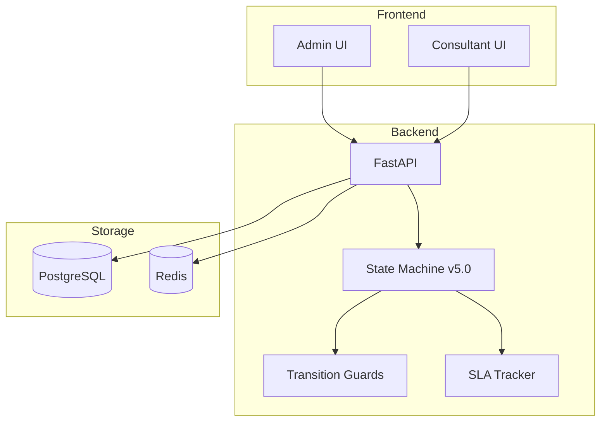
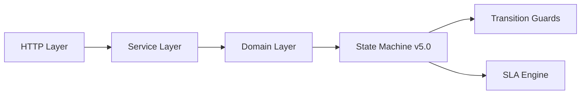
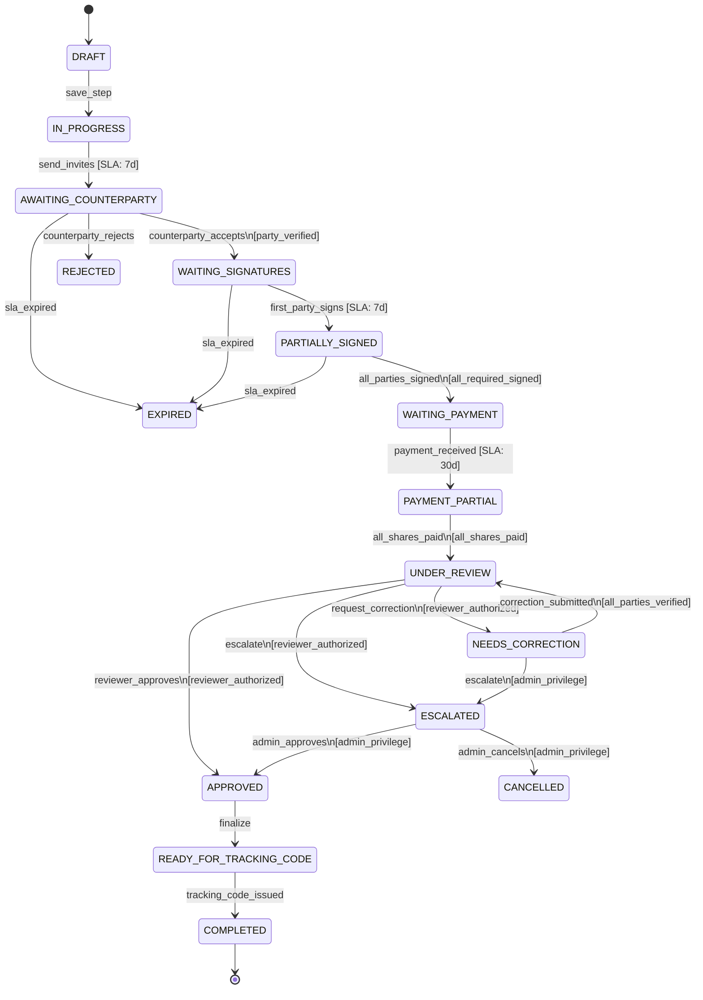
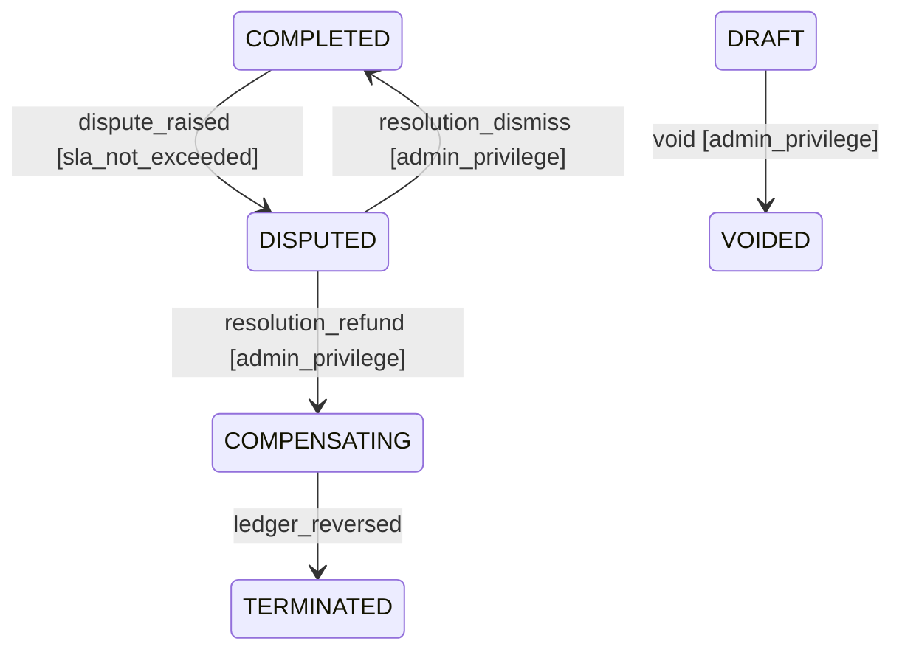
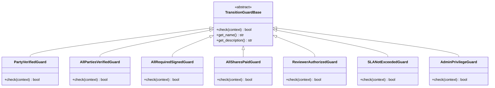
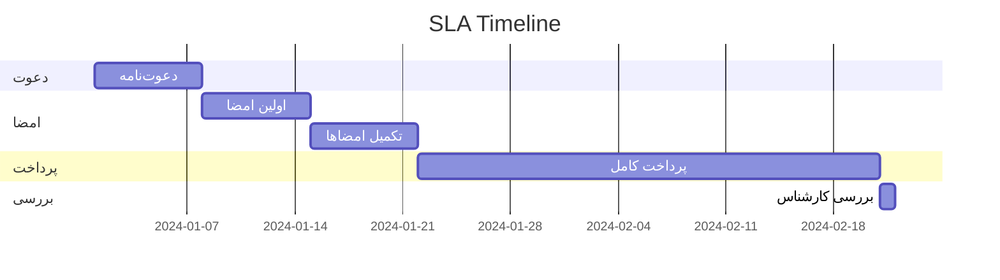
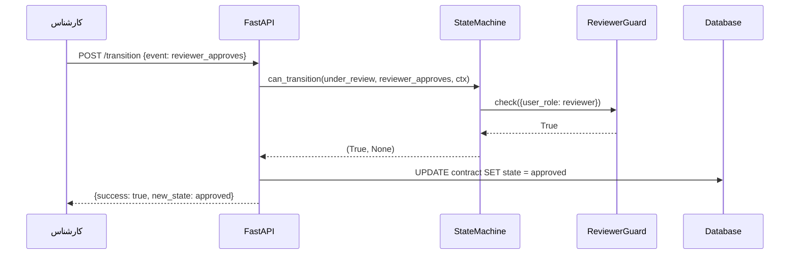
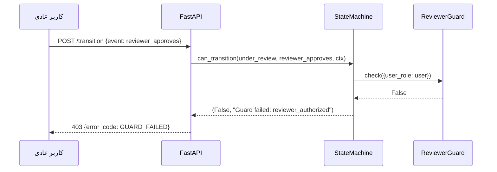
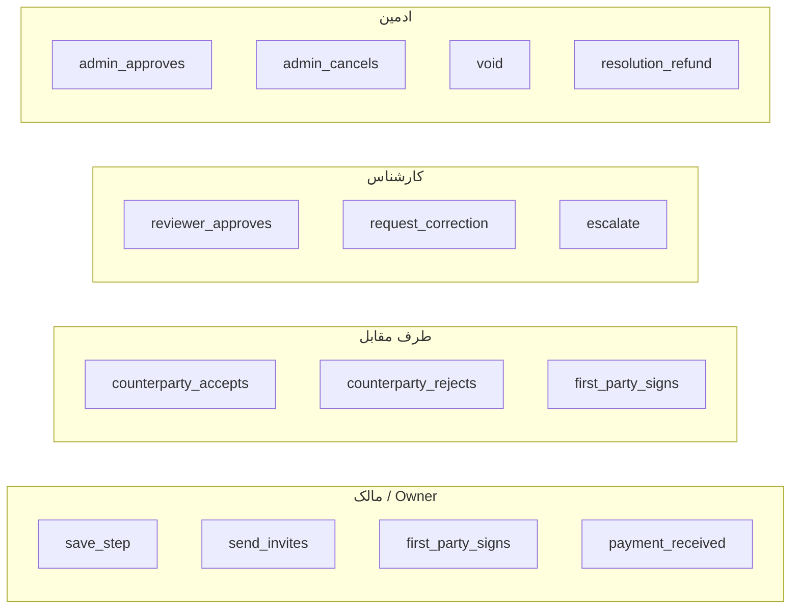
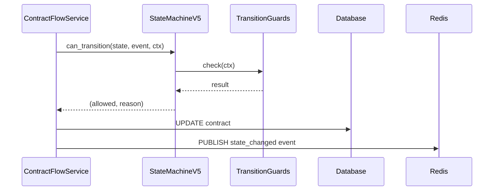

# AMLINE Master Specification v5.0

> **نسخه:** 5.0  
> **تاریخ:** 2026-04-15  
> **وضعیت:** نهایی  

---

## فهرست مطالب

1. [معرفی](#1-معرفی)
2. [معماری کلی](#2-معماری-کلی)
3. [State Machine v5.0](#3-state-machine-v50)
4. [Transition Guards](#4-transition-guards)
5. [SLA Tracking](#5-sla-tracking)
6. [API Specifications](#6-api-specifications)
7. [RBAC Matrix](#7-rbac-matrix)
8. [Business Rules](#8-business-rules)
9. [Error Codes](#9-error-codes)
10. [Integration](#10-integration)
11. [ضمائم](#11-ضمائم)

---

## 1. معرفی

پلتفرم **Amline** یک سیستم مدیریت قرارداد ملکی است که چرخه کامل حیات قرارداد را از مرحله پیش‌نویس تا تکمیل پوشش می‌دهد. نسخه v5.0 این مشخصات، State Machine جدیدی با ۲۰ وضعیت و ۲۵ انتقال را معرفی می‌کند.

### 1.1 اهداف

- تعریف دقیق ۲۰ state چرخه حیات قرارداد
- ۲۵ transition با guard conditions
- SLA deadline tracking برای هر انتقال
- Error handling جامع
- RBAC (Role-Based Access Control) کامل

### 1.2 قراردادهای پشتیبانی‌شده

| نوع | شرح |
|-----|-----|
| `RENT` | اجاره ملک |
| `SALE` | خرید و فروش |
| `EXCHANGE` | معاوضه |
| `CONSTRUCTION` | مشارکت در ساخت |
| `PRE_SALE` | پیش‌فروش |
| `LEASE_TO_OWN` | اجاره به شرط تملیک |

---

## 2. معماری کلی

### 2.1 نمودار معماری



### 2.2 لایه‌های سیستم



---

## 3. State Machine v5.0

### 3.1 تعریف ۲۰ State

| # | State | مقدار | نوع | شرح |
|---|-------|-------|-----|-----|
| 1 | `DRAFT` | `draft` | اولیه | پیش‌نویس قرارداد |
| 2 | `IN_PROGRESS` | `in_progress` | عادی | تکمیل ویزارد |
| 3 | `AWAITING_COUNTERPARTY` | `awaiting_counterparty` | انتظار | منتظر طرف مقابل |
| 4 | `REJECTED` | `rejected` | پایانی | رد شده توسط طرف مقابل |
| 5 | `EXPIRED` | `expired` | پایانی | انقضای SLA |
| 6 | `WAITING_SIGNATURES` | `waiting_signatures` | امضا | منتظر امضاها |
| 7 | `PARTIALLY_SIGNED` | `partially_signed` | امضا | امضای جزئی |
| 8 | `WAITING_PAYMENT` | `waiting_payment` | پرداخت | منتظر پرداخت |
| 9 | `PAYMENT_PARTIAL` | `payment_partial` | پرداخت | پرداخت جزئی |
| 10 | `UNDER_REVIEW` | `under_review` | بررسی | در دست بررسی |
| 11 | `NEEDS_CORRECTION` | `needs_correction` | بررسی | نیاز به اصلاح |
| 12 | `ESCALATED` | `escalated` | بررسی | ارجاع به مدیر |
| 13 | `APPROVED` | `approved` | تأیید | تأیید شده |
| 14 | `READY_FOR_TRACKING_CODE` | `ready_for_tracking_code` | ثبت | آماده کد رهگیری |
| 15 | `COMPLETED` | `completed` | پایانی | تکمیل شده |
| 16 | `DISPUTED` | `disputed` | اختلاف | اختلاف جاری |
| 17 | `COMPENSATING` | `compensating` | جبران | جبران خسارت |
| 18 | `CANCELLED` | `cancelled` | پایانی | لغو شده |
| 19 | `TERMINATED` | `terminated` | پایانی | خاتمه یافته |
| 20 | `VOIDED` | `voided` | پایانی | ابطال شده |

### 3.2 نمودار state machine (مسیر اصلی)



### 3.3 نمودار مسیرهای استثناء



### 3.4 ۲۵ Transition کامل

| # | از | رویداد | به | Guards | SLA |
|---|----|---------|----|--------|-----|
| 1 | DRAFT | save_step | IN_PROGRESS | — | — |
| 2 | IN_PROGRESS | send_invites | AWAITING_COUNTERPARTY | — | 7 روز |
| 3 | AWAITING_COUNTERPARTY | counterparty_accepts | WAITING_SIGNATURES | party_verified | 7 روز |
| 4 | AWAITING_COUNTERPARTY | counterparty_rejects | REJECTED | — | — |
| 5 | AWAITING_COUNTERPARTY | sla_expired | EXPIRED | — | — |
| 6 | WAITING_SIGNATURES | first_party_signs | PARTIALLY_SIGNED | — | 7 روز |
| 7 | WAITING_SIGNATURES | sla_expired | EXPIRED | — | — |
| 8 | PARTIALLY_SIGNED | all_parties_signed | WAITING_PAYMENT | all_required_signed | 7 روز |
| 9 | PARTIALLY_SIGNED | sla_expired | EXPIRED | — | — |
| 10 | WAITING_PAYMENT | payment_received | PAYMENT_PARTIAL | — | 30 روز |
| 11 | PAYMENT_PARTIAL | all_shares_paid | UNDER_REVIEW | all_shares_paid | 1 روز |
| 12 | UNDER_REVIEW | reviewer_approves | APPROVED | reviewer_authorized | — |
| 13 | UNDER_REVIEW | request_correction | NEEDS_CORRECTION | reviewer_authorized | — |
| 14 | UNDER_REVIEW | escalate | ESCALATED | reviewer_authorized | — |
| 15 | NEEDS_CORRECTION | correction_submitted | UNDER_REVIEW | all_parties_verified | — |
| 16 | NEEDS_CORRECTION | escalate | ESCALATED | admin_privilege | — |
| 17 | ESCALATED | admin_approves | APPROVED | admin_privilege | — |
| 18 | ESCALATED | admin_cancels | CANCELLED | admin_privilege | — |
| 19 | APPROVED | finalize | READY_FOR_TRACKING_CODE | — | — |
| 20 | READY_FOR_TRACKING_CODE | tracking_code_issued | COMPLETED | — | — |
| 21 | COMPLETED | dispute_raised | DISPUTED | sla_not_exceeded | — |
| 22 | DISPUTED | resolution_refund | COMPENSATING | admin_privilege | — |
| 23 | DISPUTED | resolution_dismiss | COMPLETED | admin_privilege | — |
| 24 | COMPENSATING | ledger_reversed | TERMINATED | — | — |
| 25 | DRAFT | void | VOIDED | admin_privilege | — |

---

## 4. Transition Guards

### 4.1 معماری Guards



### 4.2 توضیح Guards

#### 4.2.1 `PartyVerifiedGuard`
- **نام:** `party_verified`
- **شرط:** `context.party_verified == True` و `context.party_id` غیرخالی
- **کاربرد:** قبول دعوت‌نامه توسط طرف مقابل

#### 4.2.2 `AllPartiesVerifiedGuard`
- **نام:** `all_parties_verified`
- **شرط:** حداقل ۲ طرف در `context.parties` وجود داشته باشد و همه دارای `verified: True` باشند
- **کاربرد:** ارسال اصلاحیه

#### 4.2.3 `AllRequiredSignedGuard`
- **نام:** `all_required_signed`
- **شرط:** `completed_signatures_count >= required_signatures_count > 0`
- **کاربرد:** انتقال از PARTIALLY_SIGNED به WAITING_PAYMENT

#### 4.2.4 `AllSharesPaidGuard`
- **نام:** `all_shares_paid`
- **شرط:** `(total_paid / total_required) * 100 >= 99.0` و `total_required > 0`
- **کاربرد:** انتقال از PAYMENT_PARTIAL به UNDER_REVIEW

#### 4.2.5 `ReviewerAuthorizedGuard`
- **نام:** `reviewer_authorized`
- **شرط:** `user_role in {reviewer, senior_reviewer, admin, superadmin}`
- **کاربرد:** تأیید/رد/ارجاع در مرحله بررسی

#### 4.2.6 `SLANotExceededGuard`
- **نام:** `sla_not_exceeded`
- **شرط:** `now < sla_deadline` (اگر deadline تنظیم شده باشد)
- **کاربرد:** اعتراض به قرارداد تکمیل‌شده

#### 4.2.7 `AdminPrivilegeGuard`
- **نام:** `admin_privilege`
- **شرط:** `user_role in {admin, superadmin}`
- **کاربرد:** ابطال، ارجاع اجباری، تأیید/لغو مدیریتی

### 4.3 فرمت Context

```python
context = {
    # Party verification
    "party_verified": bool,
    "party_id": str,
    "parties": [{"verified": bool}, ...],

    # Signatures
    "required_signatures_count": int,
    "completed_signatures_count": int,

    # Payments
    "total_required": float,
    "total_paid": float,

    # User/role
    "user_role": str,  # "reviewer" | "senior_reviewer" | "admin" | "superadmin" | "user"

    # SLA
    "sla_deadline": datetime | str | None,
}
```

---

## 5. SLA Tracking

### 5.1 تعریف SLA‌ها

| مرحله | SLA | توضیح |
|-------|-----|-------|
| دعوت‌نامه | ۷ روز | از `send_invites` تا پاسخ |
| امضاها | ۷ روز | از `counterparty_accepts` تا `first_party_signs` |
| تکمیل امضا | ۷ روز | از `first_party_signs` تا `all_parties_signed` |
| پرداخت | ۳۰ روز | از `payment_received` تا تکمیل |
| بررسی | ۱ روز | از `all_shares_paid` تا تأیید/رد |

### 5.2 نمودار SLA



### 5.3 استفاده از `get_deadline()`

```python
sm = ContractStateMachineV5()
t = sm.get_transition("in_progress", "send_invites")
deadline = t.get_deadline()  # datetime + 7 days
```

---

## 6. API Specifications

### 6.1 Endpoint‌های State Machine

#### `GET /api/v1/contracts/{contract_id}/state`

پاسخ:
```json
{
  "contract_id": "uuid",
  "current_state": "under_review",
  "allowed_events": ["reviewer_approves", "request_correction", "escalate"],
  "is_terminal": false
}
```

#### `POST /api/v1/contracts/{contract_id}/transition`

درخواست:
```json
{
  "event": "reviewer_approves",
  "context": {
    "user_role": "reviewer"
  }
}
```

پاسخ موفق:
```json
{
  "success": true,
  "previous_state": "under_review",
  "new_state": "approved",
  "sla_deadline": null
}
```

پاسخ خطا:
```json
{
  "success": false,
  "error_code": "GUARD_FAILED",
  "guard_name": "reviewer_authorized",
  "message": "کارشناس مجاز است"
}
```

#### `GET /api/v1/contracts/{contract_id}/transitions`

پاسخ:
```json
{
  "transitions": [
    {
      "event": "reviewer_approves",
      "to_state": "approved",
      "guards": [
        {"name": "reviewer_authorized", "description": "کارشناس مجاز است"}
      ],
      "sla_days": null,
      "deadline": null
    }
  ]
}
```

### 6.2 Sequence Diagram: Successful Review



### 6.3 Sequence Diagram: Guard Failure



---

## 7. RBAC Matrix

### 7.1 نقش‌های سیستم

| نقش | شناسه | توضیح |
|-----|-------|-------|
| مالک | `owner` | مالک/موجر/فروشنده |
| طرف مقابل | `counterparty` | مستأجر/خریدار |
| کارشناس | `reviewer` | کارشناس بررسی |
| کارشناس ارشد | `senior_reviewer` | کارشناس ارشد |
| ادمین | `admin` | مدیر سیستم |
| سوپرادمین | `superadmin` | مدیر ارشد |

### 7.2 ماتریس دسترسی رویدادها

| رویداد | owner | counterparty | reviewer | senior_reviewer | admin | superadmin |
|--------|-------|-------------|----------|-----------------|-------|------------|
| `save_step` | ✅ | — | — | — | ✅ | ✅ |
| `send_invites` | ✅ | — | — | — | ✅ | ✅ |
| `counterparty_accepts` | — | ✅ | — | — | ✅ | ✅ |
| `counterparty_rejects` | — | ✅ | — | — | ✅ | ✅ |
| `first_party_signs` | ✅ | ✅ | — | — | ✅ | ✅ |
| `all_parties_signed` | ✅ | ✅ | — | — | ✅ | ✅ |
| `payment_received` | ✅ | ✅ | — | — | ✅ | ✅ |
| `all_shares_paid` | ✅ | ✅ | — | — | ✅ | ✅ |
| `reviewer_approves` | — | — | ✅ | ✅ | ✅ | ✅ |
| `request_correction` | — | — | ✅ | ✅ | ✅ | ✅ |
| `escalate` | — | — | ✅ | ✅ | ✅ | ✅ |
| `correction_submitted` | ✅ | ✅ | — | — | ✅ | ✅ |
| `admin_approves` | — | — | — | — | ✅ | ✅ |
| `admin_cancels` | — | — | — | — | ✅ | ✅ |
| `finalize` | ✅ | — | — | — | ✅ | ✅ |
| `tracking_code_issued` | — | — | — | — | ✅ | ✅ |
| `dispute_raised` | ✅ | ✅ | — | — | ✅ | ✅ |
| `resolution_refund` | — | — | — | — | ✅ | ✅ |
| `resolution_dismiss` | — | — | — | — | ✅ | ✅ |
| `ledger_reversed` | — | — | — | — | ✅ | ✅ |
| `void` | — | — | — | — | ✅ | ✅ |
| `sla_expired` | — | — | — | — | ✅ | ✅ |

### 7.3 Swimlane Diagram



---

## 8. Business Rules

### 8.1 قوانین امضا

**BR-SIG-001:** امضا فقط از طرف کاربر تأییدشده قابل قبول است.

**BR-SIG-002:** امضای ناقص اجازه پرداخت نمی‌دهد (حداقل باید `required_signatures_count` رسیده باشد).

**BR-SIG-003:** SLA امضا ۷ روز از زمان ارسال دعوت است. انقضا → EXPIRED.

### 8.2 قوانین پرداخت

**BR-PAY-001:** پرداخت ناقص (کمتر از ۹۹٪) اجازه انتقال به UNDER_REVIEW را نمی‌دهد.

**BR-PAY-002:** SLA پرداخت ۳۰ روز از زمان اولین پرداخت است.

**BR-PAY-003:** مبلغ پرداخت با مبلغ قرارداد باید تطابق داشته باشد.

### 8.3 قوانین بررسی

**BR-REV-001:** فقط کارشناس/ادمین می‌تواند قرارداد را تأیید/رد کند.

**BR-REV-002:** درخواست اصلاح باید همراه با توضیحات باشد.

**BR-REV-003:** پس از ۳ بار درخواست اصلاح، قرارداد به ESCALATED می‌رود.

### 8.4 قوانین اختلاف

**BR-DIS-001:** اعتراض فقط در صورت معتبر بودن SLA امکان‌پذیر است.

**BR-DIS-002:** تصمیم‌گیری در اختلاف فقط توسط ادمین امکان‌پذیر است.

**BR-DIS-003:** استرداد وجه → COMPENSATING → TERMINATED.

### 8.5 قوانین کلی

**BR-GEN-001:** state‌های پایانی (COMPLETED, REJECTED, EXPIRED, CANCELLED, TERMINATED, VOIDED) قابل تغییر نیستند (به جز COMPLETED که می‌تواند به DISPUTED برود).

**BR-GEN-002:** هر انتقال باید در لاگ ثبت شود.

**BR-GEN-003:** context باید هنگام انتقال ذخیره شود.

---

## 9. Error Codes

### 9.1 جدول خطاها

| کد | نام | پیام | HTTP Status |
|----|-----|------|-------------|
| `SM001` | `INVALID_TRANSITION` | انتقال نامعتبر: state یا رویداد وجود ندارد | 422 |
| `SM002` | `GUARD_FAILED` | شرط guard رد شد | 403 |
| `SM003` | `SLA_EXCEEDED` | SLA منقضی شده | 409 |
| `SM004` | `PARTY_NOT_VERIFIED` | طرف احراز هویت نشده | 403 |
| `SM005` | `INSUFFICIENT_SIGNATURES` | امضاهای ناکافی | 422 |
| `SM006` | `PAYMENT_INCOMPLETE` | پرداخت ناقص (کمتر از ۹۹٪) | 422 |
| `SM007` | `REVIEWER_NOT_AUTHORIZED` | کارشناس مجاز نیست | 403 |
| `SM008` | `ADMIN_REQUIRED` | دسترسی ادمین لازم است | 403 |
| `SM009` | `TERMINAL_STATE` | state پایانی است | 409 |

### 9.2 ساختار پاسخ خطا

```json
{
  "error_code": "SM002",
  "error_name": "GUARD_FAILED",
  "guard_name": "reviewer_authorized",
  "message": "کارشناس مجاز است",
  "current_state": "under_review",
  "requested_event": "reviewer_approves",
  "details": {
    "user_role": "user",
    "required_roles": ["reviewer", "senior_reviewer", "admin", "superadmin"]
  }
}
```

---

## 10. Integration

### 10.1 سازگاری با State Machine موجود

State Machine v5.0 کاملاً با `contract_state_machine.py` موجود سازگار است.

#### نگاشت state‌ها

| v5.0 State | Legacy State (`contract_state_machine.py`) |
|------------|------------------------------------------|
| `draft` | `draft` |
| `awaiting_counterparty` | `awaiting_parties` |
| `waiting_signatures` | `signing_in_progress` |
| `payment_partial` | `payment_partial` |
| `under_review` | `legal_review` |
| `ready_for_tracking_code` | `registry_pending` |
| `completed` | `completed` |
| `disputed` | `dispute_open` |
| `compensating` | `compensating` |
| `cancelled` | `cancelled` |
| `expired` | `expired` |

### 10.2 Migration Path

```python
# مثال migrate
from app.domain.contracts.state_machine_v5 import (
    ContractStateMachineV5,
    get_contract_state_machine_v5,
)

# جایگزین ContractStateMachine قدیمی
sm_v5 = get_contract_state_machine_v5()

# همان API
can, err = sm_v5.can_transition(current_state, event, context)
if can:
    new_state = sm_v5.transition(current_state, event, context)
```

### 10.3 Backward Compatibility

- تمام eventهای `contract_state_machine.py` معادل در v5.0 دارند
- API `can_transition()`, `transition()`, `allowed_events()` بدون تغییر است
- `transition_contract_payload()` می‌تواند به v5.0 migrate شود

### 10.4 نمودار تعامل سرویس‌ها



---

## 11. ضمائم

### ضمیمه A: ساختار فایل‌ها

```
backend/backend/app/domain/contracts/
├── __init__.py
├── ssot.py                   # SSOT lifecycle + kinds
├── transition_guards.py      # [جدید] Guard classes
└── state_machine_v5.py       # [جدید] State Machine v5.0

tests/unit/
└── test_contract_state_machine_v5.py  # [جدید] 28 test

docs/
└── AMLINE_MASTER_SPECIFICATION_v5.0.md  # این سند
```

### ضمیمه B: نمونه استفاده

```python
from app.domain.contracts.state_machine_v5 import (
    ContractStateMachineV5,
    ContractLifecycleStateV5,
)

sm = ContractStateMachineV5()

# بررسی انتقال
context = {
    "user_role": "reviewer",
    "party_verified": True,
    "party_id": "party-123",
}

can_do, error = sm.can_transition(
    "awaiting_counterparty",
    "counterparty_accepts",
    context,
)

if can_do:
    transition = sm.get_transition("awaiting_counterparty", "counterparty_accepts")
    new_state = sm.transition("awaiting_counterparty", "counterparty_accepts", context)
    deadline = transition.get_deadline()
    print(f"New state: {new_state}, SLA deadline: {deadline}")
else:
    print(f"Cannot transition: {error}")
```

### ضمیمه C: لیست کامل Guards و Context keys

| Guard | Context Keys مورد نیاز |
|-------|------------------------|
| `PartyVerifiedGuard` | `party_verified: bool`, `party_id: str` |
| `AllPartiesVerifiedGuard` | `parties: list[{verified: bool}]` (min 2) |
| `AllRequiredSignedGuard` | `required_signatures_count: int`, `completed_signatures_count: int` |
| `AllSharesPaidGuard` | `total_required: float`, `total_paid: float` |
| `ReviewerAuthorizedGuard` | `user_role: str` |
| `SLANotExceededGuard` | `sla_deadline: datetime\|str\|None` |
| `AdminPrivilegeGuard` | `user_role: str` |

### ضمیمه D: معیارهای موفقیت

| معیار | وضعیت |
|-------|-------|
| ۲۰ state تعریف‌شده | ✅ |
| ۲۵ transition کامل | ✅ |
| Guard conditions | ✅ |
| SLA deadline tracking | ✅ |
| ۲۸ سناریو تست (شامل ۱۵ سناریو اصلی) | ✅ |
| سازگاری با state machine موجود | ✅ |
| RBAC matrix کامل | ✅ |
| API documentation | ✅ |
| Error codes | ✅ |
| Business rules | ✅ |

---

*آخرین به‌روزرسانی: 2026-04-15 — نسخه 5.0*
