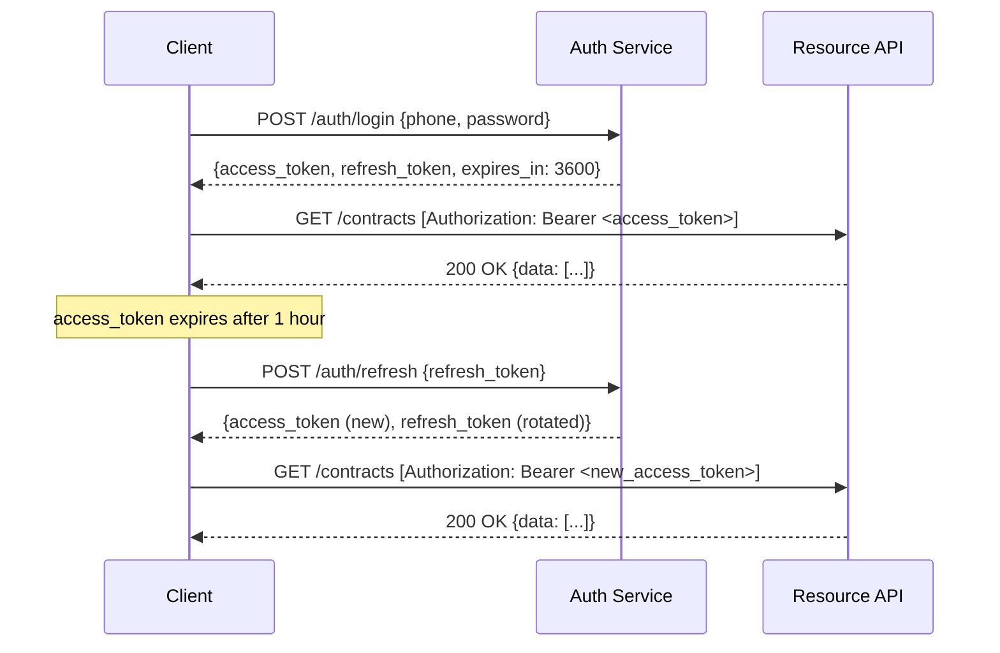

# API Contract Specification — Amline Enterprise Master v5.0

| Field       | Value                            |
|-------------|----------------------------------|
| Version     | v5.0                             |
| Date        | 2026-04-15                       |
| Status      | Active                           |
| Base URL    | `https://api.amline.ir/v5`       |
| Maintainer  | Backend Platform Team            |
| Document ID | AME-API-0008                     |

---

## Table of Contents

1. [API Design Principles](#1-api-design-principles)
2. [Authentication](#2-authentication)
3. [Standard Response Envelope](#3-standard-response-envelope)
4. [Rate Limiting](#4-rate-limiting)
5. [Pagination](#5-pagination)
6. [Filtering and Sorting](#6-filtering-and-sorting)
7. [Auth Endpoints](#7-auth-endpoints)
8. [Contract Endpoints](#8-contract-endpoints)
9. [Payment Endpoints](#9-payment-endpoints)
10. [Review Endpoints](#10-review-endpoints)
11. [Tracking Endpoints](#11-tracking-endpoints)
12. [Support Endpoints](#12-support-endpoints)
13. [Admin Endpoints](#13-admin-endpoints)
14. [OpenAPI 3.0 Snippet](#14-openapi-30-snippet)

---

## 1. API Design Principles

| Principle              | Implementation                                                           |
|------------------------|--------------------------------------------------------------------------|
| **RESTful**            | Resources as nouns; HTTP verbs for actions; stateless                   |
| **Versioned**          | URL path versioning: `/v5/...`; breaking changes increment major version |
| **Snake_case**         | All JSON field names use snake_case                                      |
| **Paginated**          | All list endpoints use cursor-based or offset pagination                 |
| **Idempotent**         | POST with `Idempotency-Key` header; safe to retry on timeout            |
| **Consistent errors**  | Uniform error envelope across all endpoints                              |
| **Hypermedia-lite**    | Key related resources linked via `_links` in responses                   |
| **Bilingual**          | Error messages returned in both Persian and English                      |

### Base URL

```
Production:  https://api.amline.ir/v5
Staging:     https://staging-api.amline.ir/v5
Development: http://localhost:8000/v5
```

---

## 2. Authentication

### Token Types

| Token Type      | Lifetime   | Storage        | Usage                        |
|-----------------|------------|----------------|------------------------------|
| Access Token    | 1 hour     | Memory only    | API authorization (Bearer)   |
| Refresh Token   | 30 days    | HttpOnly cookie| Obtain new access token      |

### Request Authentication

All protected endpoints require:

```http
Authorization: Bearer <access_token>
```

### Refresh Token Flow



---

## 3. Standard Response Envelope

### Success Response

```json
{
  "success": true,
  "data": { },
  "error": null,
  "meta": {
    "timestamp": "2026-04-15T10:30:00.000Z",
    "request_id": "req-550e8400-e29b-41d4",
    "version": "5.0",
    "page": 1,
    "page_size": 20,
    "total": 150,
    "total_pages": 8,
    "has_next": true,
    "has_prev": false
  }
}
```

### Error Response

```json
{
  "success": false,
  "data": null,
  "error": {
    "code": "ERR_001",
    "message": "Invalid contract state transition",
    "message_fa": "انتقال حالت قرارداد نامعتبر است",
    "details": {
      "current_state": "ACCEPTED",
      "attempted_transition": "DRAFT",
      "allowed_transitions": ["COMPLETED", "DISPUTED", "CANCELLED"]
    },
    "documentation_url": "https://docs.amline.ir/errors/ERR_001"
  },
  "meta": {
    "timestamp": "2026-04-15T10:30:00.000Z",
    "request_id": "req-660f9511-f30c-52e5"
  }
}
```

---

## 4. Rate Limiting

### Rate Limit Headers

```http
X-RateLimit-Limit: 1000
X-RateLimit-Remaining: 847
X-RateLimit-Reset: 1713178800
X-RateLimit-Policy: "1000;w=3600"
```

### Limits by Role

| Role         | Requests/Hour | Burst (per minute) |
|--------------|---------------|--------------------|
| SUPER_ADMIN  | Unlimited     | Unlimited          |
| ADMIN        | 10,000        | 500                |
| OPS_REVIEWER | 5,000         | 200                |
| CONSULTANT   | 2,000         | 100                |
| LANDLORD     | 1,000         | 60                 |
| TENANT       | 1,000         | 60                 |
| Anonymous    | 100           | 10                 |

When limit exceeded: HTTP 429 with `Retry-After: <seconds>` header.

---

## 5. Pagination

### Offset Pagination (default)

```
GET /contracts?page=2&page_size=20
```

| Parameter   | Default | Max  | Description              |
|-------------|---------|------|--------------------------|
| `page`      | 1       | —    | 1-indexed page number    |
| `page_size` | 20      | 100  | Items per page           |

### Cursor Pagination (for high-volume endpoints)

```
GET /payments/ledger?cursor=eyJpZCI6MTAwMX0&direction=next&limit=50
```

---

## 6. Filtering and Sorting

### Filtering

```
GET /contracts?state=ACTIVE&contract_type=LEASE&created_after=2026-01-01&created_before=2026-04-15
```

### Sorting

```
GET /contracts?sort_by=created_at&sort_dir=desc
```

| Parameter  | Values               | Default        |
|------------|----------------------|----------------|
| `sort_by`  | Field name (snake_case)| `created_at` |
| `sort_dir` | `asc`, `desc`        | `desc`         |

---

## 7. Auth Endpoints

### 7.1 POST /auth/login

| Attribute   | Value            |
|-------------|------------------|
| **Method**  | POST             |
| **Path**    | `/auth/login`    |
| **Auth**    | None (public)    |

**Request Body:**

```json
{
  "phone": "+989123456789",
  "password": "SecureP@ssw0rd!",
  "device_id": "device-uuid-optional",
  "remember_me": false
}
```

**Success Response (200):**

```json
{
  "success": true,
  "data": {
    "access_token": "eyJhbGciOiJSUzI1NiIsInR5cCI6IkpXVCJ9...",
    "refresh_token": "dGhpcyBpcyBhIHJlZnJlc2ggdG9rZW4...",
    "token_type": "Bearer",
    "expires_in": 3600,
    "user": {
      "user_id": "USR-10001",
      "name": "علی رضایی",
      "phone": "+989123456789",
      "role": "TENANT",
      "kyc_level": "FULL"
    }
  }
}
```

**Error Codes:** `ERR_003` (invalid credentials), `ERR_011` (rate limit), `ERR_008` (account suspended)

---

### 7.2 POST /auth/refresh

| Attribute   | Value                 |
|-------------|-----------------------|
| **Method**  | POST                  |
| **Path**    | `/auth/refresh`       |
| **Auth**    | None (refresh token)  |

**Request Body:**

```json
{
  "refresh_token": "dGhpcyBpcyBhIHJlZnJlc2ggdG9rZW4..."
}
```

**Success Response (200):**

```json
{
  "success": true,
  "data": {
    "access_token": "eyJhbGciOiJSUzI1NiIsInR5cCI6IkpXVCJ9.NEW...",
    "refresh_token": "ROTATED_REFRESH_TOKEN...",
    "token_type": "Bearer",
    "expires_in": 3600
  }
}
```

**Error Codes:** `ERR_003` (invalid/expired refresh token)

---

### 7.3 POST /auth/logout

| Attribute   | Value              |
|-------------|--------------------|
| **Method**  | POST               |
| **Path**    | `/auth/logout`     |
| **Auth**    | Bearer (any role)  |

**Request Body:**

```json
{
  "refresh_token": "dGhpcyBpcyBhIHJlZnJlc2ggdG9rZW4..."
}
```

**Success Response (204):** No body.

Invalidates both access token (JTI blocklist) and refresh token.

---

### 7.4 POST /auth/kyc/submit

| Attribute   | Value              |
|-------------|--------------------|
| **Method**  | POST               |
| **Path**    | `/auth/kyc/submit` |
| **Auth**    | Bearer (any role)  |

**Request Body (multipart/form-data):**

```
document_type: NATIONAL_ID
national_id_number: 0012345678
document_front: <file>
document_back: <file>
selfie: <file>
```

**Success Response (202):**

```json
{
  "success": true,
  "data": {
    "kyc_submission_id": "KYC-SUB-2026-00101",
    "status": "PROCESSING",
    "estimated_processing_time_minutes": 15,
    "submitted_at": "2026-04-15T10:00:00Z"
  }
}
```

**Error Codes:** `ERR_010` (duplicate submission), `ERR_003` (unauthorized)

---

## 8. Contract Endpoints

### 8.1 POST /contracts

| Attribute   | Value                        |
|-------------|------------------------------|
| **Method**  | POST                         |
| **Path**    | `/contracts`                 |
| **Auth**    | TENANT, CONSULTANT           |
| **Permission** | `contract:create`         |

**Request Headers:**

```http
Idempotency-Key: <uuid>
```

**Request Body:**

```json
{
  "contract_type": "LEASE",
  "property_id": "PROP-40004",
  "seller_id": "USR-20002",
  "agent_id": "USR-30003",
  "amount": 5000000000,
  "currency": "IRR",
  "deposit_percentage": 30,
  "start_date": "2026-05-01",
  "end_date": "2027-05-01",
  "terms": "Standard residential lease with monthly payment",
  "special_conditions": "Pets allowed with additional deposit",
  "documents": [
    {
      "type": "PROPERTY_DEED",
      "file_id": "FILE-UUID-001"
    }
  ]
}
```

**Success Response (201):**

```json
{
  "success": true,
  "data": {
    "contract_id": "CTR-2026-00001",
    "state": "DRAFT",
    "contract_type": "LEASE",
    "property_id": "PROP-40004",
    "buyer_id": "USR-10001",
    "seller_id": "USR-20002",
    "agent_id": "USR-30003",
    "amount": 5000000000,
    "deposit_amount": 1500000000,
    "currency": "IRR",
    "start_date": "2026-05-01",
    "end_date": "2027-05-01",
    "created_at": "2026-04-15T10:30:00Z",
    "_links": {
      "self": "/v5/contracts/CTR-2026-00001",
      "submit": "/v5/contracts/CTR-2026-00001/submit",
      "history": "/v5/contracts/CTR-2026-00001/history"
    }
  }
}
```

**Error Codes:** `ERR_002` (amount mismatch), `ERR_005` (property unavailable), `ERR_008` (KYC required), `ERR_010` (duplicate)

---

### 8.2 GET /contracts

| Attribute      | Value                              |
|----------------|------------------------------------|
| **Method**     | GET                                |
| **Path**       | `/contracts`                       |
| **Auth**       | All authenticated roles            |
| **Permission** | `contract:read:own` or `contract:read:all` |

**Query Parameters:**

| Parameter        | Type    | Description                                  |
|------------------|---------|----------------------------------------------|
| `state`          | string  | Filter by state (comma-separated)            |
| `contract_type`  | string  | LEASE, PRE_SALE, SALE                        |
| `created_after`  | date    | ISO-8601 date                                |
| `created_before` | date    | ISO-8601 date                                |
| `property_id`    | string  | Filter by property                           |
| `page`           | integer | Page number (default: 1)                     |
| `page_size`      | integer | Items per page (default: 20, max: 100)       |
| `sort_by`        | string  | `created_at`, `amount`, `state`              |
| `sort_dir`       | string  | `asc`, `desc`                                |

**Success Response (200):**

```json
{
  "success": true,
  "data": [
    {
      "contract_id": "CTR-2026-00001",
      "state": "ACTIVE",
      "contract_type": "LEASE",
      "amount": 5000000000,
      "currency": "IRR",
      "created_at": "2026-04-15T10:30:00Z"
    }
  ],
  "meta": {
    "page": 1,
    "page_size": 20,
    "total": 1,
    "total_pages": 1,
    "has_next": false,
    "has_prev": false,
    "timestamp": "2026-04-15T10:30:00Z"
  }
}
```

---

### 8.3 GET /contracts/{id}

| Attribute      | Value                              |
|----------------|------------------------------------|
| **Method**     | GET                                |
| **Path**       | `/contracts/{id}`                  |
| **Auth**       | All roles (RLS enforced)           |
| **Permission** | `contract:read:own`                |

**Success Response (200):** Full contract object (all fields).

**Error Codes:** `ERR_004` (not found), `ERR_003` (unauthorized — not a party)

---

### 8.4 PATCH /contracts/{id}

| Attribute      | Value                                  |
|----------------|----------------------------------------|
| **Method**     | PATCH                                  |
| **Path**       | `/contracts/{id}`                      |
| **Auth**       | TENANT, CONSULTANT                     |
| **Permission** | `contract:update:draft`                |
| **Constraint** | Only allowed when state = `DRAFT`      |

**Request Body (partial update, all fields optional):**

```json
{
  "amount": 5500000000,
  "special_conditions": "Updated terms",
  "end_date": "2027-06-01"
}
```

**Success Response (200):** Updated contract object.

**Error Codes:** `ERR_001` (not in DRAFT state), `ERR_002` (validation failed)

---

### 8.5 DELETE /contracts/{id}

| Attribute      | Value                                  |
|----------------|----------------------------------------|
| **Method**     | DELETE                                 |
| **Path**       | `/contracts/{id}`                      |
| **Auth**       | TENANT, CONSULTANT, SUPER_ADMIN        |
| **Constraint** | Only allowed when state = `DRAFT`      |

**Request Body:**

```json
{
  "reason": "Changed mind before submission"
}
```

**Success Response (204):** No body. Contract soft-deleted (state → `CANCELLED`).

---

### 8.6 POST /contracts/{id}/submit

| Attribute      | Value                                     |
|----------------|-------------------------------------------|
| **Method**     | POST                                      |
| **Path**       | `/contracts/{id}/submit`                  |
| **Auth**       | TENANT, CONSULTANT                        |
| **Permission** | `contract:submit_for_review`              |
| **Transition** | DRAFT → PENDING_REVIEW                    |

**Request Body:**

```json
{
  "acknowledgement": true,
  "submission_notes": "All documents uploaded"
}
```

**Success Response (200):**

```json
{
  "success": true,
  "data": {
    "contract_id": "CTR-2026-00001",
    "new_state": "PENDING_REVIEW",
    "review_id": "REV-2026-00051",
    "estimated_review_time_hours": 24
  }
}
```

**Error Codes:** `ERR_001`, `ERR_008` (KYC not verified), `ERR_006` (review queue full)

---

### 8.7 POST /contracts/{id}/counter-offer

| Attribute      | Value                                  |
|----------------|----------------------------------------|
| **Method**     | POST                                   |
| **Path**       | `/contracts/{id}/counter-offer`        |
| **Auth**       | LANDLORD, TENANT, CONSULTANT           |
| **Permission** | `contract:counter_offer`               |
| **Constraint** | Only in APPROVED state, within 48h window |

**Request Body:**

```json
{
  "proposed_amount": 4800000000,
  "proposed_deposit_percentage": 25,
  "proposed_start_date": "2026-06-01",
  "notes": "Prefer earlier start date and slightly lower deposit"
}
```

**Success Response (200):** Updated contract with counter-offer details.

**Error Codes:** `ERR_001`, VR-007 violation (counter-offer window expired)

---

### 8.8 POST /contracts/{id}/accept

| Attribute      | Value                                  |
|----------------|----------------------------------------|
| **Method**     | POST                                   |
| **Path**       | `/contracts/{id}/accept`               |
| **Auth**       | LANDLORD, TENANT (opposing party)      |
| **Permission** | `contract:accept`                      |

**Request Body:**

```json
{
  "accept": true,
  "signature_timestamp": "2026-04-15T12:00:00Z"
}
```

**Success Response (200):** Contract transitions to `DEPOSIT_PENDING`.

---

### 8.9 POST /contracts/{id}/dispute

| Attribute      | Value                                  |
|----------------|----------------------------------------|
| **Method**     | POST                                   |
| **Path**       | `/contracts/{id}/dispute`              |
| **Auth**       | LANDLORD, TENANT                       |
| **Permission** | `contract:dispute`                     |
| **Constraint** | Must be ACTIVE; within 7 days of incident |

**Request Body:**

```json
{
  "dispute_type": "PAYMENT_NOT_RECEIVED",
  "incident_date": "2026-04-10",
  "description": "Deposit was paid but seller is not cooperating",
  "evidence_file_ids": ["FILE-UUID-002", "FILE-UUID-003"]
}
```

**Success Response (202):**

```json
{
  "success": true,
  "data": {
    "dispute_id": "DSP-2026-00001",
    "contract_id": "CTR-2026-00001",
    "status": "UNDER_INVESTIGATION",
    "created_at": "2026-04-15T14:00:00Z",
    "sla_resolution_deadline": "2026-04-22T14:00:00Z"
  }
}
```

**Error Codes:** `ERR_009` (dispute window expired — VR-008), `ERR_001`

---

### 8.10 GET /contracts/{id}/history

| Attribute      | Value                                  |
|----------------|----------------------------------------|
| **Method**     | GET                                    |
| **Path**       | `/contracts/{id}/history`              |
| **Auth**       | All roles with contract access         |
| **Permission** | `contract:view_history`                |

**Success Response (200):**

```json
{
  "success": true,
  "data": [
    {
      "transition_id": "TRN-001",
      "from_state": "DRAFT",
      "to_state": "PENDING_REVIEW",
      "actor_id": "USR-10001",
      "actor_role": "TENANT",
      "reason": "Submitted by buyer",
      "timestamp": "2026-04-15T10:35:00Z"
    }
  ]
}
```

---

## 9. Payment Endpoints

### 9.1 POST /payments/initiate

| Attribute      | Value                                  |
|----------------|----------------------------------------|
| **Method**     | POST                                   |
| **Path**       | `/payments/initiate`                   |
| **Auth**       | TENANT                                 |
| **Permission** | `payment:initiate`                     |

**Request Body:**

```json
{
  "contract_id": "CTR-2026-00001",
  "payment_type": "DEPOSIT",
  "gateway": "ZARINPAL",
  "callback_url": "https://app.amline.ir/payment/callback"
}
```

**Success Response (200):**

```json
{
  "success": true,
  "data": {
    "payment_id": "PAY-2026-00101",
    "gateway_url": "https://payment.zarinpal.com/StartPay/ZP-REF-999",
    "reference_id": "ZP-REF-999",
    "expires_at": "2026-04-15T16:35:00Z",
    "amount": 1500000000,
    "currency": "IRR"
  }
}
```

**Error Codes:** `ERR_002`, `ERR_007` (escrow conditions), `ERR_008`

---

### 9.2 POST /payments/verify

| Attribute      | Value                                  |
|----------------|----------------------------------------|
| **Method**     | POST                                   |
| **Path**       | `/payments/verify`                     |
| **Auth**       | TENANT                                 |
| **Permission** | `payment:verify`                       |

**Request Body:**

```json
{
  "payment_id": "PAY-2026-00101",
  "gateway": "ZARINPAL",
  "authority": "ZP-AUTH-12345",
  "status": "OK"
}
```

**Success Response (200):**

```json
{
  "success": true,
  "data": {
    "payment_id": "PAY-2026-00101",
    "status": "COMPLETED",
    "transaction_ref": "ZP-TXN-123456789",
    "verified_at": "2026-04-15T16:12:00Z"
  }
}
```

---

### 9.3 GET /payments/{id}

| Attribute      | Value                          |
|----------------|--------------------------------|
| **Method**     | GET                            |
| **Path**       | `/payments/{id}`               |
| **Auth**       | TENANT, LANDLORD, ADMIN        |
| **Permission** | `payment:read:own`             |

**Success Response (200):** Full payment object with status, amount, gateway ref, timestamps.

---

### 9.4 POST /payments/{id}/refund

| Attribute      | Value                          |
|----------------|--------------------------------|
| **Method**     | POST                           |
| **Path**       | `/payments/{id}/refund`        |
| **Auth**       | TENANT, SUPER_ADMIN            |
| **Permission** | `payment:refund`               |

**Request Body:**

```json
{
  "reason": "CONTRACT_CANCELLED",
  "refund_amount": 1500000000,
  "bank_account_iban": "IR123456789012345678901234"
}
```

**Success Response (202):** Refund initiated with estimated 3-5 business day timeline.

---

### 9.5 GET /payments/ledger

| Attribute      | Value                              |
|----------------|------------------------------------|
| **Method**     | GET                                |
| **Path**       | `/payments/ledger`                 |
| **Auth**       | ADMIN, SUPER_ADMIN, TENANT, LANDLORD |
| **Permission** | `payment:ledger:read:own`          |

**Query Parameters:** `contract_id`, `from_date`, `to_date`, `entry_type`, `cursor`, `limit`

**Success Response (200):** Paginated list of ledger entries with debit/credit, balance.

---

### 9.6 GET /payments/summary

| Attribute      | Value                          |
|----------------|--------------------------------|
| **Method**     | GET                            |
| **Path**       | `/payments/summary`            |
| **Auth**       | ADMIN, CONSULTANT, LANDLORD, TENANT |
| **Permission** | `payment:summary:own`          |

**Success Response (200):**

```json
{
  "success": true,
  "data": {
    "total_deposited": 15000000000,
    "total_refunded": 0,
    "pending_payments": 1,
    "completed_payments": 3,
    "currency": "IRR",
    "period": {
      "from": "2026-01-01",
      "to": "2026-04-15"
    }
  }
}
```

---

## 10. Review Endpoints

### 10.1 GET /reviews/queue

| Attribute      | Value                          |
|----------------|--------------------------------|
| **Method**     | GET                            |
| **Path**       | `/reviews/queue`               |
| **Auth**       | OPS_REVIEWER, ADMIN, SUPER_ADMIN |
| **Permission** | `review:queue:read`            |

**Query Parameters:** `state`, `priority`, `assigned_to`, `page`, `page_size`

**Success Response (200):** Paginated list of review items with contract summary, priority, SLA deadline.

---

### 10.2 POST /reviews/{id}/assign

| Attribute      | Value                          |
|----------------|--------------------------------|
| **Method**     | POST                           |
| **Path**       | `/reviews/{id}/assign`         |
| **Auth**       | OPS_REVIEWER, ADMIN, SUPER_ADMIN |
| **Permission** | `review:assign`                |

**Request Body:**

```json
{
  "reviewer_id": "USR-OPS-001",
  "priority": "HIGH",
  "notes": "Requires senior review due to high contract value"
}
```

**Success Response (200):** Updated review item with reviewer and SLA deadline.

---

### 10.3 POST /reviews/{id}/decision

| Attribute      | Value                              |
|----------------|------------------------------------|
| **Method**     | POST                               |
| **Path**       | `/reviews/{id}/decision`           |
| **Auth**       | OPS_REVIEWER, SUPER_ADMIN          |
| **Permission** | `review:decision:approve` or `review:decision:reject` |

**Request Body:**

```json
{
  "decision": "APPROVED",
  "notes": "All documents verified. KYC passed for both parties. Property deed valid.",
  "checklist": {
    "documents_verified": true,
    "kyc_checked": true,
    "property_verified": true,
    "amount_validated": true
  }
}
```

**Success Response (200):**

```json
{
  "success": true,
  "data": {
    "review_id": "REV-2026-00051",
    "decision": "APPROVED",
    "completed_at": "2026-04-15T20:15:00Z",
    "contract_new_state": "APPROVED"
  }
}
```

**Error Codes:** `ERR_003` (insufficient permission), `ERR_001`

---

### 10.4 POST /reviews/{id}/escalate

| Attribute      | Value                          |
|----------------|--------------------------------|
| **Method**     | POST                           |
| **Path**       | `/reviews/{id}/escalate`       |
| **Auth**       | OPS_REVIEWER, ADMIN            |
| **Permission** | `review:escalate`              |

**Request Body:**

```json
{
  "escalation_reason": "Complex property valuation dispute requires senior review",
  "escalate_to": "SENIOR_REVIEWER"
}
```

---

### 10.5 GET /reviews/{id}

| Attribute      | Value                              |
|----------------|------------------------------------|
| **Method**     | GET                                |
| **Path**       | `/reviews/{id}`                    |
| **Auth**       | OPS_REVIEWER, ADMIN, contract parties |
| **Permission** | `review:read:own`                  |

**Success Response (200):** Full review item with decision history, checklist, notes.

---

## 11. Tracking Endpoints

### 11.1 POST /tracking/issue

| Attribute      | Value                              |
|----------------|------------------------------------|
| **Method**     | POST                               |
| **Path**       | `/tracking/issue`                  |
| **Auth**       | System/Internal only (SUPER_ADMIN) |
| **Permission** | `tracking:issue`                   |
| **Constraint** | VR-009 must pass                   |

**Request Body:**

```json
{
  "contract_id": "CTR-2026-00001",
  "issued_to": "USR-10001"
}
```

**Success Response (201):**

```json
{
  "success": true,
  "data": {
    "tracking_code": "AME-2026-CTR00001-TC",
    "contract_id": "CTR-2026-00001",
    "qr_code_url": "https://cdn.amline.ir/qr/AME-2026-CTR00001-TC.png",
    "pdf_url": "https://cdn.amline.ir/tc/AME-2026-CTR00001-TC.pdf",
    "issued_at": "2026-04-16T09:00:00Z",
    "expires_at": "2027-05-01T23:59:59Z",
    "checksum": "SHA256:a3f1b2c4d5e6f7a8"
  }
}
```

**Error Codes:** `ERR_005` (already issued), `ERR_007` (escrow conditions not met), VR-009 failures

---

### 11.2 POST /tracking/{code}/void

| Attribute      | Value                          |
|----------------|--------------------------------|
| **Method**     | POST                           |
| **Path**       | `/tracking/{code}/void`        |
| **Auth**       | ADMIN, SUPER_ADMIN             |
| **Permission** | `tracking:void`                |

**Request Body:**

```json
{
  "void_reason": "CONTRACT_CANCELLED",
  "void_reason_detail": "Buyer withdrew from deal",
  "replacement_code": null
}
```

---

### 11.3 GET /tracking/{code}/verify

| Attribute      | Value                          |
|----------------|--------------------------------|
| **Method**     | GET                            |
| **Path**       | `/tracking/{code}/verify`      |
| **Auth**       | Public (no authentication)     |
| **Permission** | `tracking:verify:public`       |

**Success Response (200):**

```json
{
  "success": true,
  "data": {
    "tracking_code": "AME-2026-CTR00001-TC",
    "is_valid": true,
    "is_voided": false,
    "contract_type": "LEASE",
    "property_district": "Tehran, District 5",
    "issued_at": "2026-04-16T09:00:00Z",
    "expires_at": "2027-05-01T23:59:59Z",
    "status": "ACTIVE",
    "verification_timestamp": "2026-04-15T12:00:00Z"
  }
}
```

Note: Property address details are masked for privacy on public endpoint.

---

## 12. Support Endpoints

### 12.1 POST /support/tickets

| Attribute      | Value                      |
|----------------|----------------------------|
| **Method**     | POST                       |
| **Path**       | `/support/tickets`         |
| **Auth**       | All roles                  |
| **Permission** | `support:ticket:create`    |

**Request Body:**

```json
{
  "contract_id": "CTR-2026-00001",
  "category": "PAYMENT_ISSUE",
  "priority": "HIGH",
  "subject": "Payment not reflected",
  "description": "Paid via Zarinpal but contract still DEPOSIT_PENDING",
  "file_ids": ["FILE-UUID-005"]
}
```

**Success Response (201):**

```json
{
  "success": true,
  "data": {
    "ticket_id": "TKT-2026-00301",
    "status": "OPEN",
    "priority": "HIGH",
    "sla_response_deadline": "2026-04-15T22:00:00Z",
    "created_at": "2026-04-15T18:00:00Z"
  }
}
```

---

### 12.2 GET /support/tickets

| Attribute      | Value                      |
|----------------|----------------------------|
| **Method**     | GET                        |
| **Path**       | `/support/tickets`         |
| **Auth**       | All roles (RLS enforced)   |
| **Permission** | `support:ticket:read:own`  |

**Query Parameters:** `status`, `priority`, `category`, `page`, `page_size`

---

### 12.3 PATCH /support/tickets/{id}

| Attribute      | Value                      |
|----------------|----------------------------|
| **Method**     | PATCH                      |
| **Path**       | `/support/tickets/{id}`    |
| **Auth**       | Creator, ADMIN, OPS_REVIEWER |
| **Permission** | `support:ticket:update`    |

**Request Body (partial):**

```json
{
  "priority": "CRITICAL",
  "additional_notes": "Adding bank receipt as evidence"
}
```

---

### 12.4 POST /support/tickets/{id}/resolve

| Attribute      | Value                          |
|----------------|--------------------------------|
| **Method**     | POST                           |
| **Path**       | `/support/tickets/{id}/resolve`|
| **Auth**       | ADMIN, OPS_REVIEWER, SUPER_ADMIN |
| **Permission** | `support:ticket:resolve`       |

**Request Body:**

```json
{
  "resolution": "Payment verified manually via gateway admin. Contract state updated.",
  "resolution_type": "RESOLVED",
  "internal_notes": "ZP gateway had 30min delay; webhook finally arrived"
}
```

---

## 13. Admin Endpoints

### 13.1 GET /admin/dashboard

| Attribute      | Value                  |
|----------------|------------------------|
| **Method**     | GET                    |
| **Path**       | `/admin/dashboard`     |
| **Auth**       | ADMIN, SUPER_ADMIN     |
| **Permission** | `admin:dashboard:view` |

**Success Response (200):**

```json
{
  "success": true,
  "data": {
    "contracts": {
      "total": 15420,
      "active": 3201,
      "pending_review": 47,
      "today_created": 82
    },
    "payments": {
      "total_volume_irr": 75000000000000,
      "today_volume_irr": 5000000000,
      "pending_count": 12
    },
    "users": {
      "total": 48200,
      "active_today": 1230,
      "kyc_pending": 89
    },
    "reviews": {
      "queue_size": 47,
      "avg_completion_hours": 18.5,
      "sla_breaches_today": 2
    },
    "period": "2026-04-15"
  }
}
```

---

### 13.2 GET /admin/reports

| Attribute      | Value                   |
|----------------|-------------------------|
| **Method**     | GET                     |
| **Path**       | `/admin/reports`        |
| **Auth**       | ADMIN, SUPER_ADMIN      |
| **Permission** | `admin:reports:generate`|

**Query Parameters:** `report_type` (CONTRACTS, PAYMENTS, USERS, REVIEWS), `from_date`, `to_date`, `format` (JSON, CSV, PDF)

---

### 13.3 GET /admin/users

| Attribute      | Value                    |
|----------------|--------------------------|
| **Method**     | GET                      |
| **Path**       | `/admin/users`           |
| **Auth**       | ADMIN, SUPER_ADMIN       |
| **Permission** | `user:profile:read:any`  |

**Query Parameters:** `role`, `kyc_level`, `status`, `search` (name/phone), `page`, `page_size`

---

### 13.4 POST /admin/users/{id}/role

| Attribute      | Value                    |
|----------------|--------------------------|
| **Method**     | POST                     |
| **Path**       | `/admin/users/{id}/role` |
| **Auth**       | ADMIN (limited), SUPER_ADMIN |
| **Permission** | `role:assign:consultant` or `role:assign:admin` |

**Request Body:**

```json
{
  "role": "CONSULTANT",
  "reason": "Agency license verified",
  "effective_from": "2026-04-15T00:00:00Z",
  "effective_until": null
}
```

**Success Response (200):** Updated user with new role, previous role recorded in audit log.

---

## 14. OpenAPI 3.0 Snippet

```yaml
openapi: "3.0.3"
info:
  title: Amline Enterprise API
  version: "5.0"
  description: |
    Amline Enterprise Master v5.0 — Real Estate Transaction Platform API.
    All amounts are in IRR (Iranian Rial) unless otherwise noted.
  contact:
    name: Amline API Team
    email: api@amline.ir
    url: https://docs.amline.ir

servers:
  - url: https://api.amline.ir/v5
    description: Production
  - url: https://staging-api.amline.ir/v5
    description: Staging

security:
  - BearerAuth: []

components:
  securitySchemes:
    BearerAuth:
      type: http
      scheme: bearer
      bearerFormat: JWT

  schemas:
    ApiMeta:
      type: object
      properties:
        timestamp:
          type: string
          format: date-time
        request_id:
          type: string
        version:
          type: string
        page:
          type: integer
        page_size:
          type: integer
        total:
          type: integer
        total_pages:
          type: integer
        has_next:
          type: boolean
        has_prev:
          type: boolean

    ApiError:
      type: object
      properties:
        code:
          type: string
          example: ERR_001
        message:
          type: string
          example: Invalid contract state transition
        message_fa:
          type: string
          example: "انتقال حالت قرارداد نامعتبر است"
        details:
          type: object
          additionalProperties: true
        documentation_url:
          type: string
          format: uri

    Contract:
      type: object
      properties:
        contract_id:
          type: string
          example: CTR-2026-00001
        state:
          type: string
          enum: [DRAFT, PENDING_REVIEW, UNDER_REVIEW, APPROVED, REJECTED,
                 DEPOSIT_PENDING, DEPOSIT_PAID, ACCEPTED, TRACKING_ISSUED,
                 ACTIVE, DISPUTED, COMPLETED, CANCELLED, EXPIRED]
        contract_type:
          type: string
          enum: [LEASE, SALE, PRE_SALE]
        buyer_id:
          type: string
        seller_id:
          type: string
        agent_id:
          type: string
          nullable: true
        property_id:
          type: string
        amount:
          type: integer
          format: int64
          description: Contract amount in IRR
        deposit_amount:
          type: integer
          format: int64
        deposit_percentage:
          type: number
          format: float
        currency:
          type: string
          default: IRR
        start_date:
          type: string
          format: date
        end_date:
          type: string
          format: date
        created_at:
          type: string
          format: date-time
        updated_at:
          type: string
          format: date-time

    ContractCreateRequest:
      type: object
      required: [contract_type, property_id, seller_id, amount, currency,
                 deposit_percentage, start_date, end_date]
      properties:
        contract_type:
          type: string
          enum: [LEASE, SALE, PRE_SALE]
        property_id:
          type: string
        seller_id:
          type: string
        agent_id:
          type: string
          nullable: true
        amount:
          type: integer
          format: int64
          minimum: 1
          maximum: 100000000000
        currency:
          type: string
          default: IRR
          enum: [IRR]
        deposit_percentage:
          type: number
          minimum: 10
          maximum: 30
        start_date:
          type: string
          format: date
        end_date:
          type: string
          format: date
        terms:
          type: string
          maxLength: 5000
        special_conditions:
          type: string
          maxLength: 2000
        documents:
          type: array
          items:
            type: object
            properties:
              type:
                type: string
              file_id:
                type: string

paths:
  /contracts:
    get:
      summary: List contracts
      operationId: listContracts
      tags: [Contracts]
      security:
        - BearerAuth: []
      parameters:
        - name: state
          in: query
          schema:
            type: string
          description: Filter by contract state (comma-separated)
        - name: contract_type
          in: query
          schema:
            type: string
            enum: [LEASE, SALE, PRE_SALE]
        - name: created_after
          in: query
          schema:
            type: string
            format: date
        - name: created_before
          in: query
          schema:
            type: string
            format: date
        - name: page
          in: query
          schema:
            type: integer
            default: 1
            minimum: 1
        - name: page_size
          in: query
          schema:
            type: integer
            default: 20
            minimum: 1
            maximum: 100
        - name: sort_by
          in: query
          schema:
            type: string
            enum: [created_at, amount, state]
            default: created_at
        - name: sort_dir
          in: query
          schema:
            type: string
            enum: [asc, desc]
            default: desc
      responses:
        "200":
          description: Paginated list of contracts
          content:
            application/json:
              schema:
                type: object
                properties:
                  success:
                    type: boolean
                    example: true
                  data:
                    type: array
                    items:
                      $ref: '#/components/schemas/Contract'
                  error:
                    nullable: true
                  meta:
                    $ref: '#/components/schemas/ApiMeta'
        "401":
          description: Unauthorized
        "403":
          description: Forbidden
        "429":
          description: Rate limit exceeded

    post:
      summary: Create a new contract
      operationId: createContract
      tags: [Contracts]
      security:
        - BearerAuth: []
      parameters:
        - name: Idempotency-Key
          in: header
          required: false
          schema:
            type: string
            format: uuid
      requestBody:
        required: true
        content:
          application/json:
            schema:
              $ref: '#/components/schemas/ContractCreateRequest'
      responses:
        "201":
          description: Contract created
          content:
            application/json:
              schema:
                type: object
                properties:
                  success:
                    type: boolean
                  data:
                    $ref: '#/components/schemas/Contract'
        "400":
          description: Validation error
        "403":
          description: KYC required or unauthorized
        "409":
          description: Duplicate submission
        "422":
          description: Business rule violation
```

---

*Document maintained by Backend Platform Team. For changes, open a PR against `docs/v5/API-CONTRACT.md`.*
