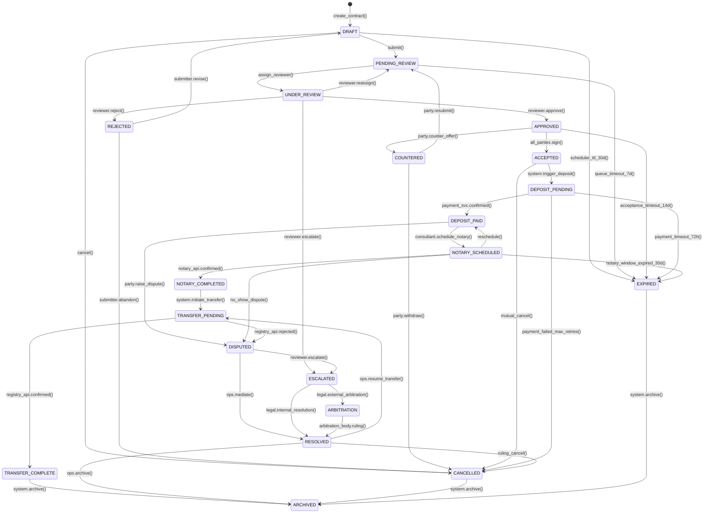
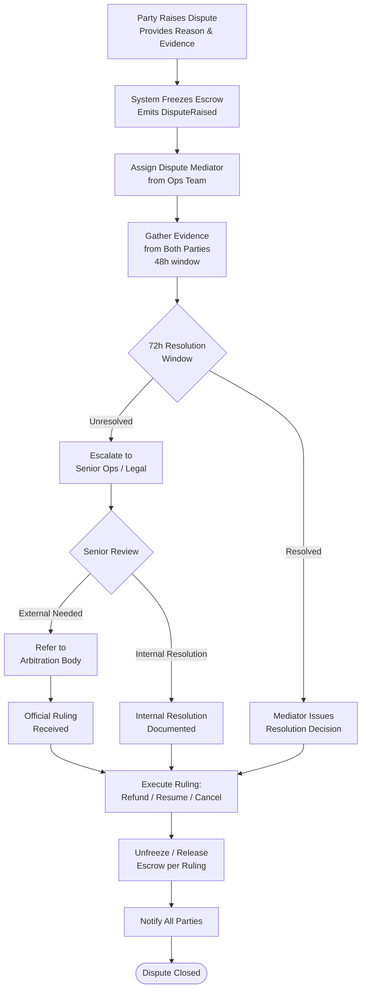
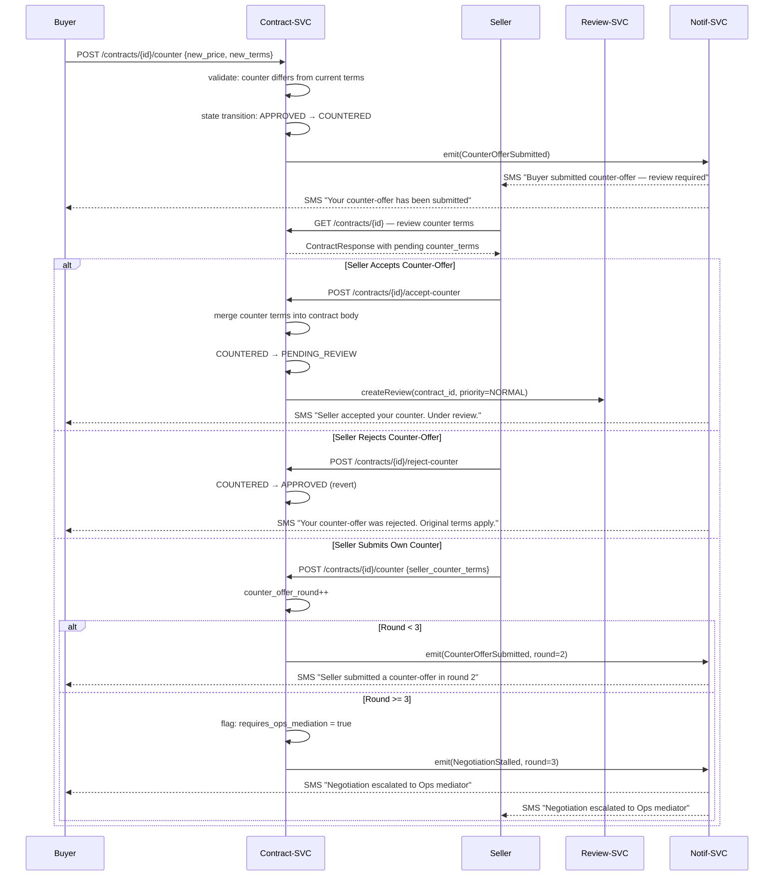

# Contracts Domain Specification — Amline v5.0

| Attribute | Value |
|-----------|-------|
| **Version** | v5.0 |
| **Date** | 2026-04-15 |
| **Status** | Active |
| **Domain** | Contract |
| **Service** | `contract-svc` |
| **Owner** | Contract Domain Team |

---

## Table of Contents

1. [Domain Overview](#1-domain-overview)
2. [Contract Sub-Types](#2-contract-sub-types)
3. [State Machine (All 20+ States)](#3-state-machine)
4. [State Transition Table](#4-state-transition-table)
5. [Validation Rules per Transition](#5-validation-rules-per-transition)
6. [Contract DTOs (JSON Schemas)](#6-contract-dtos)
7. [Business Rules](#7-business-rules)
8. [Dispute Handling Flow](#8-dispute-handling-flow)
9. [Counter-Offer Flow](#9-counter-offer-flow)
10. [Contract Type Comparison Table](#10-contract-type-comparison-table)
11. [Database Schema (PostgreSQL DDL)](#11-database-schema)
12. [Service Layer API](#12-service-layer-api)
13. [Cross-References](#13-cross-references)

---

## 1. Domain Overview

The **Contract Domain** is the central orchestration hub of the Amline platform. It models the full lifecycle of a real estate transaction agreement between a buyer (خریدار) and a seller (فروشنده), mediated by a licensed real estate consultant (مشاور) in Iran.

### 1.1 Responsibilities

- Create, store, and manage real estate contracts in all supported sub-types.
- Drive the contract state machine through well-defined transitions with actor-based authorization.
- Emit domain events to downstream services (Payment, Review, Tracking, Notification).
- Maintain an immutable event log for every state change and party action.
- Enforce validation rules, KYC requirements, and regulatory constraints.
- Coordinate with the Review-Ops domain for human-in-the-loop approvals.
- Coordinate with the Payment domain for deposit, escrow, and settlement triggers.
- Coordinate with the Tracking domain for tracking code issuance.
- Coordinate with the Notary API for appointment scheduling.

### 1.2 Bounded Context

The Contract domain **owns**:
- `contracts` table and all child tables (`contract_parties`, `contract_documents`, `contract_events`).
- Contract business logic and validation rules.
- State machine definition and transition authorization.

The Contract domain **does not own**:
- Payment processing (delegated to Payment domain).
- Human review queue management (delegated to Review-Ops domain).
- Tracking code generation and registry (delegated to Tracking domain).
- User identity and KYC status (read from Auth domain via sync API).

---

## 2. Contract Sub-Types

### 2.1 بیع‌نامه (Pre-Sale Agreement)

A **بیع‌نامه** (literally "sale letter") is a commitment between a buyer and seller to complete a property sale at a future date. It is used when the property is not yet ready for final transfer (e.g., under construction, pending legal clearance).

**Key characteristics:**
- Typically 10–30% deposit (بیعانه) paid upfront.
- Penalty clauses (خسارت) defined for breach by either party.
- Governed by Iranian Civil Code Articles 338–395.
- Final sale must be completed at a notary office (دفترخانه).
- Tracking code is issued when the pre-sale agreement is registered.

### 2.2 قرارداد فروش (Sale Contract)

A **قرارداد فروش** is the final agreement that transfers property ownership immediately (or on a specified date) from seller to buyer. This is the most common contract type.

**Key characteristics:**
- Full payment or mortgage-backed payment.
- Immediate title transfer at notary office.
- Mandatory tracking code (کد رهگیری) required by law.
- Integration with سازمان ثبت اسناد و املاک (Property Registry Organization).

### 2.3 اجاره‌به‌شرط‌تملیک (Lease-to-Own)

A **اجاره‌به‌شرط‌تملیک** is a hybrid lease/purchase agreement. The tenant pays monthly rent, and after a defined period, gains the option (or obligation) to purchase the property.

**Key characteristics:**
- Monthly payment schedule tracked by the platform.
- Purchase option exercisable after lease term.
- Ownership does not transfer until final purchase payment.
- Complex commission structure (split across lease period).

---

## 3. State Machine

### 3.1 State Definitions

| State | Code | Terminal? | Description |
|-------|------|-----------|-------------|
| Draft | `DRAFT` | No | Contract is being composed. Editable. |
| Pending Review | `PENDING_REVIEW` | No | Submitted to ops review queue. |
| Under Review | `UNDER_REVIEW` | No | Actively being reviewed. |
| Approved | `APPROVED` | No | Review passed. Awaiting party acceptance. |
| Rejected | `REJECTED` | No | Review failed. Returned with comments. |
| Countered | `COUNTERED` | No | Counter-offer submitted by a party. |
| Accepted | `ACCEPTED` | No | All parties signed/accepted. |
| Deposit Pending | `DEPOSIT_PENDING` | No | Awaiting deposit payment. |
| Deposit Paid | `DEPOSIT_PAID` | No | Deposit confirmed in escrow. |
| Notary Scheduled | `NOTARY_SCHEDULED` | No | Notary appointment booked. |
| Notary Completed | `NOTARY_COMPLETED` | No | Notarization completed. |
| Transfer Pending | `TRANSFER_PENDING` | No | Registry processing transfer. |
| Transfer Complete | `TRANSFER_COMPLETE` | No | Ownership transferred. |
| Cancelled | `CANCELLED` | No | Contract voided. Awaiting archive. |
| Disputed | `DISPUTED` | No | Formal dispute raised. |
| Escalated | `ESCALATED` | No | Dispute escalated to senior/legal. |
| Arbitration | `ARBITRATION` | No | Handed to external arbitration. |
| Resolved | `RESOLVED` | No | Dispute resolved. Path determined. |
| Expired | `EXPIRED` | No | Validity window exceeded. |
| Archived | `ARCHIVED` | Yes | Final state. Retained for audit. |

### 3.2 State Diagram



---

## 4. State Transition Table

| # | From State | To State | Trigger | Actor | Conditions | Side Effects |
|---|-----------|---------|---------|-------|-----------|-------------|
| 1 | `DRAFT` | `PENDING_REVIEW` | `submit()` | Consultant / Buyer / Seller | All required fields present; min 1 document uploaded; parties identified | Emit `ContractSubmittedForReview`; create Review record |
| 2 | `DRAFT` | `CANCELLED` | `cancel()` | Any party | Contract in DRAFT | Emit `ContractCancelled`; soft-delete documents |
| 3 | `DRAFT` | `EXPIRED` | Scheduler | System | 30 days since creation without submission | Emit `ContractExpired`; schedule archival |
| 4 | `PENDING_REVIEW` | `UNDER_REVIEW` | `assign_reviewer()` | Review-SVC | Available reviewer found | Update review.assigned_reviewer; start SLA timer |
| 5 | `PENDING_REVIEW` | `EXPIRED` | Scheduler | System | 7 days in queue without assignment | Emit `ContractExpired`; alert ops |
| 6 | `UNDER_REVIEW` | `APPROVED` | `approve()` | Reviewer | All documents verified; no blocking issues | Emit `ReviewApproved`; notify parties |
| 7 | `UNDER_REVIEW` | `REJECTED` | `reject()` | Reviewer | Rejection reason provided | Emit `ReviewRejected`; record reason; notify submitter |
| 8 | `UNDER_REVIEW` | `ESCALATED` | `escalate()` | Reviewer | Escalation reason provided | Emit `ReviewEscalated`; assign senior reviewer |
| 9 | `UNDER_REVIEW` | `PENDING_REVIEW` | `reassign()` | Reviewer / Admin | Reassignment reason provided | Return to queue; select different reviewer |
| 10 | `REJECTED` | `DRAFT` | `revise()` | Submitter | Within 14 days of rejection | Preserve rejection notes; allow edits |
| 11 | `REJECTED` | `CANCELLED` | `abandon()` | Submitter | Any time after rejection | Emit `ContractCancelled` |
| 12 | `APPROVED` | `COUNTERED` | `counter_offer()` | Buyer or Seller | Counter terms differ from current | Emit `CounterOfferSubmitted`; notify other party |
| 13 | `APPROVED` | `ACCEPTED` | `sign()` / `accept()` | All parties | All parties must have signed; KYC verified | Emit `ContractAccepted`; trigger deposit open |
| 14 | `APPROVED` | `EXPIRED` | Scheduler | System | 14 days without all-party acceptance | Emit `ContractExpired` |
| 15 | `COUNTERED` | `PENDING_REVIEW` | `resubmit()` | Any party | Counter terms validated | Create new Review; emit `ContractResubmitted` |
| 16 | `COUNTERED` | `CANCELLED` | `withdraw()` | Any party | Withdrawal reason provided | Emit `ContractCancelled` |
| 17 | `ACCEPTED` | `DEPOSIT_PENDING` | System (auto) | System | Contract state = ACCEPTED | Open escrow account; start payment timer |
| 18 | `ACCEPTED` | `CANCELLED` | `mutual_cancel()` | Both parties | Both parties consent to cancel | Emit `ContractCancelled`; no penalty |
| 19 | `DEPOSIT_PENDING` | `DEPOSIT_PAID` | Payment webhook | Payment-SVC | Gateway confirmed; amount matches | Emit `DepositPaid`; update escrow status |
| 20 | `DEPOSIT_PENDING` | `CANCELLED` | System | System | 3 failed payment attempts | Emit `ContractCancelled`; close escrow |
| 21 | `DEPOSIT_PAID` | `NOTARY_SCHEDULED` | `schedule_notary()` | Consultant / Ops | Valid notary office; date in future | Emit `NotaryScheduled`; notify parties |
| 22 | `DEPOSIT_PAID` | `DISPUTED` | `raise_dispute()` | Buyer or Seller | Dispute reason provided | Emit `DisputeRaised`; freeze escrow |
| 23 | `NOTARY_SCHEDULED` | `NOTARY_COMPLETED` | Notary webhook | Notary API | Official confirmation received | Emit `NotaryCompleted`; trigger tracking code |
| 24 | `NOTARY_COMPLETED` | `TRANSFER_PENDING` | System (auto) | System | Tracking code issued | Emit `TransferPending` |
| 25 | `TRANSFER_PENDING` | `TRANSFER_COMPLETE` | Registry webhook | Registry API | Official confirmation | Emit `TransferComplete`; release escrow |
| 26 | `DISPUTED` | `ESCALATED` | `escalate()` | Reviewer / Admin | 72h unresolved | Emit `DisputeEscalated`; freeze escrow |
| 27 | `ESCALATED` | `ARBITRATION` | `external_arbitration()` | Legal Team | Internal resolution failed | Notify arbitration body |
| 28 | `RESOLVED` | `TRANSFER_PENDING` | `resume_transfer()` | Ops Admin | Ruling = proceed | Re-initiate transfer |
| 29 | `RESOLVED` | `CANCELLED` | `ruling_cancel()` | Ops Admin | Ruling = cancel | Process refunds per ruling |
| 30 | `TRANSFER_COMPLETE` | `ARCHIVED` | System (auto) | System | Escrow fully released | Emit `ContractArchived` |

---

## 5. Validation Rules per Transition

### 5.1 DRAFT → PENDING_REVIEW Validations

```python
# Pseudocode — see contract_service.py for full implementation
SUBMISSION_RULES = [
    ("PARTIES_IDENTIFIED",    lambda c: bool(c.buyer_id and c.seller_id)),
    ("PROPERTY_SET",          lambda c: c.property_id is not None),
    ("PRICE_POSITIVE",        lambda c: c.property_price > 0),
    ("EFFECTIVE_DATE_SET",    lambda c: c.effective_date is not None),
    ("EFFECTIVE_DATE_FUTURE", lambda c: c.effective_date >= date.today()),
    ("MIN_ONE_DOCUMENT",      lambda c: len(c.documents) >= 1),
    ("CONTRACT_TYPE_VALID",   lambda c: c.type in {"PRESALE", "SALE", "LEASE_TO_OWN"}),
    ("NO_ACTIVE_DUPLICATE",   lambda c: not repo.has_active_contract(c.property_id)),
]
```

### 5.2 APPROVED → ACCEPTED Validations

```python
ACCEPTANCE_RULES = [
    ("ALL_PARTIES_KYC",         lambda c: all(p.kyc_verified for p in c.parties)),
    ("ALL_PARTIES_SIGNED",      lambda c: all(p.signature_status == "SIGNED" for p in c.parties)),
    ("WITHIN_ACCEPT_WINDOW",    lambda c: date.today() <= c.approved_at.date() + timedelta(days=14)),
]
```

### 5.3 DEPOSIT_PAID → NOTARY_SCHEDULED Validations

```python
NOTARY_SCHEDULE_RULES = [
    ("NOTARY_OFFICE_VALID",  lambda req: notary_api.office_exists(req.notary_office_id)),
    ("DATE_IN_FUTURE",       lambda req: req.scheduled_date > datetime.now(tz=TEHRAN_TZ)),
    ("DATE_AFTER_DEPOSIT",   lambda c, req: req.scheduled_date > c.deposit_paid_at),
    ("ACTOR_AUTHORIZED",     lambda actor: actor.role in {"CONSULTANT", "OPS_ADMIN"}),
]
```

### 5.4 void / cancel post-DEPOSIT_PAID Validations

```python
CANCEL_POST_DEPOSIT_RULES = [
    ("BOTH_PARTIES_CONSENT",  lambda c, req: req.consenting_party_ids == {c.buyer_id, c.seller_id}),
    ("REASON_PROVIDED",       lambda req: bool(req.reason and len(req.reason) >= 20)),
    ("NO_ACTIVE_ARBITRATION", lambda c: c.state != "ARBITRATION"),
]
```

---

## 6. Contract DTOs

### 6.1 ContractCreateRequest (JSON Schema)

```json
{
  "$schema": "https://json-schema.org/draft/2020-12/schema",
  "$id": "https://api.amline.ir/schemas/ContractCreateRequest.json",
  "title": "ContractCreateRequest",
  "type": "object",
  "required": ["type", "property_id", "buyer_id", "seller_id", "property_price", "currency", "effective_date"],
  "properties": {
    "type": { "type": "string", "enum": ["PRESALE", "SALE", "LEASE_TO_OWN"] },
    "property_id": { "type": "string", "format": "uuid" },
    "buyer_id": { "type": "string", "format": "uuid" },
    "seller_id": { "type": "string", "format": "uuid" },
    "consultant_id": { "type": "string", "format": "uuid" },
    "property_price": { "type": "integer", "minimum": 1 },
    "currency": { "type": "string", "enum": ["IRR"], "default": "IRR" },
    "deposit_percentage": { "type": "number", "minimum": 0.10, "maximum": 0.30 },
    "effective_date": { "type": "string", "format": "date" },
    "expiry_date": { "type": "string", "format": "date" },
    "terms": {
      "type": "object",
      "properties": {
        "penalty_clause": { "type": "string" },
        "payment_schedule": { "type": "array" },
        "special_conditions": { "type": "string" }
      }
    },
    "metadata": { "type": "object" }
  }
}
```

### 6.2 ContractUpdateRequest (JSON Schema)

```json
{
  "$schema": "https://json-schema.org/draft/2020-12/schema",
  "$id": "https://api.amline.ir/schemas/ContractUpdateRequest.json",
  "title": "ContractUpdateRequest",
  "description": "Only allowed in DRAFT state. buyer_id and seller_id are immutable.",
  "type": "object",
  "properties": {
    "property_price":      { "type": "integer", "minimum": 1 },
    "effective_date":      { "type": "string", "format": "date" },
    "expiry_date":         { "type": "string", "format": "date" },
    "deposit_percentage":  { "type": "number", "minimum": 0.10, "maximum": 0.30 },
    "terms":               { "type": "object" },
    "metadata":            { "type": "object" }
  },
  "additionalProperties": false
}
```

### 6.3 ContractResponse (JSON Schema)

```json
{
  "$schema": "https://json-schema.org/draft/2020-12/schema",
  "$id": "https://api.amline.ir/schemas/ContractResponse.json",
  "title": "ContractResponse",
  "type": "object",
  "properties": {
    "id":               { "type": "string", "format": "uuid" },
    "contract_number":  { "type": "string", "example": "CTR-2026-001234" },
    "type":             { "type": "string", "enum": ["PRESALE", "SALE", "LEASE_TO_OWN"] },
    "state":            { "type": "string" },
    "buyer":            { "$ref": "#/$defs/PartyResponse" },
    "seller":           { "$ref": "#/$defs/PartyResponse" },
    "consultant_id":    { "type": "string", "format": "uuid" },
    "property_id":      { "type": "string", "format": "uuid" },
    "property_price":   { "type": "integer" },
    "deposit_amount":   { "type": "integer" },
    "currency":         { "type": "string" },
    "effective_date":   { "type": "string", "format": "date" },
    "expiry_date":      { "type": "string", "format": "date" },
    "terms":            { "type": "object" },
    "documents":        { "type": "array", "items": { "$ref": "#/$defs/DocumentResponse" } },
    "tracking_code":    { "type": "string", "nullable": true },
    "created_at":       { "type": "string", "format": "date-time" },
    "updated_at":       { "type": "string", "format": "date-time" },
    "_links": {
      "type": "object",
      "properties": {
        "self":    { "type": "string", "format": "uri" },
        "events":  { "type": "string", "format": "uri" },
        "payment": { "type": "string", "format": "uri" }
      }
    }
  },
  "$defs": {
    "PartyResponse": {
      "type": "object",
      "properties": {
        "user_id":          { "type": "string" },
        "full_name":        { "type": "string" },
        "national_id":      { "type": "string" },
        "kyc_verified":     { "type": "boolean" },
        "signature_status": { "type": "string", "enum": ["PENDING", "SIGNED", "DECLINED"] },
        "signed_at":        { "type": "string", "format": "date-time", "nullable": true }
      }
    },
    "DocumentResponse": {
      "type": "object",
      "properties": {
        "id":            { "type": "string" },
        "document_type": { "type": "string" },
        "file_name":     { "type": "string" },
        "is_verified":   { "type": "boolean" },
        "uploaded_at":   { "type": "string", "format": "date-time" }
      }
    }
  }
}
```

---

## 7. Business Rules

### 7.1 Contract Creation Rules

- A **property** can have at most **one active contract** at any time (states other than CANCELLED, EXPIRED, ARCHIVED).
- A **buyer** can have at most **10 active contracts** simultaneously (fraud prevention).
- A **seller** can have at most **5 active contracts** simultaneously.
- Contract `property_price` must be within ±50% of the property last assessed value (if available).
- `effective_date` must be in the future. `expiry_date` must be greater than `effective_date`.
- For PRESALE contracts, `expiry_date` must be at least 30 days from today.

### 7.2 Contract Modification Rules

- Only contracts in `DRAFT` state may be modified via `PUT /contracts/{id}`.
- After `PENDING_REVIEW`, modifications require returning to `DRAFT` via `reject()` then `revise()`.
- Changing `property_price` by more than 20% triggers automatic priority upgrade to HIGH review.
- `buyer_id` and `seller_id` cannot be changed after `PENDING_REVIEW`.

### 7.3 Cancellation Rules

| Scenario | Penalty | Refund to Buyer |
|----------|---------|----------------|
| Mutual cancellation in ACCEPTED state | None | 100% of deposit |
| Buyer unilateral cancel after DEPOSIT_PAID | Buyer forfeits deposit % per terms | Remaining amount |
| Seller unilateral cancel after DEPOSIT_PAID | Seller pays 2x deposit to buyer | 100% + penalty |
| Cancellation due to fraud detection | No penalty; investigation initiated | 100% held pending |
| Cancellation by arbitration ruling | Per ruling (1x to 3x deposit) | Per ruling |

### 7.4 Counter-Offer Rules

- Only one active counter-offer allowed at a time.
- Counter-offer must differ in at least one material term (price, date, or conditions).
- Maximum **3 rounds** of counter-offers before mandatory human intervention.
- Each counter-offer resets the acceptance timer (14 days from new approval).

---

## 8. Dispute Handling Flow



### 8.1 Evidence Types Accepted

| Evidence Type | Format | Max Size |
|--------------|--------|---------|
| Property photographs | JPEG, PNG | 10 MB |
| Payment receipts | PDF, JPEG | 5 MB |
| Bank statements | PDF | 10 MB |
| Message exports (WhatsApp/SMS) | PDF, TXT | 5 MB |
| Signed addendum documents | PDF | 20 MB |
| Official appraisal (کارشناسی رسمی) | PDF | 20 MB |
| Court orders or legal notices | PDF | 20 MB |

---

## 9. Counter-Offer Flow



---

## 10. Contract Type Comparison Table

| Feature | بیع‌نامه (Pre-Sale) | قرارداد فروش (Sale) | اجاره‌به‌شرط‌تملیک (Lease-to-Own) |
|---------|-------------------|---------------------|-----------------------------------|
| **Ownership Transfer** | At future completion date | At notary signing | After full lease term + final payment |
| **Deposit Required** | 10–30% upfront | 100% or mortgage | First month + security deposit |
| **Tracking Code** | At pre-sale registration | At notary completion | At contract signing |
| **Notary Required** | Yes (at final completion) | Yes (immediately) | Yes (at purchase option exercise) |
| **Cancellation Penalty** | 1x–2x deposit | Full contract value | Loss of paid rent |
| **Platform Commission** | 2% of total price | 2% of sale price | 2% of contract value |
| **Agent Commission** | 2–3% | 2–3% | 1.5–2.5% (reduced) |
| **VAT Applies** | 9% on commissions | 9% on commissions | 9% on commissions |
| **Duration** | Up to 2 years pending | Immediate | 1–5 years lease + purchase |
| **Counter-Offer Rounds** | Max 3 | Max 3 | Max 5 |
| **Dispute Window** | 180 days | 90 days | Per payment period |
| **State Count** | 20 states | 20 states | 22 states (+ lease states) |

---

## 11. Database Schema

### 11.1 Contracts Table

```sql
CREATE TABLE contracts (
    id                  UUID PRIMARY KEY DEFAULT gen_random_uuid(),
    contract_number     VARCHAR(30) NOT NULL UNIQUE,
    type                VARCHAR(20) NOT NULL CHECK (type IN ('PRESALE', 'SALE', 'LEASE_TO_OWN')),
    state               VARCHAR(30) NOT NULL DEFAULT 'DRAFT',
    buyer_party_id      UUID NOT NULL,
    seller_party_id     UUID NOT NULL,
    property_id         UUID NOT NULL,
    consultant_id       UUID,
    agency_id           UUID,
    property_price      BIGINT NOT NULL CHECK (property_price > 0),
    deposit_percentage  NUMERIC(5,4) CHECK (deposit_percentage BETWEEN 0.10 AND 0.30),
    deposit_amount      BIGINT,
    currency            CHAR(3) NOT NULL DEFAULT 'IRR',
    effective_date      DATE NOT NULL,
    expiry_date         DATE,
    terms               JSONB NOT NULL DEFAULT '{}',
    metadata            JSONB NOT NULL DEFAULT '{}',
    counter_offer_round SMALLINT NOT NULL DEFAULT 0,
    requires_ops_mediation BOOLEAN NOT NULL DEFAULT FALSE,
    approved_at         TIMESTAMP WITH TIME ZONE,
    accepted_at         TIMESTAMP WITH TIME ZONE,
    deposit_paid_at     TIMESTAMP WITH TIME ZONE,
    cancelled_at        TIMESTAMP WITH TIME ZONE,
    cancellation_reason TEXT,
    created_by          UUID NOT NULL,
    created_at          TIMESTAMP WITH TIME ZONE NOT NULL DEFAULT NOW(),
    updated_at          TIMESTAMP WITH TIME ZONE NOT NULL DEFAULT NOW(),
    version             INTEGER NOT NULL DEFAULT 1
);

CREATE INDEX idx_contracts_state         ON contracts(state);
CREATE INDEX idx_contracts_property      ON contracts(property_id);
CREATE INDEX idx_contracts_buyer         ON contracts(buyer_party_id);
CREATE INDEX idx_contracts_seller        ON contracts(seller_party_id);
CREATE INDEX idx_contracts_consultant    ON contracts(consultant_id);
CREATE INDEX idx_contracts_created_at   ON contracts(created_at DESC);
CREATE INDEX idx_contracts_state_date   ON contracts(state, created_at DESC);

-- Unique active contract per property
CREATE UNIQUE INDEX idx_contracts_active_property
    ON contracts(property_id)
    WHERE state NOT IN ('CANCELLED', 'EXPIRED', 'ARCHIVED');
```

### 11.2 Contract Parties Table

```sql
CREATE TABLE contract_parties (
    id               UUID PRIMARY KEY DEFAULT gen_random_uuid(),
    contract_id      UUID NOT NULL REFERENCES contracts(id) ON DELETE CASCADE,
    role             VARCHAR(20) NOT NULL CHECK (role IN ('BUYER', 'SELLER', 'GUARANTOR')),
    user_id          UUID NOT NULL,
    full_name        VARCHAR(200) NOT NULL,
    national_id      VARCHAR(20) NOT NULL,
    phone            VARCHAR(20),
    email            VARCHAR(255),
    address          TEXT,
    kyc_verified     BOOLEAN NOT NULL DEFAULT FALSE,
    kyc_verified_at  TIMESTAMP WITH TIME ZONE,
    signature_status VARCHAR(20) NOT NULL DEFAULT 'PENDING'
                     CHECK (signature_status IN ('PENDING', 'SIGNED', 'DECLINED')),
    signed_at        TIMESTAMP WITH TIME ZONE,
    ip_at_signing    INET,
    created_at       TIMESTAMP WITH TIME ZONE NOT NULL DEFAULT NOW(),
    UNIQUE (contract_id, role, user_id)
);

CREATE INDEX idx_contract_parties_contract ON contract_parties(contract_id);
CREATE INDEX idx_contract_parties_user     ON contract_parties(user_id);
```

### 11.3 Contract Documents Table

```sql
CREATE TABLE contract_documents (
    id               UUID PRIMARY KEY DEFAULT gen_random_uuid(),
    contract_id      UUID NOT NULL REFERENCES contracts(id) ON DELETE CASCADE,
    document_type    VARCHAR(50) NOT NULL,
    file_name        VARCHAR(500) NOT NULL,
    file_path        VARCHAR(1000) NOT NULL,
    storage_bucket   VARCHAR(100) NOT NULL DEFAULT 'contract-documents',
    mime_type        VARCHAR(100) NOT NULL,
    file_size_bytes  INTEGER NOT NULL CHECK (file_size_bytes > 0),
    checksum_sha256  CHAR(64) NOT NULL,
    is_verified      BOOLEAN NOT NULL DEFAULT FALSE,
    verified_by      UUID,
    verified_at      TIMESTAMP WITH TIME ZONE,
    uploaded_by      UUID NOT NULL,
    uploaded_at      TIMESTAMP WITH TIME ZONE NOT NULL DEFAULT NOW(),
    is_deleted       BOOLEAN NOT NULL DEFAULT FALSE,
    deleted_at       TIMESTAMP WITH TIME ZONE
);

CREATE INDEX idx_contract_docs_contract ON contract_documents(contract_id);
CREATE INDEX idx_contract_docs_type     ON contract_documents(document_type);
```

### 11.4 Contract Events Table

```sql
CREATE TABLE contract_events (
    id              UUID PRIMARY KEY DEFAULT gen_random_uuid(),
    contract_id     UUID NOT NULL REFERENCES contracts(id),
    sequence_num    BIGINT NOT NULL,
    event_type      VARCHAR(100) NOT NULL,
    from_state      VARCHAR(30),
    to_state        VARCHAR(30),
    actor_id        UUID,
    actor_role      VARCHAR(50),
    actor_ip        INET,
    payload         JSONB NOT NULL DEFAULT '{}',
    reason          TEXT,
    correlation_id  UUID,
    occurred_at     TIMESTAMP WITH TIME ZONE NOT NULL DEFAULT NOW()
) PARTITION BY RANGE (occurred_at);

CREATE TABLE contract_events_2026 PARTITION OF contract_events
    FOR VALUES FROM ('2026-01-01') TO ('2027-01-01');
CREATE TABLE contract_events_2027 PARTITION OF contract_events
    FOR VALUES FROM ('2027-01-01') TO ('2028-01-01');

CREATE INDEX idx_contract_events_contract ON contract_events(contract_id, sequence_num);
CREATE INDEX idx_contract_events_type     ON contract_events(event_type);
CREATE INDEX idx_contract_events_occurred ON contract_events(occurred_at DESC);
CREATE UNIQUE INDEX idx_contract_events_seq ON contract_events(contract_id, sequence_num);
```

---

## 12. Service Layer API

The following Python-style signatures document the primary service operations. Full implementations reside in `contract-svc/src/services/contract_service.py`.

```python
from uuid import UUID
from datetime import date, datetime, timedelta
from typing import Optional
from enum import Enum


class ContractType(str, Enum):
    PRESALE      = "PRESALE"
    SALE         = "SALE"
    LEASE_TO_OWN = "LEASE_TO_OWN"


class ContractState(str, Enum):
    DRAFT             = "DRAFT"
    PENDING_REVIEW    = "PENDING_REVIEW"
    UNDER_REVIEW      = "UNDER_REVIEW"
    APPROVED          = "APPROVED"
    REJECTED          = "REJECTED"
    COUNTERED         = "COUNTERED"
    ACCEPTED          = "ACCEPTED"
    DEPOSIT_PENDING   = "DEPOSIT_PENDING"
    DEPOSIT_PAID      = "DEPOSIT_PAID"
    NOTARY_SCHEDULED  = "NOTARY_SCHEDULED"
    NOTARY_COMPLETED  = "NOTARY_COMPLETED"
    TRANSFER_PENDING  = "TRANSFER_PENDING"
    TRANSFER_COMPLETE = "TRANSFER_COMPLETE"
    CANCELLED         = "CANCELLED"
    DISPUTED          = "DISPUTED"
    ESCALATED         = "ESCALATED"
    ARBITRATION       = "ARBITRATION"
    RESOLVED          = "RESOLVED"
    EXPIRED           = "EXPIRED"
    ARCHIVED          = "ARCHIVED"


class ContractService:
    # Core service for the Contract domain.

    async def create_contract(
        self, request: "ContractCreateRequest", actor: "Actor"
    ) -> "Contract":
        # Create a new contract in DRAFT state.
        # Raises DuplicateContractError if property already has active contract.
        await self._validate_no_active_contract(request.property_id)
        contract = await self.repo.create(request, actor)
        await self.event_bus.publish("ContractCreated", contract.to_event_payload())
        return contract

    async def submit_for_review(
        self, contract_id: UUID, actor: "Actor"
    ) -> "Contract":
        # Transition DRAFT → PENDING_REVIEW.
        # Validates all submission rules before transitioning.
        contract = await self.repo.get_for_update(contract_id)
        self._assert_state(contract, ContractState.DRAFT)
        self._assert_actor_authorized(contract, actor, ["CONSULTANT", "BUYER", "SELLER"])
        await self._run_submission_validations(contract)
        contract = await self.repo.transition(contract, ContractState.PENDING_REVIEW, actor)
        review = await self.review_client.create_review(
            contract_id, priority=self._compute_priority(contract)
        )
        await self.event_bus.publish("ContractSubmittedForReview", {
            "contract_id": str(contract_id),
            "review_id":   str(review.id),
            "priority":    review.priority,
        })
        return contract

    async def accept_contract(
        self, contract_id: UUID, party_user_id: UUID, actor: "Actor"
    ) -> "Contract":
        # Record a party acceptance / signature.
        # Transitions to ACCEPTED when all parties have signed.
        contract = await self.repo.get_for_update(contract_id)
        self._assert_state(contract, ContractState.APPROVED)
        party = contract.get_party(party_user_id)
        if not party:
            raise PartyNotFoundError(contract_id, party_user_id)
        if not party.kyc_verified:
            raise KYCNotVerifiedError(party_user_id)
        await self.repo.sign_party(party.id, actor.ip)
        if contract.all_parties_signed():
            contract = await self.repo.transition(contract, ContractState.ACCEPTED, actor)
            await self._trigger_deposit(contract)
            await self.event_bus.publish("ContractAccepted", contract.to_event_payload())
        return contract

    async def raise_dispute(
        self,
        contract_id: UUID,
        reason: str,
        evidence_ids: list[UUID],
        actor: "Actor"
    ) -> "Contract":
        # Raise a formal dispute. Freezes escrow immediately.
        # Allowed in: DEPOSIT_PAID, NOTARY_SCHEDULED, TRANSFER_PENDING.
        allowed = [
            ContractState.DEPOSIT_PAID,
            ContractState.NOTARY_SCHEDULED,
            ContractState.TRANSFER_PENDING,
        ]
        contract = await self.repo.get_for_update(contract_id)
        self._assert_state_in(contract, allowed)
        await self.payment_client.freeze_escrow(contract.escrow_id)
        contract = await self.repo.transition(
            contract, ContractState.DISPUTED, actor, reason=reason
        )
        await self.event_bus.publish("DisputeRaised", {
            "contract_id":     str(contract_id),
            "disputing_party": str(actor.user_id),
            "reason":          reason,
            "evidence_ids":    [str(e) for e in evidence_ids],
        })
        return contract

    async def schedule_notary(
        self,
        contract_id: UUID,
        notary_office_id: str,
        scheduled_date: datetime,
        actor: "Actor",
    ) -> "Contract":
        # Schedule notary appointment. DEPOSIT_PAID → NOTARY_SCHEDULED.
        contract = await self.repo.get_for_update(contract_id)
        self._assert_state(contract, ContractState.DEPOSIT_PAID)
        self._assert_actor_authorized(contract, actor, ["CONSULTANT", "OPS_ADMIN"])
        await self._validate_notary_schedule(contract, notary_office_id, scheduled_date)
        appt = await self.notary_client.create_appointment(
            contract_id, notary_office_id, scheduled_date
        )
        contract = await self.repo.transition(
            contract, ContractState.NOTARY_SCHEDULED, actor,
            payload={"appointment_ref": appt.ref, "scheduled_date": scheduled_date.isoformat()}
        )
        await self.event_bus.publish("NotaryScheduled", contract.to_event_payload())
        return contract

    async def handle_payment_confirmed(self, payment_id: UUID, contract_id: UUID) -> None:
        # Called by Payment-SVC event handler when PaymentCompleted received.
        contract = await self.repo.get_for_update(contract_id)
        if contract.state != ContractState.DEPOSIT_PENDING:
            return  # Idempotent — already processed
        await self.repo.transition(contract, ContractState.DEPOSIT_PAID, actor=None, payload={
            "payment_id": str(payment_id),
            "deposit_paid_at": datetime.utcnow().isoformat(),
        })
        await self.event_bus.publish("DepositPaid", {"contract_id": str(contract_id)})

    async def archive_contract(self, contract_id: UUID) -> "Contract":
        # Transition terminal states to ARCHIVED. Called by scheduler.
        contract = await self.repo.get_for_update(contract_id)
        terminal_pre_archive = [
            ContractState.CANCELLED,
            ContractState.EXPIRED,
            ContractState.TRANSFER_COMPLETE,
            ContractState.RESOLVED,
        ]
        self._assert_state_in(contract, terminal_pre_archive)
        contract = await self.repo.transition(contract, ContractState.ARCHIVED, actor=None)
        await self.event_bus.publish("ContractArchived", contract.to_event_payload())
        return contract
```

---

## 13. Cross-References

| Topic | Reference Document |
|-------|------------------|
| Payment and escrow management | [PAYMENTS-SPEC.md](./PAYMENTS-SPEC.md) |
| Review queue and SLA management | [REVIEW-OPS-SPEC.md](./REVIEW-OPS-SPEC.md) |
| Tracking code issuance and voiding | [TRACKING-SPEC.md](./TRACKING-SPEC.md) |
| System-wide architecture | [ENTERPRISE-MASTER.md](./ENTERPRISE-MASTER.md) |
| API endpoint catalog | [ENTERPRISE-MASTER.md — Appendix E](./ENTERPRISE-MASTER.md#appendix-e--api-endpoint-catalog) |
| Role permissions | [ENTERPRISE-MASTER.md — Appendix D](./ENTERPRISE-MASTER.md#appendix-d--role-permission-matrix) |
| Error codes | [ENTERPRISE-MASTER.md — Appendix F](./ENTERPRISE-MASTER.md#appendix-f--error-code-reference) |
