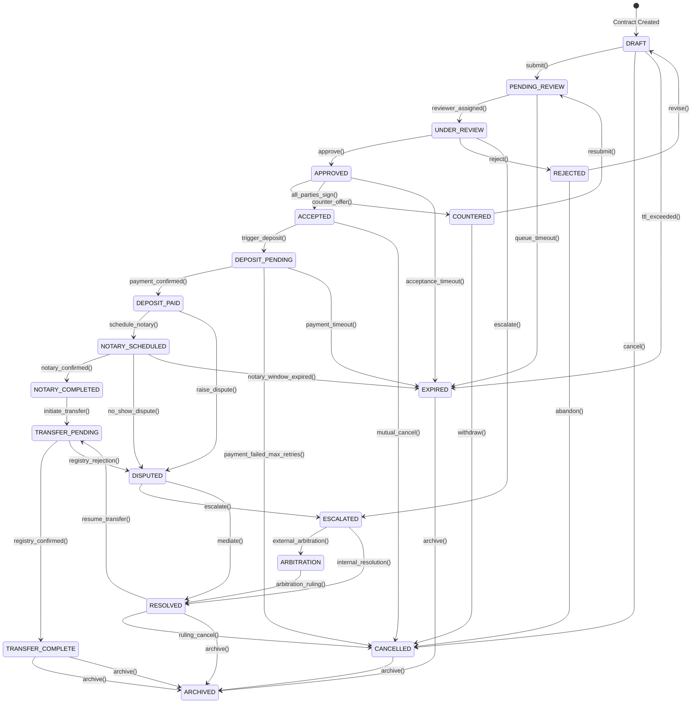
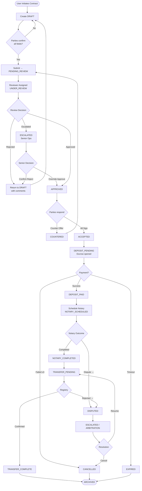
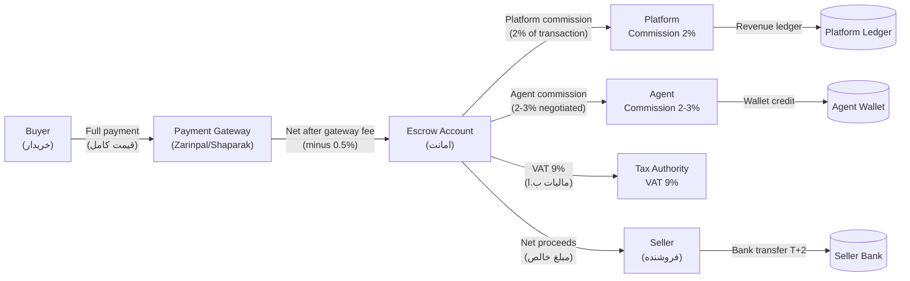
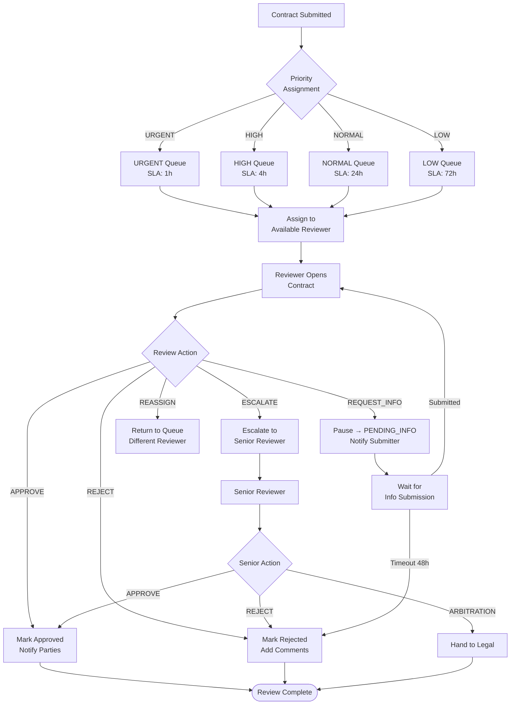
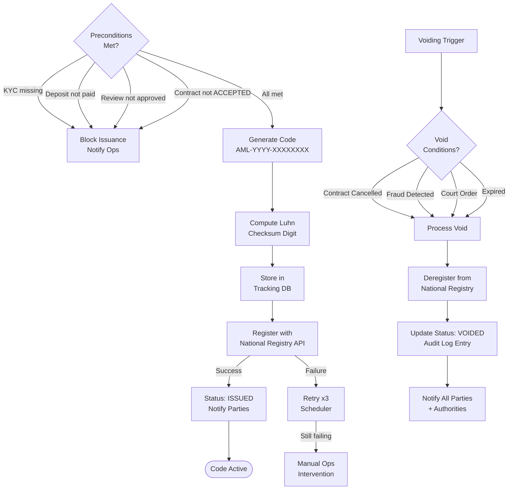
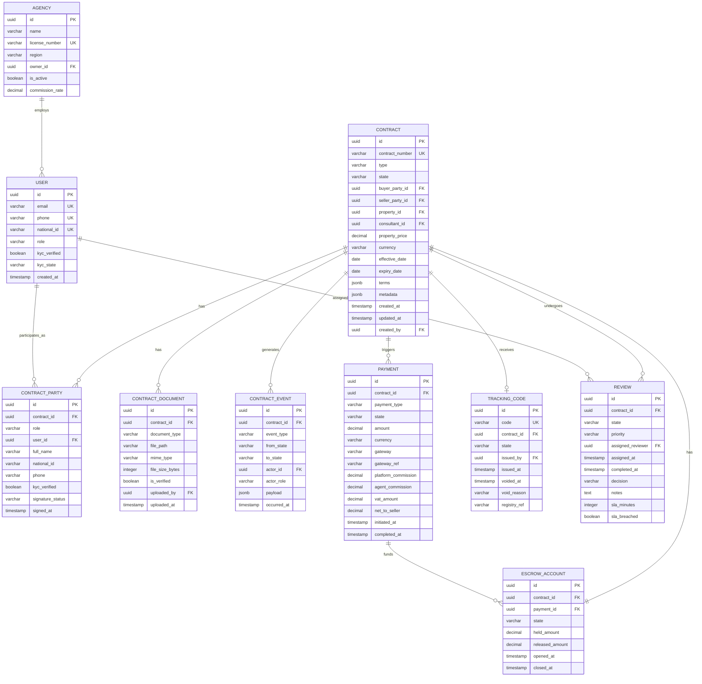
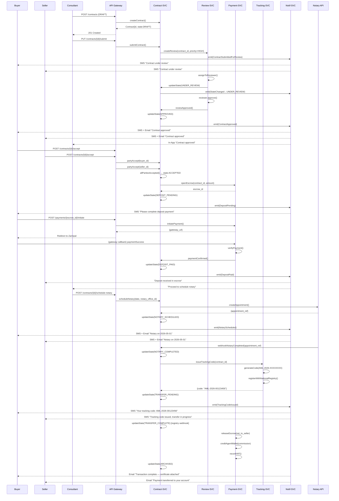
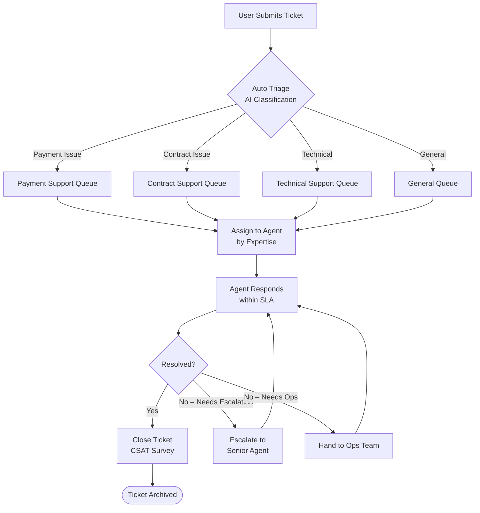

# Amline Enterprise Master v5.0

| Attribute | Value |
|-----------|-------|
| **Version** | v5.0 |
| **Date** | 2026-04-15 |
| **Status** | Active |
| **Classification** | Internal — Confidential |
| **Owner** | Amline Platform Engineering |
| **Review Cycle** | Quarterly |

---

## Table of Contents

1. [Executive Summary](#1-executive-summary)
2. [System Architecture Overview](#2-system-architecture-overview)
3. [7-Domain Architecture](#3-7-domain-architecture)
4. [Service Boundaries and Contracts](#4-service-boundaries-and-contracts)
5. [Contract State Machine](#5-contract-state-machine)
6. [Complete Contract Lifecycle Flow](#6-complete-contract-lifecycle-flow)
7. [Payment & Commission Flow](#7-payment--commission-flow)
8. [Review / Escalation / Ops Flow](#8-review--escalation--ops-flow)
9. [Tracking Code Issuance / Voiding Flow](#9-tracking-code-issuance--voiding-flow)
10. [Admin Panel Design](#10-admin-panel-design)
11. [Consultant Panel Design](#11-consultant-panel-design)
12. [End-User Panel Design](#12-end-user-panel-design)
13. [Deep Domain-Level ERD](#13-deep-domain-level-erd)
14. [Event-Driven Architecture](#14-event-driven-architecture)
15. [Notification Orchestration Rules](#15-notification-orchestration-rules)
16. [Fraud / Security / Audit Framework](#16-fraud--security--audit-framework)
17. [KPI / Analytics / Observability Metrics](#17-kpi--analytics--observability-metrics)
18. [NFR / SLA / Infrastructure Requirements](#18-nfr--sla--infrastructure-requirements)
19. [Execution Roadmap Summary](#19-execution-roadmap-summary)
20. [Complete Workflow Catalog](#20-complete-workflow-catalog)
21. [Sequence Diagram — Full Contract Scenario](#21-sequence-diagram--full-contract-scenario)
22. [Swimlane Diagram Description](#22-swimlane-diagram-description)
23. [Support Ticket Flow](#23-support-ticket-flow)
24. [Content / Magazine Flow](#24-content--magazine-flow)
25. [Aggregate Financial Flow](#25-aggregate-financial-flow)
26. [Appendix A — Contract State Transitions Table](#appendix-a--contract-state-transitions-table)
27. [Appendix B — Validation Rules Matrix](#appendix-b--validation-rules-matrix)
28. [Appendix C — Event Schema Definitions](#appendix-c--event-schema-definitions)
29. [Appendix D — Role Permission Matrix](#appendix-d--role-permission-matrix)
30. [Appendix E — API Endpoint Catalog](#appendix-e--api-endpoint-catalog)
31. [Appendix F — Error Code Reference](#appendix-f--error-code-reference)
32. [Appendix G — QA Test Scenarios](#appendix-g--qa-test-scenarios)
33. [Appendix H — SLA Definitions](#appendix-h--sla-definitions)
34. [Appendix I — Technology Stack](#appendix-i--technology-stack)
35. [Appendix J — Glossary](#appendix-j--glossary)
36. [Appendix K — Change Log](#appendix-k--change-log)
37. [References](#references)

---

## 1. Executive Summary

### 1.1 English

Amline Enterprise Master v5.0 is the definitive technical and operational blueprint for the Amline Real Estate Transaction Platform. It consolidates seven functional domains — Contract Management, Payment & Commission, Review Operations, Tracking Code Registry, Agency Management, Customer Support, and Marketplace — into a unified, event-driven microservices architecture deployed on a cloud-native Kubernetes infrastructure within Iran's regulatory environment.

The platform mediates every stage of a real estate transaction lifecycle: from initial property listing and consultant assignment, through contract drafting, multi-party review, notary scheduling, financial settlement, tracking code issuance, and final transfer of ownership. The system is designed to process **50,000+ active contracts simultaneously**, handle **10,000+ daily payment transactions**, and maintain **99.95% uptime SLA** across all critical services.

Key design pillars:

- **Domain Isolation**: Each of the seven domains exposes a well-defined API boundary and owns its data store (Database-per-Service pattern), communicating exclusively through the event bus (Apache Kafka).
- **Auditability**: Every state mutation, financial transaction, and user action is immutably appended to domain-specific audit ledgers stored in append-only PostgreSQL partitioned tables.
- **Regulatory Compliance**: VAT 9% (مالیات بر ارزش افزوده), escrow regulations, notary integration (دفترخانه), and property registry (سازمان ثبت اسناد) requirements are first-class concerns.
- **Security**: Zero-trust network policies, AES-256 encryption at rest, mTLS between services, OWASP Top-10 mitigations, and SOC-2 aligned logging.
- **Observability**: Prometheus + Grafana dashboards, distributed tracing via Jaeger, centralized logging via ELK stack, and SLA breach alerting via PagerDuty-compatible webhooks.

### 1.2 Persian (خلاصه اجرایی)

پلتفرم جامع مسکن آملاین نسخه ۵.۰، یک سامانه معاملاتی ملک از نوع میکروسرویس مبتنی بر رویداد است که هفت حوزه کارکردی را در یک معماری یکپارچه ادغام می‌کند: مدیریت قرارداد، پرداخت و کمیسیون، عملیات بررسی، رجیستری کد رهگیری، مدیریت آژانس، پشتیبانی مشتری، و بازار. این پلتفرم تمامی مراحل چرخه حیات یک معامله ملکی را پوشش می‌دهد — از آگهی اولیه ملک و انتساب مشاور، تا تنظیم قرارداد، بررسی چندجانبه، برنامه‌ریزی دفترخانه، تسویه مالی، صدور کد رهگیری، و انتقال نهایی مالکیت. هدف این سند، فراهم آوردن یک مرجع دقیق فنی و عملیاتی برای همه تیم‌های مهندسی، محصول، و عملیات است.

---

## 2. System Architecture Overview

### 2.1 High-Level Microservices Map

```mermaid
graph TB
    subgraph CLIENT_TIER["Client Tier"]
        WEBAPP["Web App (Next.js)"]
        MOBILE["Mobile App (React Native)"]
        ADMIN["Admin Panel (React)"]
        CONSULTANT["Consultant Portal (React)"]
    end

    subgraph API_GATEWAY["API Gateway Layer"]
        GW["Kong API Gateway"]
        AUTH["Auth Service (Keycloak)"]
        RATELIMIT["Rate Limiter"]
    end

    subgraph DOMAIN_SERVICES["Domain Services"]
        CONTRACT["Contract Service"]
        PAYMENT["Payment Service"]
        REVIEW["Review-Ops Service"]
        TRACKING["Tracking Service"]
        AGENCY["Agency Service"]
        SUPPORT["Support Service"]
        MARKETPLACE["Marketplace Service"]
    end

    subgraph PLATFORM["Platform Services"]
        NOTIF["Notification Service"]
        SEARCH["Search Service (Elasticsearch)"]
        STORAGE["Storage Service (MinIO)"]
        AUDIT["Audit Service"]
        SCHEDULER["Scheduler (Temporal)"]
    end

    subgraph DATA_TIER["Data Tier"]
        PG_CONTRACT[("PostgreSQL — Contract DB")]
        PG_PAYMENT[("PostgreSQL — Payment DB")]
        PG_REVIEW[("PostgreSQL — Review DB")]
        PG_TRACKING[("PostgreSQL — Tracking DB")]
        PG_AGENCY[("PostgreSQL — Agency DB")]
        PG_SUPPORT[("PostgreSQL — Support DB")]
        REDIS[("Redis Cluster")]
        ES[("Elasticsearch")]
    end

    subgraph MESSAGING["Messaging Layer"]
        KAFKA["Apache Kafka (3 brokers)"]
    end

    subgraph EXTERNAL["External Integrations"]
        ZARINPAL["Zarinpal Gateway"]
        SHAPARAK["Shaparak Gateway"]
        SMS["SMS Provider (Kavenegar)"]
        NOTARY["Notary Registry API"]
        PREG["Property Registry (سازمان ثبت)"]
    end

    WEBAPP & MOBILE & ADMIN & CONSULTANT --> GW
    GW --> AUTH
    GW --> RATELIMIT
    GW --> DOMAIN_SERVICES

    CONTRACT --> KAFKA
    PAYMENT --> KAFKA
    REVIEW --> KAFKA
    TRACKING --> KAFKA
    AGENCY --> KAFKA
    SUPPORT --> KAFKA
    MARKETPLACE --> KAFKA

    KAFKA --> NOTIF
    KAFKA --> AUDIT
    KAFKA --> SCHEDULER

    CONTRACT --> PG_CONTRACT
    PAYMENT --> PG_PAYMENT
    REVIEW --> PG_REVIEW
    TRACKING --> PG_TRACKING
    AGENCY --> PG_AGENCY
    SUPPORT --> PG_SUPPORT

    PAYMENT --> ZARINPAL
    PAYMENT --> SHAPARAK
    NOTIF --> SMS
    CONTRACT --> NOTARY
    TRACKING --> PREG

    MARKETPLACE --> ES
    SEARCH --> ES
    STORAGE --> NOTIF
```



### 2.2 Deployment Architecture

The platform runs on **Kubernetes 1.29+** with the following node pools:

| Pool | Instance Type | Count | Purpose |
|------|--------------|-------|---------|
| system | 4 vCPU / 8 GB | 3 | Cluster control, ingress |
| general | 8 vCPU / 16 GB | 6 | Domain services |
| data | 16 vCPU / 64 GB | 3 | PostgreSQL, Redis, Kafka |
| search | 8 vCPU / 32 GB | 3 | Elasticsearch |
| gpu | 8 vCPU / 32 GB + GPU | 2 | ML-based fraud detection |

All services are deployed with **HorizontalPodAutoscaler** (min=2, max=10 replicas), configured to scale on CPU > 70% and memory > 80%.

### 2.3 Network Topology

```
Internet → ArvanCloud CDN → WAF → Load Balancer → Kong Ingress
                                                        |
                                             ┌──────────┴──────────┐
                                        API Namespace          Admin Namespace
                                        (mTLS enforced)        (VPN-only access)
```

---

## 3. 7-Domain Architecture

### 3.1 Domain Map

| # | Domain | Service Name | Primary Responsibility | Key Entities |
|---|--------|-------------|----------------------|--------------|
| 1 | Contract | `contract-svc` | Lifecycle of real estate contracts | Contract, Party, Document, Event |
| 2 | Payment | `payment-svc` | Payments, commissions, escrow, settlements | Payment, Ledger, Escrow, Wallet |
| 3 | Review-Ops | `review-svc` | Human review queues, SLA, escalation | Review, Queue, Reviewer, Action |
| 4 | Tracking | `tracking-svc` | Tracking code issuance, registry, voiding | TrackingCode, CodeEvent |
| 5 | Agency | `agency-svc` | Agency profiles, consultants, listings | Agency, Consultant, Listing, Lead |
| 6 | Support | `support-svc` | Tickets, chat, knowledge base | Ticket, Message, Article |
| 7 | Marketplace | `marketplace-svc` | Property search, recommendations, ads | Property, Listing, Ad, Impression |

### 3.2 Domain Ownership Rules

- Each domain **owns its database schema** entirely. No cross-domain JOINs are permitted.
- Cross-domain data needs are satisfied by **event subscriptions** or **synchronous API calls** with explicit SLA contracts.
- Each domain publishes its **OpenAPI 3.1 specification** as the authoritative API contract.
- Schema changes follow **backward-compatible versioning** (additive-only) unless a major version is bumped with a coordinated deprecation window.

### 3.3 Contract Domain

The Contract domain is the **central orchestration hub** of the platform. It drives state machine transitions and emits events that downstream domains react to. A contract represents the formal agreement between a buyer and seller (or tenant and landlord) for a real estate property in Iran.

**Sub-types:**
- **بیع‌نامه (Pre-Sale / Promissory Sale Agreement):** Commitment to purchase a property not yet ready for final transfer.
- **قرارداد فروش (Sale Contract):** Final sale agreement with immediate transfer of ownership.
- **اجاره‌به‌شرط‌تملیک (Lease-to-Own):** Rental agreement with a purchase option clause.

### 3.4 Payment Domain

Responsible for all financial flows. Uses a **double-entry ledger** to maintain financial integrity. Integrates with Iranian payment gateways (Zarinpal, Shaparak) and manages escrow accounts regulated under Iranian banking law.

### 3.5 Review-Ops Domain

A human-in-the-loop review layer that validates contracts, verifies documents, and approves state transitions that carry legal or financial risk. Reviewers are organized in priority queues with automated SLA monitoring.

### 3.6 Tracking Domain

Issues official tracking codes (کد رهگیری) required by Iranian law for every real estate transaction. Coordinates with the national property registry system (سامانه ثبت معاملات ملکی).

### 3.7 Agency Domain

Manages real estate agencies and their consultants. Handles commission structures, performance metrics, territory assignments, and lead routing.

### 3.8 Support Domain

Multi-channel customer support: web chat, SMS callbacks, email tickets, and knowledge base. Integrates with CRM for customer history context.

### 3.9 Marketplace Domain

Public-facing property search, listing management, advertisement serving, and ML-powered recommendation engine.

---

## 4. Service Boundaries and Contracts

### 4.1 Inter-Service Communication Matrix

| Consumer → | Contract-SVC | Payment-SVC | Review-SVC | Tracking-SVC | Agency-SVC |
|------------|-------------|------------|-----------|-------------|-----------|
| **Contract-SVC** | — | Sync: create_payment | Sync: submit_review | Sync: issue_code | Sync: get_consultant |
| **Payment-SVC** | Event: PaymentCompleted | — | — | — | Sync: get_commission_rate |
| **Review-SVC** | Event: ReviewApproved | — | — | — | — |
| **Tracking-SVC** | Event: CodeIssued | — | — | — | — |
| **Notification-SVC** | Sub: all contract events | Sub: all payment events | Sub: review events | Sub: code events | — |
| **Audit-SVC** | Sub: all events | Sub: all events | Sub: all events | Sub: all events | Sub: all events |

### 4.2 API Contract Versioning Policy

- **URI versioning**: `/api/v{major}/...`
- **Minor changes**: Additive fields — backward compatible — no version bump.
- **Breaking changes**: New major version + 90-day deprecation window for old version.
- All breaking changes require a **Design Review Board (DRB) approval** and migration guide.

### 4.3 Kafka Topic Naming Convention

```
amline.{domain}.{entity}.{event_type}.v{version}

Examples:
  amline.contract.contract.state_changed.v1
  amline.payment.payment.completed.v1
  amline.review.review.approved.v2
  amline.tracking.code.issued.v1
```

---

## 5. Contract State Machine

### 5.1 State Definitions

| State | Code | Description | Allowed Actors |
|-------|------|-------------|----------------|
| Draft | `DRAFT` | Contract is being composed. Not yet submitted. | Buyer, Seller, Consultant |
| Pending Review | `PENDING_REVIEW` | Submitted for human review by Ops team. | System |
| Under Review | `UNDER_REVIEW` | Actively being reviewed by a reviewer. | Reviewer |
| Approved | `APPROVED` | Review passed; awaiting party acceptance. | Reviewer |
| Rejected | `REJECTED` | Review failed; returned to drafter with notes. | Reviewer |
| Countered | `COUNTERED` | One party submitted a counter-offer. | Buyer, Seller |
| Accepted | `ACCEPTED` | All parties have digitally signed/accepted. | Buyer, Seller |
| Deposit Pending | `DEPOSIT_PENDING` | Awaiting earnest money / deposit payment. | System |
| Deposit Paid | `DEPOSIT_PAID` | Deposit received and confirmed in escrow. | Payment-SVC |
| Notary Scheduled | `NOTARY_SCHEDULED` | Appointment at دفترخانه (notary office) is set. | Consultant, Ops |
| Notary Completed | `NOTARY_COMPLETED` | Notarization was performed successfully. | Notary Integration |
| Transfer Pending | `TRANSFER_PENDING` | Ownership transfer in progress at registry. | Registry Integration |
| Transfer Complete | `TRANSFER_COMPLETE` | Ownership formally transferred. | Registry Integration |
| Cancelled | `CANCELLED` | Contract voided before completion. | Buyer, Seller, Admin |
| Disputed | `DISPUTED` | One party raised a formal dispute. | Buyer, Seller |
| Escalated | `ESCALATED` | Dispute escalated to senior ops / legal. | Reviewer, Admin |
| Arbitration | `ARBITRATION` | Handed to external arbitration body. | Legal Team |
| Resolved | `RESOLVED` | Dispute resolved; contract path determined. | Legal Team, Admin |
| Expired | `EXPIRED` | Contract validity window passed without completion. | System (Scheduler) |
| Archived | `ARCHIVED` | Final terminal state; data retained for audit. | System |

### 5.2 State Diagram



---

## 6. Complete Contract Lifecycle Flow



---

## 7. Payment & Commission Flow



### 7.1 Commission Formula

```
transaction_amount = contract.property_price
gateway_fee       = transaction_amount × 0.005
gross_net         = transaction_amount - gateway_fee
platform_comm     = gross_net × 0.020
agent_comm        = gross_net × agent.commission_rate   # 0.020–0.030
vat_base          = platform_comm + agent_comm
vat               = vat_base × 0.09
net_to_seller     = gross_net - platform_comm - agent_comm - vat
```

### 7.2 Escrow Release Triggers

| Trigger Event | Action |
|--------------|--------|
| `NOTARY_COMPLETED` | Release agent commission to wallet |
| `TRANSFER_COMPLETE` | Release net proceeds to seller bank |
| `CANCELLED` (mutual) | Full refund to buyer within T+1 |
| `CANCELLED` (breach) | Partial refund per contract penalty clause |
| `DISPUTED` | Freeze all escrow; await resolution |
| `RESOLVED` → resume | Follow ruling-defined split |

---

## 8. Review / Escalation / Ops Flow



### 8.1 SLA Breach Escalation

| Threshold | Action |
|-----------|--------|
| SLA 25% elapsed | Yellow alert to reviewer |
| SLA 50% elapsed | Orange alert + supervisor notification |
| SLA 75% elapsed | Red alert + auto-reassign option |
| SLA 100% breached | Auto-escalate + KPI penalty recorded |
| SLA 150% (critical) | Auto-escalate to manager + PagerDuty alert |

---

## 9. Tracking Code Issuance / Voiding Flow



---

## 10. Admin Panel Design

### 10.1 Site Map

```
Admin Panel (/admin)
├── Dashboard
│   ├── KPI Overview (contracts today, revenue, active reviews)
│   ├── SLA Compliance Heat Map
│   ├── Live Transaction Feed
│   └── Alert Center
├── Contracts
│   ├── All Contracts (filterable by state, date, value, region)
│   ├── Contract Detail View
│   ├── State Override Tool (with audit reason)
│   └── Bulk Operations
├── Payments
│   ├── Transaction Log
│   ├── Escrow Dashboard
│   ├── Settlement Queue
│   ├── Refund Management
│   └── Financial Reports
├── Review Operations
│   ├── Queue Monitor
│   ├── Reviewer Assignments
│   ├── SLA Dashboard
│   └── Escalation Center
├── Tracking Codes
│   ├── Code Registry
│   ├── Issuance Log
│   ├── Voiding Center
│   └── Registry Sync Status
├── Agencies & Consultants
│   ├── Agency Registry
│   ├── Consultant Profiles
│   ├── Commission Management
│   └── Performance Reports
├── Users
│   ├── User Registry
│   ├── KYC Verification Queue
│   ├── Role Management
│   └── Session Audit
├── Support
│   ├── Ticket Dashboard
│   ├── Knowledge Base Editor
│   └── CSAT Reports
├── Fraud & Security
│   ├── Fraud Alerts
│   ├── IP Block List
│   ├── Anomaly Detection Feed
│   └── Audit Log Explorer
└── System
    ├── Service Health
    ├── Kafka Consumer Lag
    ├── Feature Flags
    └── Configuration
```

### 10.2 Key Admin Permissions

- **Super Admin**: Full CRUD on all resources including state overrides.
- **Finance Admin**: Payment, escrow, settlement, refund management.
- **Ops Admin**: Review queues, SLA management, escalation.
- **Compliance Admin**: Audit logs, fraud alerts, KYC queue — read-only plus approve/reject KYC.
- **Support Admin**: Support tickets and KB management.

---

## 11. Consultant Panel Design

### 11.1 Site Map

```
Consultant Portal (/consultant)
├── My Dashboard
│   ├── Active Contracts Summary
│   ├── Upcoming Notary Appointments
│   ├── Commission Earned (month/year)
│   └── Lead Pipeline
├── Leads
│   ├── New Leads Inbox
│   ├── Lead Detail & History
│   └── Lead Conversion Funnel
├── Contracts
│   ├── My Contracts (filterable)
│   ├── Draft New Contract
│   ├── Contract Detail & Timeline
│   ├── Document Upload
│   └── Counter-Offer Tool
├── Clients
│   ├── Buyer Profiles
│   ├── Seller Profiles
│   └── Communication Log
├── Commissions
│   ├── Earnings Summary
│   ├── Payment History
│   └── Wallet Balance
├── Calendar
│   ├── Notary Appointments
│   └── Showing Schedule
├── Documents
│   ├── Uploaded Documents
│   ├── Contract Templates
│   └── Required Checklist
└── Profile
    ├── Professional Info
    ├── Agency Association
    ├── Performance Stats
    └── License & Certifications
```

---

## 12. End-User Panel Design

### 12.1 Site Map

```
User Portal (/my)
├── My Contracts
│   ├── Active Contracts
│   ├── Completed Contracts
│   └── Contract Detail & Status Timeline
├── My Properties
│   ├── Listed Properties
│   ├── Saved Searches
│   └── Viewed Properties
├── Payments
│   ├── Payment History
│   ├── Pending Payments
│   └── Receipts & Invoices
├── Tracking Codes
│   ├── My Tracking Codes
│   └── Code Verification
├── Messages
│   ├── Inbox (consultant messages)
│   └── System Notifications
├── Support
│   ├── Open Tickets
│   ├── New Ticket
│   └── Knowledge Base
└── Profile
    ├── Personal Information
    ├── KYC Documents
    ├── Notification Preferences
    └── Security Settings
```

---

## 13. Deep Domain-Level ERD



---

## 14. Event-Driven Architecture

### 14.1 Event Catalog (12 Core Events)

| # | Event Name | Topic | Producer | Consumers | Payload Key Fields |
|---|-----------|-------|----------|-----------|-------------------|
| 1 | `ContractCreated` | `amline.contract.contract.created.v1` | contract-svc | audit, notif, marketplace | contract_id, type, buyer_id, seller_id |
| 2 | `ContractStateChanged` | `amline.contract.contract.state_changed.v1` | contract-svc | audit, notif, review, tracking, payment | contract_id, from_state, to_state, actor_id |
| 3 | `ContractSubmittedForReview` | `amline.contract.contract.submitted_review.v1` | contract-svc | review-svc, notif | contract_id, priority |
| 4 | `ReviewApproved` | `amline.review.review.approved.v1` | review-svc | contract-svc, notif, audit | review_id, contract_id, reviewer_id |
| 5 | `ReviewRejected` | `amline.review.review.rejected.v1` | review-svc | contract-svc, notif, audit | review_id, contract_id, reason |
| 6 | `PaymentInitiated` | `amline.payment.payment.initiated.v1` | payment-svc | notif, audit | payment_id, contract_id, amount |
| 7 | `PaymentCompleted` | `amline.payment.payment.completed.v1` | payment-svc | contract-svc, escrow-svc, notif, audit | payment_id, contract_id, gateway_ref |
| 8 | `PaymentFailed` | `amline.payment.payment.failed.v1` | payment-svc | contract-svc, notif, audit | payment_id, contract_id, failure_code |
| 9 | `EscrowReleased` | `amline.payment.escrow.released.v1` | payment-svc | audit, notif | escrow_id, contract_id, amount, recipient |
| 10 | `TrackingCodeIssued` | `amline.tracking.code.issued.v1` | tracking-svc | contract-svc, notif, audit | code, contract_id, issued_at |
| 11 | `TrackingCodeVoided` | `amline.tracking.code.voided.v1` | tracking-svc | contract-svc, notif, audit | code, contract_id, reason |
| 12 | `DisputeRaised` | `amline.contract.dispute.raised.v1` | contract-svc | review-svc, payment-svc, notif, audit | contract_id, disputing_party, reason |

### 14.2 Event Schema Standard

All events follow the **CloudEvents v1.0** specification:

```json
{
  "specversion": "1.0",
  "id": "uuid-v4",
  "source": "amline/contract-svc",
  "type": "com.amline.contract.state_changed.v1",
  "time": "2026-04-15T10:30:00Z",
  "datacontenttype": "application/json",
  "data": { ... }
}
```

### 14.3 Kafka Configuration

- **Replication factor**: 3
- **Min ISR**: 2
- **Retention**: 7 days (contract events: 90 days)
- **Partitions**: 12 (scaled per throughput)
- **Consumer groups**: one per consuming service

---

## 15. Notification Orchestration Rules

### 15.1 Notification Channels

| Channel | Provider | Use Case |
|---------|----------|---------|
| SMS | Kavenegar | Critical state changes, OTP, payment confirmations |
| Push Notification | Firebase FCM | All mobile app events |
| Email | Sendinblue | Documents, summaries, reports |
| In-App | WebSocket | Real-time status updates |
| WhatsApp | Official API | Consultant-client communications |

### 15.2 Notification Rules Table

| Event | Recipient | Channel | Template | Delay |
|-------|-----------|---------|---------|-------|
| ContractCreated | Buyer, Seller, Consultant | SMS + In-App | `contract_created` | Immediate |
| ContractStateChanged → APPROVED | Buyer, Seller | SMS + Email + In-App | `contract_approved` | Immediate |
| ContractStateChanged → REJECTED | Submitter, Consultant | SMS + In-App | `contract_rejected` | Immediate |
| ContractStateChanged → ACCEPTED | All parties | SMS + Email | `contract_accepted` | Immediate |
| PaymentInitiated | Buyer | SMS + In-App | `payment_initiated` | Immediate |
| PaymentCompleted | Buyer, Seller, Consultant | SMS + Email + In-App | `payment_success` | Immediate |
| PaymentFailed | Buyer | SMS + In-App | `payment_failed` | Immediate |
| TrackingCodeIssued | Buyer, Seller | SMS + Email | `code_issued` | Immediate |
| ReviewSLABreach | Reviewer, Manager | In-App + Email | `sla_breach` | At breach |
| DisputeRaised | All parties, Ops | SMS + In-App + Email | `dispute_raised` | Immediate |
| NotaryScheduled | Buyer, Seller, Consultant | SMS + Email + In-App | `notary_scheduled` | Immediate |

### 15.3 Notification Throttling

- Maximum 10 SMS per user per hour.
- Notification deduplication window: 60 seconds per event type per user.
- Critical notifications (payment, dispute) bypass throttling.

---

## 16. Fraud / Security / Audit Framework

### 16.1 Fraud Detection Signals

| Signal | Threshold | Action |
|--------|-----------|--------|
| Multiple contracts same property | > 1 active | Alert + Manual Review |
| Payment amount mismatch | > 5% of contract value | Block + Alert |
| IP geolocation anomaly | Distance > 500km from usual | Step-up auth |
| Rapid state change velocity | > 5 changes in 10 minutes | Rate limit + Alert |
| KYC document similarity score | < 85% with submitted ID | Reject + Ops Review |
| Failed payment retries | > 5 in 1 hour | Lock account + Alert |
| Duplicate national ID across accounts | Any duplicate | Merge investigation |
| Contract value outlier | > 3σ from regional median | Compliance review |

### 16.2 Security Controls

- **Authentication**: OAuth 2.0 / OIDC via Keycloak. MFA enforced for all admin and consultant roles.
- **Authorization**: RBAC with fine-grained resource permissions. JWT tokens with 15-minute expiry.
- **Encryption at Rest**: AES-256 for all PII fields; Vault-managed encryption keys.
- **Encryption in Transit**: TLS 1.3 externally; mTLS between services via Istio service mesh.
- **Input Validation**: JSON Schema validation at API gateway; parameterized queries only.
- **Secret Management**: HashiCorp Vault with automatic rotation every 90 days.
- **OWASP Top-10**: Mitigated via WAF rules (ModSecurity) + security headers.
- **Dependency Scanning**: Snyk integrated in CI/CD pipeline; zero critical CVEs policy.
- **SAST/DAST**: Semgrep (SAST) + OWASP ZAP (DAST) on every release branch.

### 16.3 Audit Log Requirements

Every mutating operation must produce an audit record:

```json
{
  "audit_id": "uuid",
  "timestamp": "ISO-8601",
  "actor_id": "uuid",
  "actor_role": "string",
  "actor_ip": "string",
  "action": "string",
  "resource_type": "string",
  "resource_id": "uuid",
  "before_state": {},
  "after_state": {},
  "reason": "string",
  "correlation_id": "uuid"
}
```

Audit logs are **immutable** (append-only table with no UPDATE/DELETE permissions), retained for **7 years** per Iranian commercial law requirements, and replicated to an off-site cold storage bucket.

---

## 17. KPI / Analytics / Observability Metrics

### 17.1 Business KPIs

| KPI | Target | Measurement Frequency |
|-----|--------|----------------------|
| Contract completion rate | > 78% | Daily |
| Average time to tracking code | < 5 business days | Weekly |
| Review SLA compliance | > 95% | Daily |
| Payment success rate (first attempt) | > 92% | Daily |
| Dispute rate | < 2% of contracts | Weekly |
| Average contract value | Monitor trend | Monthly |
| Consultant conversion rate | > 35% | Monthly |
| Customer satisfaction (CSAT) | > 4.2 / 5.0 | Monthly |
| Platform commission revenue | Target per quarter | Monthly |

### 17.2 Technical Metrics (Prometheus)

| Metric | Alert Threshold |
|--------|----------------|
| `http_request_duration_p99` | > 500ms |
| `http_error_rate_5xx` | > 1% |
| `kafka_consumer_lag` | > 10,000 messages |
| `db_connection_pool_wait` | > 100ms |
| `payment_gateway_error_rate` | > 2% |
| `pod_restart_count` | > 3 in 5min |
| `disk_usage` | > 80% |
| `memory_usage` | > 85% |

### 17.3 Distributed Tracing

All services instrument traces using **OpenTelemetry SDK**. Traces propagate via `traceparent` headers (W3C Trace Context). Jaeger stores 48-hour hot traces; cold traces archived to object storage.

### 17.4 Dashboards

- **Operations Dashboard**: Live contract funnel, queue depth, SLA status.
- **Financial Dashboard**: Daily revenue, escrow balances, settlement queue.
- **Engineering Dashboard**: Service latency, error rates, Kafka lag.
- **Business Intelligence**: Tableau-connected data warehouse (nightly ETL from PostgreSQL replicas).

---

## 18. NFR / SLA / Infrastructure Requirements

### 18.1 Non-Functional Requirements

| Category | Requirement |
|----------|-------------|
| **Availability** | 99.95% uptime for critical services (contract, payment, tracking) |
| **Availability** | 99.9% uptime for non-critical services (marketplace, support) |
| **Performance** | P50 API response < 100ms; P99 < 500ms |
| **Throughput** | 5,000 API requests/second peak |
| **Scalability** | Horizontal scale to 10x baseline in < 5 minutes |
| **Recovery** | RTO < 15 minutes; RPO < 5 minutes |
| **Data Retention** | Contracts: 10 years; Payments: 7 years; Logs: 2 years |
| **Compliance** | Iranian banking regulations, property law, GDPR-equivalent |
| **Localization** | Farsi (RTL) primary; full Persian calendar (Jalali) support |

### 18.2 Infrastructure Sizing

| Component | Specification | Count | Notes |
|-----------|--------------|-------|-------|
| PostgreSQL | 16 vCPU, 64 GB RAM, 2 TB NVMe | 3 | Primary + 2 read replicas per DB |
| Redis | 8 vCPU, 32 GB RAM | 6 | Cluster mode, 3 masters + 3 replicas |
| Kafka | 8 vCPU, 32 GB RAM, 5 TB disk | 3 | 3 brokers + ZooKeeper ensemble |
| Elasticsearch | 8 vCPU, 32 GB RAM | 3 | 3-node cluster |
| MinIO | 4 vCPU, 16 GB RAM, 20 TB | 4 | Erasure coding 2+2 |

---

## 19. Execution Roadmap Summary

| Phase | Name | Duration | Key Deliverables |
|-------|------|----------|-----------------|
| **Phase 1** | Foundation | Q2 2026 | Core contract CRUD, basic payment flow, admin panel MVP, user auth |
| **Phase 2** | Review & Compliance | Q3 2026 | Review-ops system, KYC integration, tracking code issuance, notary API |
| **Phase 3** | Financial Operations | Q4 2026 | Escrow management, commission split, VAT reporting, settlement automation |
| **Phase 4** | Scale & Intelligence | Q1 2027 | ML fraud detection, recommendation engine, analytics data warehouse |
| **Phase 5** | Marketplace Expansion | Q2 2027 | Full marketplace features, advertisement platform, multi-agency network |

---

## 20. Complete Workflow Catalog

| # | Workflow Category | Key Workflows |
|---|-------------------|---------------|
| 1 | **Contract Creation** | Draft, validate, submit, template-based creation |
| 2 | **Review Operations** | Assign, review, approve, reject, escalate, reassign |
| 3 | **Counter-Offer** | Submit counter, negotiate, accept/reject counter |
| 4 | **Payment Processing** | Initiate, gateway redirect, confirm, fail & retry |
| 5 | **Escrow Management** | Open escrow, hold, partial release, full release, freeze |
| 6 | **Commission Distribution** | Calculate, split, wallet credit, bank transfer |
| 7 | **Tracking Code** | Issue, register, activate, suspend, void |
| 8 | **Notary Coordination** | Schedule, confirm, reschedule, complete, cancel |
| 9 | **Dispute Resolution** | Raise, assign mediator, gather evidence, rule, resolve |
| 10 | **KYC Verification** | Submit, verify, approve, reject, re-request |
| 11 | **Agency Onboarding** | Register, verify license, activate, assign territory |
| 12 | **Consultant Management** | Onboard, assign agency, manage leads, track performance |
| 13 | **Support Tickets** | Create, assign, respond, escalate, resolve, close |
| 14 | **Fraud Investigation** | Detect, alert, freeze, investigate, clear/penalize |
| 15 | **Refund Processing** | Request, validate, approve, process gateway refund |
| 16 | **Content / Magazine** | Draft article, review, publish, update, archive |
| 17 | **Reporting & Reconciliation** | Daily reconciliation, VAT report, commission statement |

---

## 21. Sequence Diagram — Full Contract Scenario



---

## 22. Swimlane Diagram Description

The full contract lifecycle swimlane spans **six actors**: Buyer, Seller, Consultant, Review-Ops Reviewer, Payment System, and Registry/Notary.

**Lane 1 — Buyer**: Initiates inquiry → accepts contract → makes deposit payment → attends notary → receives tracking code → ownership confirmed.

**Lane 2 — Seller**: Reviews draft → accepts/counters contract → confirms deposit received → attends notary → receives net proceeds.

**Lane 3 — Consultant**: Creates draft → manages negotiations → schedules notary → coordinates document collection → monitors timeline.

**Lane 4 — Review-Ops Reviewer**: Receives queue assignment → reviews documents and contract terms → approves/rejects/escalates → records decision with reason.

**Lane 5 — Payment System**: Opens escrow → verifies gateway callback → holds funds → releases on trigger events → records ledger entries → initiates bank transfers.

**Lane 6 — Registry / Notary**: Receives appointment request → confirms notarization → triggers transfer → issues official ownership document → reports completion.

---

## 23. Support Ticket Flow



---

## 24. Content / Magazine Flow

```mermaid
flowchart LR
    AUTHOR[Content Author] --> DRAFT[Write Article\nDraft]
    DRAFT --> SUBMIT[Submit for\nEditorial Review]
    SUBMIT --> EDITOR{Editorial\nDecision}
    EDITOR --> |Needs revision| REVISE[Return with Comments]
    REVISE --> DRAFT
    EDITOR --> |Approved| SEO[SEO Optimization\nMeta + Tags]
    SEO --> SCHEDULE[Schedule Publication\nor Publish Now]
    SCHEDULE --> PUBLISH[Published on\nMagazine Section]
    PUBLISH --> ANALYTICS[Analytics\n(views, engagement)]
    ANALYTICS --> ARCHIVE[Archive after\n12 months]
```

---

## 25. Aggregate Financial Flow

### 25.1 Financial Scenarios Summary

| # | Scenario | Buyer Pays | Platform Gets | Agent Gets | Seller Gets | VAT |
|---|----------|-----------|--------------|-----------|------------|-----|
| 1 | Standard Sale | 100% | 2% | 2% | ~86.3% | 9% of commissions |
| 2 | Pre-Sale (بیع‌نامه) | 20% deposit | 2% of deposit | 2% of deposit | 17.3% | 9% of commissions |
| 3 | Lease-to-Own | Monthly + balloon | 2% of contract value | 2.5% | Periodic | 9% of commissions |
| 4 | Cancelled (mutual) | Refund 95% | 0.5% admin fee | 0% | 0% returned | Reversed |
| 5 | Cancelled (buyer breach) | Lose deposit % | 2% of penalty | 1% of penalty | Keeps penalty | On fees |
| 6 | Cancelled (seller breach) | Full refund + penalty | 2% | 1% | Pays penalty | On fees |
| 7 | Disputed → Buyer wins | Full refund | 1% mediation fee | 0% | Returns funds | On fees |
| 8 | Disputed → Seller wins | Forfeits deposit | 1% mediation fee | 1% | Keeps deposit | On fees |
| 9 | Arbitration ruling | Per ruling | 1.5% arbitration fee | Per ruling | Per ruling | Per ruling |

---

## Appendix A — Contract State Transitions Table

| # | From State | To State | Trigger | Actor | Conditions | Side Effects |
|---|-----------|---------|---------|-------|-----------|-------------|
| 1 | DRAFT | PENDING_REVIEW | submit() | Buyer/Seller/Consultant | All required fields complete; parties identified | Create review record; Emit ContractSubmittedForReview |
| 2 | DRAFT | CANCELLED | cancel() | Any party | Must be in DRAFT | Emit ContractCancelled; notify all |
| 3 | DRAFT | EXPIRED | scheduler | System | TTL 30 days elapsed | Archive after 90 days |
| 4 | PENDING_REVIEW | UNDER_REVIEW | reviewer_assigned | Review-SVC | Available reviewer found | Start SLA timer |
| 5 | UNDER_REVIEW | APPROVED | approve() | Reviewer | All documents verified; fields valid | Notify parties; reset SLA |
| 6 | UNDER_REVIEW | REJECTED | reject() | Reviewer | Must provide reason | Notify submitter with reason |
| 7 | UNDER_REVIEW | ESCALATED | escalate() | Reviewer | Must provide escalation reason | Assign senior reviewer |
| 8 | REJECTED | DRAFT | revise() | Submitter | Within 14 days of rejection | Preserve rejection notes |
| 9 | APPROVED | COUNTERED | counter_offer() | Buyer or Seller | Must specify counter terms | Notify other party |
| 10 | APPROVED | ACCEPTED | all_parties_sign() | Both parties | All parties must sign | Open escrow; trigger deposit |
| 11 | COUNTERED | PENDING_REVIEW | resubmit() | Any party | Counter terms filled | New review record created |
| 12 | ACCEPTED | DEPOSIT_PENDING | trigger_deposit() | System | Escrow account opened | Start payment timer |
| 13 | DEPOSIT_PENDING | DEPOSIT_PAID | payment_confirmed | Payment-SVC | Gateway confirmed success | Notify parties; start notary window |
| 14 | DEPOSIT_PAID | NOTARY_SCHEDULED | schedule_notary() | Consultant/Ops | Valid notary office; date in future | Emit NotaryScheduled |
| 15 | NOTARY_SCHEDULED | NOTARY_COMPLETED | notary_confirmed | Notary API | Webhook from notary system | Issue tracking code |
| 16 | NOTARY_COMPLETED | TRANSFER_PENDING | initiate_transfer() | System | Code issued; registry ready | Emit TransferPending |
| 17 | TRANSFER_PENDING | TRANSFER_COMPLETE | registry_confirmed | Registry API | Official registry confirmation | Release escrow to seller |
| 18 | DISPUTED | ESCALATED | escalate() | Reviewer/Admin | Dispute > 72h unresolved | Freeze all escrow |
| 19 | ESCALATED | ARBITRATION | external_arbitration() | Legal Team | Internal resolution failed | Notify arbitration body |
| 20 | RESOLVED | CANCELLED | ruling_cancel() | Legal/Admin | Arbitration ruling = cancel | Process refunds per ruling |

---

## Appendix B — Validation Rules Matrix

| # | Rule Name | Context | Condition | Error Code | Message |
|---|-----------|---------|-----------|-----------|---------|
| 1 | `PARTIES_IDENTIFIED` | submit() | buyer_id AND seller_id must be set | `VAL_001` | Both buyer and seller must be identified |
| 2 | `PROPERTY_PRICE_POSITIVE` | create/update | property_price > 0 | `VAL_002` | Contract price must be a positive value |
| 3 | `EFFECTIVE_DATE_FUTURE` | submit() | effective_date >= today | `VAL_003` | Effective date cannot be in the past |
| 4 | `KYC_VERIFIED_BEFORE_ACCEPT` | accept() | All parties kyc_verified = true | `VAL_004` | All parties must complete KYC before accepting |
| 5 | `DOCUMENT_REQUIRED` | submit() | Minimum 1 document uploaded | `VAL_005` | At least one supporting document is required |
| 6 | `UNIQUE_ACTIVE_CONTRACT` | create() | No active contract for same property | `VAL_006` | Property already has an active contract |
| 7 | `DEPOSIT_WITHIN_RANGE` | deposit | deposit_amount between 10%-30% of price | `VAL_007` | Deposit must be 10–30% of contract value |
| 8 | `NOTARY_DATE_AFTER_DEPOSIT` | schedule | notary_date > deposit_paid_at | `VAL_008` | Notary appointment must be after deposit is paid |
| 9 | `COUNTER_TERMS_DIFFER` | counter_offer | counter_terms != original_terms | `VAL_009` | Counter-offer must differ from current terms |
| 10 | `REVIEWER_ACTIVE` | assign | reviewer.is_active = true AND reviewer.available | `VAL_010` | Reviewer is not available |
| 11 | `PAYMENT_AMOUNT_MATCH` | confirm | payment.amount ~= escrow.held_amount (±1%) | `VAL_011` | Payment amount does not match escrow requirement |
| 12 | `VOID_REASON_REQUIRED` | void_code() | void_reason must be non-empty | `VAL_012` | A reason must be provided to void tracking code |

---

## Appendix C — Event Schema Definitions

### C.1 ContractStateChanged

```json
{
  "specversion": "1.0",
  "id": "550e8400-e29b-41d4-a716-446655440000",
  "source": "amline/contract-svc/prod",
  "type": "com.amline.contract.state_changed.v1",
  "time": "2026-04-15T10:30:00.000Z",
  "datacontenttype": "application/json",
  "data": {
    "contract_id": "a1b2c3d4-...",
    "contract_number": "CTR-2026-001234",
    "from_state": "PENDING_REVIEW",
    "to_state": "UNDER_REVIEW",
    "actor_id": "rev-uuid-...",
    "actor_role": "REVIEWER",
    "reason": null,
    "timestamp": "2026-04-15T10:30:00.000Z",
    "correlation_id": "corr-uuid-..."
  }
}
```

### C.2 PaymentCompleted

```json
{
  "specversion": "1.0",
  "id": "661f9511-f30c-52e5-b827-557766551111",
  "source": "amline/payment-svc/prod",
  "type": "com.amline.payment.payment.completed.v1",
  "time": "2026-04-15T11:00:00.000Z",
  "datacontenttype": "application/json",
  "data": {
    "payment_id": "pay-uuid-...",
    "contract_id": "a1b2c3d4-...",
    "amount": 5000000000,
    "currency": "IRR",
    "gateway": "ZARINPAL",
    "gateway_ref": "ZP-20260415-123456",
    "platform_commission": 100000000,
    "agent_commission": 100000000,
    "vat_amount": 18000000,
    "net_to_seller": 4782000000,
    "timestamp": "2026-04-15T11:00:00.000Z"
  }
}
```

### C.3 TrackingCodeIssued

```json
{
  "specversion": "1.0",
  "id": "772ga622-g41d-63f6-c938-668877662222",
  "source": "amline/tracking-svc/prod",
  "type": "com.amline.tracking.code.issued.v1",
  "time": "2026-04-20T09:00:00.000Z",
  "datacontenttype": "application/json",
  "data": {
    "code": "AML-2026-00123456",
    "contract_id": "a1b2c3d4-...",
    "contract_number": "CTR-2026-001234",
    "issued_by": "ops-uuid-...",
    "registry_ref": "REG-IR-20260420-789",
    "issued_at": "2026-04-20T09:00:00.000Z"
  }
}
```

---

## Appendix D — Role Permission Matrix

| Permission | Super Admin | Finance Admin | Ops Admin | Compliance | Reviewer | Consultant | End User |
|-----------|:-----------:|:-------------:|:---------:|:----------:|:--------:|:----------:|:--------:|
| View all contracts | ✅ | ✅ | ✅ | ✅ | Assigned only | Own only | Own only |
| Create contract | ✅ | ❌ | ✅ | ❌ | ❌ | ✅ | ✅ |
| Override contract state | ✅ | ❌ | ✅ | ❌ | ❌ | ❌ | ❌ |
| Approve/Reject review | ✅ | ❌ | ✅ | ❌ | ✅ | ❌ | ❌ |
| View all payments | ✅ | ✅ | ❌ | ✅ | ❌ | Own | Own |
| Process refund | ✅ | ✅ | ❌ | ❌ | ❌ | ❌ | ❌ |
| Issue tracking code | ✅ | ❌ | ✅ | ❌ | ❌ | ❌ | ❌ |
| Void tracking code | ✅ | ❌ | ✅ | ❌ | ❌ | ❌ | ❌ |
| View audit logs | ✅ | ❌ | ❌ | ✅ | ❌ | ❌ | ❌ |
| Manage agencies | ✅ | ❌ | ✅ | ❌ | ❌ | ❌ | ❌ |
| KYC approve/reject | ✅ | ❌ | ✅ | ✅ | ❌ | ❌ | ❌ |
| View fraud alerts | ✅ | ❌ | ✅ | ✅ | ❌ | ❌ | ❌ |
| Manage feature flags | ✅ | ❌ | ❌ | ❌ | ❌ | ❌ | ❌ |
| Raise dispute | ✅ | ❌ | ✅ | ❌ | ❌ | ✅ | ✅ |

---

## Appendix E — API Endpoint Catalog

| # | Method | Path | Service | Auth | Description |
|---|--------|------|---------|------|-------------|
| 1 | POST | `/api/v1/contracts` | contract-svc | JWT | Create new contract draft |
| 2 | GET | `/api/v1/contracts/{id}` | contract-svc | JWT | Get contract details |
| 3 | PUT | `/api/v1/contracts/{id}` | contract-svc | JWT | Update contract draft |
| 4 | DELETE | `/api/v1/contracts/{id}` | contract-svc | JWT + Admin | Cancel / soft-delete contract |
| 5 | POST | `/api/v1/contracts/{id}/submit` | contract-svc | JWT | Submit for review |
| 6 | POST | `/api/v1/contracts/{id}/accept` | contract-svc | JWT | Party accepts contract |
| 7 | POST | `/api/v1/contracts/{id}/counter` | contract-svc | JWT | Submit counter-offer |
| 8 | POST | `/api/v1/contracts/{id}/cancel` | contract-svc | JWT | Cancel contract |
| 9 | POST | `/api/v1/contracts/{id}/dispute` | contract-svc | JWT | Raise dispute |
| 10 | POST | `/api/v1/contracts/{id}/schedule-notary` | contract-svc | JWT + Consultant | Schedule notary appointment |
| 11 | GET | `/api/v1/contracts/{id}/events` | contract-svc | JWT | Get contract event history |
| 12 | GET | `/api/v1/contracts` | contract-svc | JWT + Admin | List/search contracts |
| 13 | POST | `/api/v1/payments/initiate` | payment-svc | JWT | Initiate payment |
| 14 | GET | `/api/v1/payments/{id}` | payment-svc | JWT | Get payment status |
| 15 | POST | `/api/v1/payments/{id}/refund` | payment-svc | JWT + Finance | Process refund |
| 16 | GET | `/api/v1/payments/gateway/callback` | payment-svc | Gateway | Payment gateway callback |
| 17 | GET | `/api/v1/escrow/{id}` | payment-svc | JWT + Finance | Get escrow details |
| 18 | POST | `/api/v1/escrow/{id}/release` | payment-svc | JWT + Admin | Manually release escrow |
| 19 | GET | `/api/v1/reviews/{id}` | review-svc | JWT | Get review details |
| 20 | POST | `/api/v1/reviews/{id}/approve` | review-svc | JWT + Reviewer | Approve review |
| 21 | POST | `/api/v1/reviews/{id}/reject` | review-svc | JWT + Reviewer | Reject review |
| 22 | POST | `/api/v1/reviews/{id}/escalate` | review-svc | JWT + Reviewer | Escalate review |
| 23 | GET | `/api/v1/tracking/{code}` | tracking-svc | Public | Verify tracking code |
| 24 | POST | `/api/v1/tracking/issue` | tracking-svc | JWT + Ops | Issue tracking code |
| 25 | POST | `/api/v1/tracking/{code}/void` | tracking-svc | JWT + Ops | Void tracking code |
| 26 | GET | `/api/v1/users/me` | auth-svc | JWT | Get current user profile |
| 27 | POST | `/api/v1/users/kyc/submit` | auth-svc | JWT | Submit KYC documents |
| 28 | GET | `/api/v1/agencies` | agency-svc | JWT | List agencies |
| 29 | GET | `/api/v1/support/tickets` | support-svc | JWT | List my tickets |
| 30 | POST | `/api/v1/support/tickets` | support-svc | JWT | Create support ticket |

---

## Appendix F — Error Code Reference

| Code | HTTP Status | Name | Description |
|------|------------|------|-------------|
| `ERR_001` | 400 | `INVALID_CONTRACT_STATE` | Operation not allowed in current state |
| `ERR_002` | 400 | `VALIDATION_FAILED` | One or more validation rules failed |
| `ERR_003` | 401 | `UNAUTHORIZED` | Missing or invalid authentication token |
| `ERR_004` | 403 | `FORBIDDEN` | Insufficient permissions for this action |
| `ERR_005` | 404 | `CONTRACT_NOT_FOUND` | Contract with given ID does not exist |
| `ERR_006` | 404 | `PAYMENT_NOT_FOUND` | Payment with given ID does not exist |
| `ERR_007` | 409 | `DUPLICATE_CONTRACT` | Active contract already exists for property |
| `ERR_008` | 409 | `KYC_NOT_VERIFIED` | Party has not completed KYC verification |
| `ERR_009` | 422 | `PAYMENT_GATEWAY_ERROR` | Gateway rejected payment request |
| `ERR_010` | 422 | `ESCROW_INSUFFICIENT_FUNDS` | Escrow balance insufficient for operation |
| `ERR_011` | 422 | `TRACKING_CODE_ALREADY_ISSUED` | Contract already has an active tracking code |
| `ERR_012` | 422 | `TRACKING_CODE_VOIDED` | Tracking code has been voided |
| `ERR_013` | 429 | `RATE_LIMIT_EXCEEDED` | Too many requests; retry after X seconds |
| `ERR_014` | 500 | `INTERNAL_SERVER_ERROR` | Unexpected server error |
| `ERR_015` | 503 | `SERVICE_UNAVAILABLE` | Downstream service temporarily unavailable |
| `ERR_016` | 504 | `GATEWAY_TIMEOUT` | External gateway timed out |

---

## Appendix G — QA Test Scenarios

| # | Test Scenario | Category | Expected Result | Priority |
|---|--------------|---------|----------------|---------|
| 1 | Create contract with all required fields | Happy Path | 201 Created, state=DRAFT | P0 |
| 2 | Submit contract without KYC | Validation | 422, ERR_008 | P0 |
| 3 | Full contract lifecycle to ARCHIVED | E2E | All states visited correctly | P0 |
| 4 | Payment gateway failure and retry | Error Handling | 3 retries, then CANCELLED | P0 |
| 5 | Counter-offer flow (3 rounds) | Business Logic | Final acceptance recorded | P1 |
| 6 | Dispute → Arbitration → Cancel ruling | Dispute | Correct refund processed | P0 |
| 7 | SLA breach escalation at 100% | SLA | Auto-escalate triggered | P1 |
| 8 | Tracking code voiding on cancellation | Tracking | Code status=VOIDED in registry | P0 |
| 9 | Concurrent payment for same contract | Race Condition | Only one payment accepted | P0 |
| 10 | VAT calculation on commission split | Financial | VAT = 9% of (platform + agent comm) | P0 |
| 11 | Rate limit enforcement (> 1000 req/min) | Security | 429 returned | P1 |
| 12 | Admin override contract state with reason | Admin | State changed, audit log created | P1 |

---

## Appendix H — SLA Definitions

| Service | Operation | SLA Target | Measurement | Penalty |
|---------|-----------|-----------|------------|---------|
| contract-svc | API response P99 | < 500ms | Prometheus histogram | Alert + incident |
| review-svc | URGENT review assignment | < 15 min | Review assignment timestamp | Auto-escalate |
| review-svc | URGENT review completion | < 1 hour | Review completion timestamp | Manager alert |
| review-svc | HIGH review completion | < 4 hours | Review completion timestamp | Reviewer penalty |
| review-svc | NORMAL review completion | < 24 hours | Review completion timestamp | Supervisor alert |
| payment-svc | Payment processing | < 5 seconds | Initiation to confirmation | Retry mechanism |
| tracking-svc | Code issuance | < 30 seconds | Request to code stored | Retry + manual |
| tracking-svc | Registry sync | < 5 minutes | Code stored to registry confirmed | Alert |
| notification-svc | SMS delivery | < 60 seconds | Event to SMS sent | Alternate channel |
| support-svc | Ticket first response | < 2 hours (URGENT) | Ticket created to first reply | Escalation |
| Platform | Overall availability | 99.95% monthly | Uptime monitoring | SLA credit |

---

## Appendix I — Technology Stack

| Layer | Technology | Version | Justification |
|-------|-----------|---------|--------------|
| Backend Services | Python (FastAPI) | 3.12 / 0.111 | Async-native, strong typing, OpenAPI generation |
| Frontend (User) | Next.js (React) | 14.x | SSR for SEO, App Router, Vercel ecosystem |
| Frontend (Admin/Consultant) | React + Vite | 18.x / 5.x | SPA, fast dev cycle |
| Database | PostgreSQL | 16.x | ACID, JSONB, partitioning, strong ecosystem |
| Cache | Redis | 7.2 | Session store, rate limiting, pub/sub |
| Message Bus | Apache Kafka | 3.7 | High-throughput, durable event streaming |
| Search | Elasticsearch | 8.x | Full-text search, geo queries for property search |
| Object Storage | MinIO | Latest | S3-compatible, on-premises, erasure coding |
| Container Runtime | Kubernetes + containerd | 1.29 | Industry standard orchestration |
| Service Mesh | Istio | 1.21 | mTLS, traffic management, observability |
| API Gateway | Kong | 3.6 | Plugin ecosystem, rate limiting, JWT validation |
| Identity Provider | Keycloak | 24.x | OIDC/OAuth2, RBAC, Persian locale |
| Workflow Engine | Temporal | 1.23 | Durable workflows, retry policies |
| Observability | Prometheus + Grafana | Latest | Metrics, alerting, dashboards |
| Tracing | Jaeger + OpenTelemetry | Latest | Distributed tracing |
| Logging | ELK Stack | 8.x | Centralized log management |
| CI/CD | GitHub Actions + ArgoCD | Latest | GitOps deployment model |
| Secret Management | HashiCorp Vault | 1.16 | Secret rotation, PKI |
| CDN / WAF | ArvanCloud | — | Iran-based CDN, DDoS protection |

---

## Appendix J — Glossary

| Persian Term | English Term | Definition |
|-------------|-------------|-----------|
| قرارداد | Contract | A legally binding agreement between two or more parties |
| بیع‌نامه | Pre-Sale Agreement | A commitment to purchase a property in the future |
| قرارداد فروش | Sale Contract | A final agreement transferring ownership of property |
| اجاره‌به‌شرط‌تملیک | Lease-to-Own | Rental with embedded option to purchase |
| مبایعه‌نامه | Preliminary Sale Agreement | Informal agreement preceding formal contract |
| دفترخانه | Notary Office | Official office for legal document notarization in Iran |
| سازمان ثبت اسناد | Document Registry Organization | Iranian government body for property registration |
| کد رهگیری | Tracking Code | Unique code issued to validate real estate transaction |
| کارمزد | Commission | Fee paid to platform and/or agent for services |
| مالیات بر ارزش افزوده | VAT (Value Added Tax) | 9% consumption tax applied to services in Iran |
| امانت / ودیعه | Escrow / Deposit | Funds held by a neutral third party |
| احراز هویت | KYC (Know Your Customer) | Identity verification process |
| مشاور | Consultant | Licensed real estate agent |
| آژانس | Agency | Real estate brokerage firm |
| خریدار | Buyer | Party purchasing the property |
| فروشنده | Seller | Party selling the property |
| بررسی | Review | Human evaluation of a submitted contract |
| اعتراض | Dispute | Formal disagreement raised by a party |
| داوری | Arbitration | External dispute resolution process |
| پرداخت | Payment | Financial transaction |
| کیف پول | Wallet | Digital wallet for commission balances |
| حساب امانی | Escrow Account | Account holding funds pending contract completion |
| دفتر کل | Ledger | Financial record of all transactions |
| ثبت وقایع | Event Log / Audit Trail | Immutable record of all system actions |
| میکروسرویس | Microservice | Independent deployable service with bounded context |
| رویداد | Event | An immutable fact published to the message bus |
| صف | Queue | Ordered collection of items awaiting processing |
| تراکنش | Transaction | An atomic unit of financial or database operation |
| سرویس اعلان | Notification Service | System responsible for sending alerts to users |
| نرخ ارزش افزوده | VAT Rate | Currently 9% in Iran as of 2026 |
| انتقال مالکیت | Ownership Transfer | Legal transfer of property from seller to buyer |
| سند ملکی | Property Deed | Official document proving property ownership |
| قرارداد مقدماتی | Preliminary Contract | Early-stage agreement before formal contract |

---

## Appendix K — Change Log

| Version | Date | Author | Changes |
|---------|------|--------|---------|
| v5.0 | 2026-04-15 | Platform Engineering | Initial v5.0 release — full 37-section document |
| v4.2 | 2025-11-01 | Platform Engineering | Added Marketplace domain; expanded ERD |
| v4.1 | 2025-08-15 | Platform Engineering | Added arbitration states; VAT compliance updates |
| v4.0 | 2025-05-01 | Platform Engineering | Introduced event-driven architecture; Kafka integration |
| v3.5 | 2025-01-20 | Platform Engineering | Tracking code integration with national registry |
| v3.0 | 2024-09-01 | Platform Engineering | Review-ops system; SLA framework |
| v2.0 | 2024-03-15 | Platform Engineering | Payment escrow; commission splits |
| v1.0 | 2023-10-01 | Platform Engineering | Initial release — basic contract management |

---

## References

1. Iranian Real Estate Transaction Registration Law (قانون الزام ثبت معاملات ملکی)
2. Iranian VAT Law (قانون مالیات بر ارزش افزوده) — 9% rate
3. CloudEvents Specification v1.0 — https://cloudevents.io
4. OpenAPI 3.1 Specification — https://spec.openapis.org
5. PostgreSQL 16 Documentation — https://www.postgresql.org/docs/16/
6. Apache Kafka 3.7 Documentation — https://kafka.apache.org/documentation/
7. OWASP Top 10 2021 — https://owasp.org/www-project-top-ten/
8. Kubernetes 1.29 Documentation — https://kubernetes.io/docs/
9. Istio 1.21 Documentation — https://istio.io/latest/docs/
10. Temporal Workflow Engine Documentation — https://docs.temporal.io
