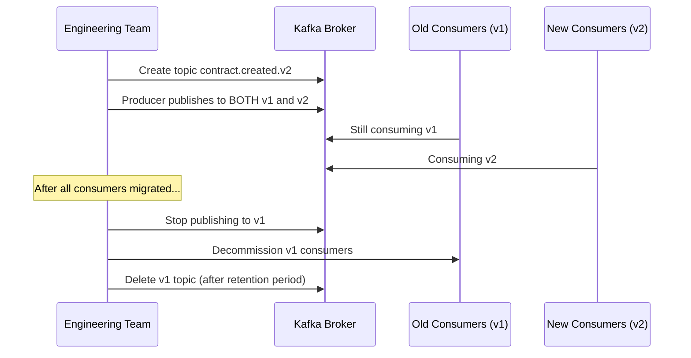
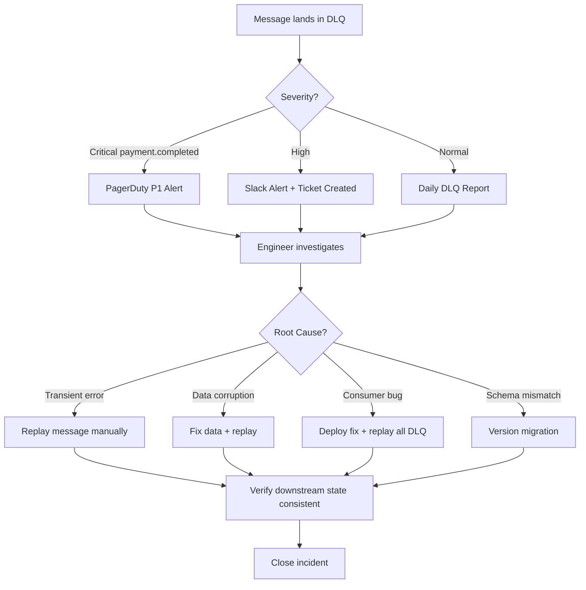
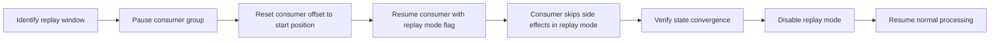
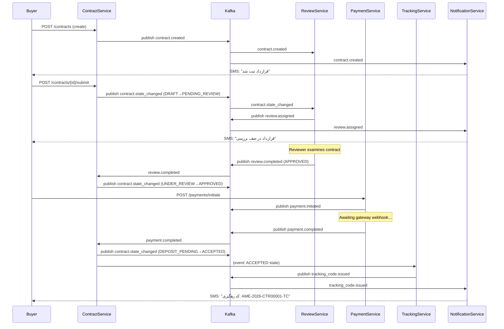

# Events Catalog — Amline Enterprise Master v5.0

| Field       | Value            |
|-------------|------------------|
| Version     | v5.0             |
| Date        | 2026-04-15       |
| Status      | Active           |
| Maintainer  | Platform Engineering Team |
| Document ID | AME-EVENTS-0006  |

---

## Table of Contents

1. [Event-Driven Architecture Overview](#1-event-driven-architecture-overview)
2. [Event Naming Convention](#2-event-naming-convention)
3. [All Events — Full Catalog](#3-all-events--full-catalog)
   - 3.1 [contract.created](#31-contractcreated)
   - 3.2 [contract.state_changed](#32-contractstate_changed)
   - 3.3 [payment.initiated](#33-paymentinitiated)
   - 3.4 [payment.completed](#34-paymentcompleted)
   - 3.5 [payment.failed](#35-paymentfailed)
   - 3.6 [review.assigned](#36-reviewassigned)
   - 3.7 [review.completed](#37-reviewcompleted)
   - 3.8 [tracking_code.issued](#38-tracking_codeissued)
   - 3.9 [tracking_code.voided](#39-tracking_codevoided)
   - 3.10 [support.ticket_created](#310-supportticket_created)
   - 3.11 [notification.sent](#311-notificationsent)
   - 3.12 [user.kyc_verified](#312-userkyc_verified)
4. [Event Versioning Strategy](#4-event-versioning-strategy)
5. [Event Ordering Guarantees](#5-event-ordering-guarantees)
6. [Dead Letter Queue (DLQ) Management](#6-dead-letter-queue-dlq-management)
7. [Event Replay Strategy](#7-event-replay-strategy)
8. [Contract Lifecycle — Sequence Diagram](#8-contract-lifecycle--sequence-diagram)
9. [Monitoring and Alerting](#9-monitoring-and-alerting)
10. [Event Store Database Schema](#10-event-store-database-schema)

---

## 1. Event-Driven Architecture Overview

Amline v5.0 adopts an **event-driven, choreography-based architecture** where services communicate exclusively through domain events published to a central message bus (Apache Kafka). No direct synchronous service-to-service calls exist for state propagation — each service owns its state and reacts to events published by other services.

### Design Principles

- **Loose coupling**: Producers have zero knowledge of consumers.
- **Eventual consistency**: The system converges to a consistent state after all events are processed.
- **Fault isolation**: A failing consumer does not affect the producer or other consumers.
- **Auditability**: Every state change is represented by a durable, replayable event.
- **Idempotency**: All consumers implement idempotent event handlers (using `event_id` deduplication).

### Architecture Diagram

```mermaid
flowchart TD
    subgraph Producers
        CS[ContractService]
        PS[PaymentService]
        RS[ReviewService]
        TS[TrackingService]
        SS[SupportService]
        NS[NotificationService]
        KS[KYCService]
    end

    subgraph EventBus["Apache Kafka — Event Bus"]
        T1[contract.created]
        T2[contract.state_changed]
        T3[payment.initiated]
        T4[payment.completed]
        T5[payment.failed]
        T6[review.assigned]
        T7[review.completed]
        T8[tracking_code.issued]
        T9[tracking_code.voided]
        T10[support.ticket_created]
        T11[notification.sent]
        T12[user.kyc_verified]
    end

    subgraph Consumers
        RevSvc[ReviewService]
        NotifSvc[NotificationService]
        TrackSvc[TrackingService]
        PaySvc[PaymentService]
        LedSvc[LedgerService]
        EscSvc[EscrowService]
        OpsSvc[OpsService]
        AuditSvc[AuditService]
        AnalSvc[AnalyticsService]
        UserSvc[UserService]
    end

    subgraph DLQ["Dead Letter Queues"]
        DLQ1[contract.created.dlq]
        DLQ2[contract.state_changed.dlq]
        DLQ3[payment.initiated.dlq]
        DLQ4[payment.completed.dlq]
        DLQ5[notification.sent.dlq]
    end

    CS --> T1 & T2
    PS --> T3 & T4 & T5
    RS --> T6 & T7
    TS --> T8 & T9
    SS --> T10
    NS --> T11
    KS --> T12

    T1 --> RevSvc & NotifSvc & TrackSvc
    T2 --> PaySvc & RevSvc & TrackSvc & NotifSvc
    T3 --> LedSvc & NotifSvc
    T4 --> CS & LedSvc & EscSvc & NotifSvc
    T5 --> CS & NotifSvc
    T6 --> NotifSvc & OpsSvc
    T7 --> CS & NotifSvc & TrackSvc
    T8 --> NotifSvc & LedSvc & AuditSvc
    T9 --> NotifSvc & AuditSvc & CS
    T10 --> NotifSvc & OpsSvc
    T11 --> AuditSvc & AnalSvc
    T12 --> CS & UserSvc & NotifSvc

    T1 -. failure .-> DLQ1
    T2 -. failure .-> DLQ2
    T3 -. failure .-> DLQ3
    T4 -. failure .-> DLQ4
    T11 -. failure .-> DLQ5
```



---

## 2. Event Naming Convention

All events follow the pattern: **`domain.event_name`** using snake_case.

| Component    | Description                                 | Example              |
|--------------|---------------------------------------------|----------------------|
| `domain`     | The owning bounded context (lowercase noun) | `contract`, `payment`|
| `.`          | Separator                                   | —                    |
| `event_name` | Past-tense verb phrase in snake_case        | `created`, `state_changed` |

### Rules

- Names must be **past-tense** (event already happened).
- Domain names are **singular** (`contract`, not `contracts`).
- No more than 3 parts: `domain.sub_domain.event` is allowed but discouraged.
- Event type string is used verbatim as the Kafka topic name.
- Maximum length: 64 characters.

### All Event Names at a Glance

| # | Event Name                  | Domain    | Kafka Partition Key |
|---|-----------------------------|-----------|---------------------|
| 1 | `contract.created`          | Contract  | `contract_id`       |
| 2 | `contract.state_changed`    | Contract  | `contract_id`       |
| 3 | `payment.initiated`         | Payment   | `contract_id`       |
| 4 | `payment.completed`         | Payment   | `contract_id`       |
| 5 | `payment.failed`            | Payment   | `contract_id`       |
| 6 | `review.assigned`           | Review    | `contract_id`       |
| 7 | `review.completed`          | Review    | `contract_id`       |
| 8 | `tracking_code.issued`      | Tracking  | `contract_id`       |
| 9 | `tracking_code.voided`      | Tracking  | `contract_id`       |
|10 | `support.ticket_created`    | Support   | `user_id`           |
|11 | `notification.sent`         | Notif.    | `user_id`           |
|12 | `user.kyc_verified`         | User/KYC  | `user_id`           |

---

## 3. All Events — Full Catalog

### Common Envelope Schema

Every event shares this base envelope:

```json
{
  "event_id": "uuid-v4",
  "event_type": "domain.event_name",
  "timestamp": "ISO-8601 UTC",
  "version": "1.0",
  "source_service": "ServiceName",
  "correlation_id": "uuid-v4",
  "payload": { }
}
```

| Field            | Type     | Required | Description                                      |
|------------------|----------|----------|--------------------------------------------------|
| `event_id`       | UUID v4  | ✅        | Globally unique event identifier (idempotency key)|
| `event_type`     | string   | ✅        | Matches Kafka topic name exactly                 |
| `timestamp`      | ISO-8601 | ✅        | UTC timestamp of event creation                  |
| `version`        | string   | ✅        | Schema version, e.g. `"1.0"`, `"2.0"`           |
| `source_service` | string   | ✅        | Name of the producing service                    |
| `correlation_id` | UUID v4  | ✅        | Traces across service boundaries (from HTTP header)|
| `payload`        | object   | ✅        | Domain-specific data (see each event below)      |

---

### 3.1 `contract.created`

| Property          | Value                                                    |
|-------------------|----------------------------------------------------------|
| **Producer**      | ContractService                                          |
| **Consumers**     | ReviewService, NotificationService, TrackingService      |
| **Kafka Topic**   | `contract.created`                                       |
| **Partition Key** | `contract_id`                                            |
| **Trigger**       | A new contract is successfully persisted in DRAFT state  |
| **Retention**     | 7 days                                                   |
| **Retry Policy**  | 3 attempts, exponential backoff (1s → 2s → 4s)          |
| **DLQ Topic**     | `contract.created.dlq`                                   |
| **Priority**      | High                                                     |

#### Full Schema

```json
{
  "event_id": "550e8400-e29b-41d4-a716-446655440000",
  "event_type": "contract.created",
  "timestamp": "2026-04-15T10:30:00.000Z",
  "version": "1.0",
  "source_service": "ContractService",
  "correlation_id": "7f3a9b2c-1234-5678-abcd-ef0123456789",
  "payload": {
    "contract_id": "CTR-2026-00001",
    "buyer_id": "USR-10001",
    "seller_id": "USR-20002",
    "agent_id": "USR-30003",
    "property_id": "PROP-40004",
    "contract_type": "LEASE",
    "amount": 5000000000,
    "currency": "IRR",
    "deposit_amount": 1500000000,
    "deposit_percentage": 30.0,
    "start_date": "2026-05-01",
    "end_date": "2027-05-01",
    "created_at": "2026-04-15T10:30:00.000Z",
    "metadata": {
      "platform_version": "5.0",
      "origin": "web"
    }
  }
}
```

#### Consumer Reactions

| Consumer             | Action Taken                                              |
|----------------------|-----------------------------------------------------------|
| ReviewService        | Creates a new review item in PENDING state                |
| NotificationService  | Sends "Contract Created" SMS/Email to buyer and seller    |
| TrackingService      | Registers contract in tracking registry                   |

#### Retry & DLQ

```
Attempt 1: Immediate
Attempt 2: +1 second delay
Attempt 3: +2 seconds delay
On failure after attempt 3 → publish to contract.created.dlq
DLQ action: OpsService alerts on-call engineer via PagerDuty
```

---

### 3.2 `contract.state_changed`

| Property          | Value                                                              |
|-------------------|--------------------------------------------------------------------|
| **Producer**      | ContractService                                                    |
| **Consumers**     | PaymentService, ReviewService, TrackingService, NotificationService|
| **Kafka Topic**   | `contract.state_changed`                                           |
| **Partition Key** | `contract_id`                                                      |
| **Trigger**       | Any valid state machine transition occurs on a contract            |
| **Retention**     | 30 days                                                            |
| **Retry Policy**  | 5 attempts, exponential backoff with jitter (max 60s)              |
| **DLQ Topic**     | `contract.state_changed.dlq`                                       |
| **Priority**      | Critical                                                           |

#### Full Schema

```json
{
  "event_id": "660f9511-f30c-52e5-b827-557766551111",
  "event_type": "contract.state_changed",
  "timestamp": "2026-04-15T14:22:00.000Z",
  "version": "1.0",
  "source_service": "ContractService",
  "correlation_id": "8a4b0c3d-2345-6789-bcde-f01234567890",
  "payload": {
    "contract_id": "CTR-2026-00001",
    "previous_state": "PENDING_REVIEW",
    "new_state": "APPROVED",
    "actor_id": "USR-OPS-001",
    "actor_role": "OPS_REVIEWER",
    "reason": "All documents verified and conditions met",
    "timestamp": "2026-04-15T14:22:00.000Z",
    "metadata": {
      "review_id": "REV-2026-00051",
      "auto_transition": false
    }
  }
}
```

#### Valid State Transitions That Trigger This Event

| From State        | To State          | Actor          |
|-------------------|-------------------|----------------|
| DRAFT             | PENDING_REVIEW    | Buyer/Agent    |
| PENDING_REVIEW    | UNDER_REVIEW      | System         |
| UNDER_REVIEW      | APPROVED          | OPS_REVIEWER   |
| UNDER_REVIEW      | REJECTED          | OPS_REVIEWER   |
| APPROVED          | DEPOSIT_PENDING   | System         |
| DEPOSIT_PENDING   | DEPOSIT_PAID      | PaymentService |
| DEPOSIT_PAID      | ACCEPTED          | System         |
| ACCEPTED          | TRACKING_ISSUED   | TrackingService|
| TRACKING_ISSUED   | ACTIVE            | System         |
| ACTIVE            | DISPUTED          | Buyer/Seller   |
| ACTIVE            | COMPLETED         | System         |
| Any (non-terminal)| CANCELLED         | Actor          |
| Any (non-terminal)| EXPIRED           | System (TTL)   |

#### DLQ Alerting

```yaml
dlq_alert:
  topic: contract.state_changed.dlq
  threshold: 1 message
  notification:
    - channel: pagerduty
      severity: critical
    - channel: slack
      channel_name: "#ops-alerts"
```

---

### 3.3 `payment.initiated`

| Property          | Value                                              |
|-------------------|----------------------------------------------------|
| **Producer**      | PaymentService                                     |
| **Consumers**     | LedgerService, NotificationService                 |
| **Kafka Topic**   | `payment.initiated`                                |
| **Partition Key** | `contract_id`                                      |
| **Trigger**       | User initiates a payment through the platform      |
| **Retention**     | 7 days                                             |
| **Retry Policy**  | 3 attempts, linear backoff (2s each)               |
| **DLQ Topic**     | `payment.initiated.dlq`                            |
| **Priority**      | High                                               |

#### Full Schema

```json
{
  "event_id": "770a1622-g41d-63f6-c938-668877662222",
  "event_type": "payment.initiated",
  "timestamp": "2026-04-15T16:05:00.000Z",
  "version": "1.0",
  "source_service": "PaymentService",
  "correlation_id": "9b5c1d4e-3456-7890-cdef-012345678901",
  "payload": {
    "payment_id": "PAY-2026-00101",
    "contract_id": "CTR-2026-00001",
    "user_id": "USR-10001",
    "amount": 1500000000,
    "currency": "IRR",
    "payment_type": "DEPOSIT",
    "gateway": "ZARINPAL",
    "reference_id": "ZP-REF-999888777",
    "gateway_url": "https://payment.zarinpal.com/StartPay/ZP-REF-999888777",
    "initiated_at": "2026-04-15T16:05:00.000Z",
    "expires_at": "2026-04-15T16:35:00.000Z"
  }
}
```

---

### 3.4 `payment.completed`

| Property          | Value                                                                  |
|-------------------|------------------------------------------------------------------------|
| **Producer**      | PaymentService / GatewayWebhookHandler                                 |
| **Consumers**     | ContractService, LedgerService, EscrowService, NotificationService     |
| **Kafka Topic**   | `payment.completed`                                                    |
| **Partition Key** | `contract_id`                                                          |
| **Trigger**       | Payment gateway sends webhook confirmation; idempotency check passes   |
| **Retention**     | 90 days (financial record)                                             |
| **Retry Policy**  | 5 attempts, exponential backoff with jitter (max 120s)                 |
| **DLQ Topic**     | `payment.completed.dlq`                                                |
| **Priority**      | Critical — financial integrity                                         |

#### Full Schema

```json
{
  "event_id": "880b2733-h52e-74g7-d049-779988773333",
  "event_type": "payment.completed",
  "timestamp": "2026-04-15T16:12:00.000Z",
  "version": "1.0",
  "source_service": "PaymentService",
  "correlation_id": "0c6d2e5f-4567-8901-defa-123456789012",
  "payload": {
    "payment_id": "PAY-2026-00101",
    "contract_id": "CTR-2026-00001",
    "user_id": "USR-10001",
    "amount": 1500000000,
    "currency": "IRR",
    "status": "COMPLETED",
    "payment_type": "DEPOSIT",
    "gateway": "ZARINPAL",
    "gateway_ref": "ZP-TXN-123456789",
    "gateway_card_pan": "1234-****-****-5678",
    "completed_at": "2026-04-15T16:12:00.000Z",
    "escrow_ref": "ESC-2026-00201"
  }
}
```

#### DLQ — Manual Review Required

Any message landing in `payment.completed.dlq` triggers an immediate P1 incident since financial records may be incomplete. Manual reconciliation against the gateway transaction log is required.

---

### 3.5 `payment.failed`

| Property          | Value                                              |
|-------------------|----------------------------------------------------|
| **Producer**      | PaymentService                                     |
| **Consumers**     | ContractService, NotificationService               |
| **Kafka Topic**   | `payment.failed`                                   |
| **Partition Key** | `contract_id`                                      |
| **Trigger**       | Gateway returns failure or payment session times out|
| **Retention**     | 14 days                                            |
| **Retry Policy**  | 3 attempts, linear backoff (5s)                    |
| **DLQ Topic**     | `payment.failed.dlq`                               |
| **Priority**      | High — triggers alert                              |

#### Full Schema

```json
{
  "event_id": "990c3844-i63f-85h8-e150-880099884444",
  "event_type": "payment.failed",
  "timestamp": "2026-04-15T16:36:00.000Z",
  "version": "1.0",
  "source_service": "PaymentService",
  "correlation_id": "1d7e3f6a-5678-9012-efab-234567890123",
  "payload": {
    "payment_id": "PAY-2026-00101",
    "contract_id": "CTR-2026-00001",
    "user_id": "USR-10001",
    "amount": 1500000000,
    "currency": "IRR",
    "error_code": "GATEWAY_TIMEOUT",
    "error_message": "No response from payment gateway within 30 seconds",
    "gateway": "ZARINPAL",
    "failed_at": "2026-04-15T16:36:00.000Z",
    "retry_count": 2,
    "is_retryable": true
  }
}
```

---

### 3.6 `review.assigned`

| Property          | Value                                              |
|-------------------|----------------------------------------------------|
| **Producer**      | ReviewService                                      |
| **Consumers**     | NotificationService, OpsService                    |
| **Kafka Topic**   | `review.assigned`                                  |
| **Partition Key** | `contract_id`                                      |
| **Trigger**       | A review item is assigned to a specific reviewer   |
| **Retention**     | 7 days                                             |
| **Retry Policy**  | 3 attempts, exponential backoff (1s → 2s → 4s)    |
| **DLQ Topic**     | `review.assigned.dlq`                              |
| **Priority**      | Normal                                             |

#### Full Schema

```json
{
  "event_id": "aa1d4955-j74g-96i9-f261-991100995555",
  "event_type": "review.assigned",
  "timestamp": "2026-04-15T11:00:00.000Z",
  "version": "1.0",
  "source_service": "ReviewService",
  "correlation_id": "2e8f4a7b-6789-0123-fabc-345678901234",
  "payload": {
    "review_id": "REV-2026-00051",
    "contract_id": "CTR-2026-00001",
    "reviewer_id": "USR-OPS-001",
    "reviewer_name": "علی محمدی",
    "priority": "HIGH",
    "assigned_at": "2026-04-15T11:00:00.000Z",
    "sla_deadline": "2026-04-16T11:00:00.000Z",
    "estimated_complexity": "MEDIUM",
    "documents_count": 5
  }
}
```

---

### 3.7 `review.completed`

| Property          | Value                                                    |
|-------------------|----------------------------------------------------------|
| **Producer**      | ReviewService                                            |
| **Consumers**     | ContractService, NotificationService, TrackingService    |
| **Kafka Topic**   | `review.completed`                                       |
| **Partition Key** | `contract_id`                                            |
| **Trigger**       | Reviewer submits a APPROVE or REJECT decision            |
| **Retention**     | 30 days                                                  |
| **Retry Policy**  | 3 attempts, exponential backoff                          |
| **DLQ Topic**     | `review.completed.dlq`                                   |
| **Priority**      | High                                                     |

#### Full Schema

```json
{
  "event_id": "bb2e5066-k85h-07j0-g372-002211006666",
  "event_type": "review.completed",
  "timestamp": "2026-04-15T20:15:00.000Z",
  "version": "1.0",
  "source_service": "ReviewService",
  "correlation_id": "3f9a5b8c-7890-1234-abcd-456789012345",
  "payload": {
    "review_id": "REV-2026-00051",
    "contract_id": "CTR-2026-00001",
    "reviewer_id": "USR-OPS-001",
    "decision": "APPROVED",
    "notes": "All documents verified. Property deed matches. KYC passed for both parties.",
    "checklist_results": {
      "documents_verified": true,
      "kyc_checked": true,
      "property_verified": true,
      "amount_validated": true
    },
    "completed_at": "2026-04-15T20:15:00.000Z",
    "duration_minutes": 555
  }
}
```

---

### 3.8 `tracking_code.issued`

| Property          | Value                                                    |
|-------------------|----------------------------------------------------------|
| **Producer**      | TrackingService                                          |
| **Consumers**     | NotificationService, LedgerService, AuditService         |
| **Kafka Topic**   | `tracking_code.issued`                                   |
| **Partition Key** | `contract_id`                                            |
| **Trigger**       | Tracking code successfully generated and stored          |
| **Retention**     | 365 days (legal requirement)                             |
| **Retry Policy**  | 3 attempts, exponential backoff                          |
| **DLQ Topic**     | `tracking_code.issued.dlq`                               |
| **Priority**      | High                                                     |

#### Full Schema

```json
{
  "event_id": "cc3f6177-l96i-18k1-h483-113322117777",
  "event_type": "tracking_code.issued",
  "timestamp": "2026-04-16T09:00:00.000Z",
  "version": "1.0",
  "source_service": "TrackingService",
  "correlation_id": "4a0b6c9d-8901-2345-bcde-567890123456",
  "payload": {
    "tracking_code": "AME-2026-CTR00001-TC",
    "contract_id": "CTR-2026-00001",
    "issued_to": "USR-10001",
    "issued_by": "SYSTEM",
    "issued_at": "2026-04-16T09:00:00.000Z",
    "expires_at": "2027-05-01T23:59:59.999Z",
    "checksum": "SHA256:a3f1b2c4d5e6f7a8b9c0d1e2f3a4b5c6",
    "qr_code_url": "https://cdn.amline.ir/qr/AME-2026-CTR00001-TC.png",
    "is_official": true
  }
}
```

---

### 3.9 `tracking_code.voided`

| Property          | Value                                                    |
|-------------------|----------------------------------------------------------|
| **Producer**      | TrackingService                                          |
| **Consumers**     | NotificationService, AuditService, ContractService       |
| **Kafka Topic**   | `tracking_code.voided`                                   |
| **Partition Key** | `contract_id`                                            |
| **Trigger**       | Tracking code explicitly invalidated by admin or system  |
| **Retention**     | 365 days (legal requirement)                             |
| **Retry Policy**  | 3 attempts, exponential backoff                          |
| **DLQ Topic**     | `tracking_code.voided.dlq`                               |
| **Priority**      | High                                                     |

#### Full Schema

```json
{
  "event_id": "dd4a7288-m07j-29l2-i594-224433228888",
  "event_type": "tracking_code.voided",
  "timestamp": "2026-04-17T14:30:00.000Z",
  "version": "1.0",
  "source_service": "TrackingService",
  "correlation_id": "5b1c7d0e-9012-3456-cdef-678901234567",
  "payload": {
    "tracking_code": "AME-2026-CTR00001-TC",
    "contract_id": "CTR-2026-00001",
    "voided_by": "USR-ADMIN-001",
    "void_reason": "CONTRACT_CANCELLED",
    "void_reason_detail": "Buyer withdrew before deposit transfer completed",
    "voided_at": "2026-04-17T14:30:00.000Z",
    "replacement_code": null
  }
}
```

---

### 3.10 `support.ticket_created`

| Property          | Value                                              |
|-------------------|----------------------------------------------------|
| **Producer**      | SupportService                                     |
| **Consumers**     | NotificationService, OpsService                    |
| **Kafka Topic**   | `support.ticket_created`                           |
| **Partition Key** | `user_id`                                          |
| **Trigger**       | User successfully creates a support ticket         |
| **Retention**     | 7 days                                             |
| **Retry Policy**  | 3 attempts, linear backoff (2s)                    |
| **DLQ Topic**     | `support.ticket_created.dlq`                       |
| **Priority**      | Normal                                             |

#### Full Schema

```json
{
  "event_id": "ee5b8399-n18k-30m3-j605-335544339999",
  "event_type": "support.ticket_created",
  "timestamp": "2026-04-15T18:00:00.000Z",
  "version": "1.0",
  "source_service": "SupportService",
  "correlation_id": "6c2d8e1f-0123-4567-defa-789012345678",
  "payload": {
    "ticket_id": "TKT-2026-00301",
    "user_id": "USR-10001",
    "contract_id": "CTR-2026-00001",
    "category": "PAYMENT_ISSUE",
    "priority": "HIGH",
    "subject": "Payment not reflected after gateway confirmation",
    "description": "I completed payment via Zarinpal but contract still shows DEPOSIT_PENDING",
    "attachments": [
      "receipt_zarinpal_999888777.pdf"
    ],
    "created_at": "2026-04-15T18:00:00.000Z",
    "sla_response_deadline": "2026-04-15T22:00:00.000Z"
  }
}
```

---

### 3.11 `notification.sent`

| Property          | Value                                              |
|-------------------|----------------------------------------------------|
| **Producer**      | NotificationService                                |
| **Consumers**     | AuditService, AnalyticsService                     |
| **Kafka Topic**   | `notification.sent`                                |
| **Partition Key** | `user_id`                                          |
| **Trigger**       | Notification successfully dispatched to channel    |
| **Retention**     | 7 days                                             |
| **Retry Policy**  | 5 attempts, exponential backoff (1s → 2s → 4s → 8s → 16s) |
| **DLQ Topic**     | `notification.sent.dlq`                            |
| **Priority**      | Low                                                |

#### Full Schema

```json
{
  "event_id": "ff6c9400-o29l-41n4-k716-446655440000",
  "event_type": "notification.sent",
  "timestamp": "2026-04-15T10:31:00.000Z",
  "version": "1.0",
  "source_service": "NotificationService",
  "correlation_id": "7d3e9f2a-1234-5678-efab-890123456789",
  "payload": {
    "notification_id": "NOTIF-2026-09001",
    "user_id": "USR-10001",
    "channel": "SMS",
    "template_id": "TMPL-CONTRACT-CREATED-BUYER",
    "template_version": "1.2",
    "rendered_preview": "قرارداد شما با شماره CTR-2026-00001 ثبت شد.",
    "status": "DELIVERED",
    "provider": "KAVENEGAR",
    "provider_message_id": "KAV-MSG-778899",
    "sent_at": "2026-04-15T10:31:00.000Z",
    "delivered_at": "2026-04-15T10:31:05.000Z"
  }
}
```

#### Dead Letter Handling

Messages in `notification.sent.dlq` indicate an audit gap. `AuditService` reconciles against `notification_log` table to identify missing records.

---

### 3.12 `user.kyc_verified`

| Property          | Value                                                    |
|-------------------|----------------------------------------------------------|
| **Producer**      | KYCService                                               |
| **Consumers**     | ContractService, UserService, NotificationService        |
| **Kafka Topic**   | `user.kyc_verified`                                      |
| **Partition Key** | `user_id`                                                |
| **Trigger**       | KYC document check passes; user status updated           |
| **Retention**     | 365 days (regulatory)                                    |
| **Retry Policy**  | 3 attempts, exponential backoff                          |
| **DLQ Topic**     | `user.kyc_verified.dlq`                                  |
| **Priority**      | High                                                     |

#### Full Schema

```json
{
  "event_id": "aa7d0511-p30m-52o5-l827-557766551111",
  "event_type": "user.kyc_verified",
  "timestamp": "2026-04-14T09:00:00.000Z",
  "version": "1.0",
  "source_service": "KYCService",
  "correlation_id": "8e4f0a3b-2345-6789-fabc-901234567890",
  "payload": {
    "user_id": "USR-10001",
    "kyc_level": "FULL",
    "previous_kyc_level": "BASIC",
    "verified_at": "2026-04-14T09:00:00.000Z",
    "expires_at": "2028-04-14T09:00:00.000Z",
    "document_type": "NATIONAL_ID",
    "document_id_hash": "SHA256:b4a2c5d6e7f8a9b0c1d2e3f4a5b6c7d8",
    "verification_provider": "SHAHKAR",
    "risk_score": 0.05
  }
}
```

---

## 4. Event Versioning Strategy

### Version Schema

Event schemas use **semantic versioning** at the minor level:

```
MAJOR.MINOR
  │      └─ Backward-compatible additions (new optional fields)
  └──────── Breaking changes (field removal, type change, rename)
```

### Compatibility Rules

| Change Type                        | Action Required                        | Version Bump |
|------------------------------------|----------------------------------------|--------------|
| Add optional field to payload      | None (consumers ignore unknown fields) | `1.0 → 1.1`  |
| Change field type                  | Dual-publish period (old + new topic)  | `1.x → 2.0`  |
| Remove field                       | Dual-publish period + consumer update  | `1.x → 2.0`  |
| Rename field                       | Dual-publish period + consumer update  | `1.x → 2.0`  |
| Add required field                 | Dual-publish period                    | `1.x → 2.0`  |

### Migration Process for Breaking Changes



### Schema Registry

All schemas are registered in **Confluent Schema Registry** at `https://schema-registry.amline.ir`:

```bash
# Register a new schema version
curl -X POST -H "Content-Type: application/vnd.schemaregistry.v1+json" \
  --data '{"schema": "...avro schema..."}' \
  https://schema-registry.amline.ir/subjects/contract.created-value/versions
```

---

## 5. Event Ordering Guarantees

### Partition Strategy

All events related to the same `contract_id` are published to the same Kafka partition, guaranteeing **total ordering per contract**.

```
Partition Key: contract_id (for contract, payment, review, tracking events)
Partition Key: user_id (for user, notification, support events)
```

### Ordering Constraints

| Guarantee                              | Scope                       |
|----------------------------------------|-----------------------------|
| Strict FIFO ordering                   | Per partition (per contract) |
| At-least-once delivery                 | All topics                  |
| Idempotent consumption (dedup by event_id) | All consumers           |
| Cross-partition ordering               | NOT guaranteed              |

### Idempotency Implementation

```python
class EventHandler:
    def handle(self, event: dict) -> None:
        event_id = event["event_id"]
        if self.event_store.exists(event_id):
            logger.info(f"Duplicate event {event_id} ignored")
            return
        with self.db.transaction():
            self.process_event(event)
            self.event_store.mark_processed(event_id)
```

---

## 6. Dead Letter Queue (DLQ) Management

### DLQ Topics Summary

| Source Topic              | DLQ Topic                     | SLA         | Action              |
|---------------------------|-------------------------------|-------------|---------------------|
| contract.created          | contract.created.dlq          | 1 hour      | Alert + manual retry|
| contract.state_changed    | contract.state_changed.dlq    | 15 minutes  | Alert (P1) + manual |
| payment.initiated         | payment.initiated.dlq         | 1 hour      | Alert + manual retry|
| payment.completed         | payment.completed.dlq         | 5 minutes   | P1 + reconciliation |
| payment.failed            | payment.failed.dlq            | 30 minutes  | Alert               |
| review.assigned           | review.assigned.dlq           | 2 hours     | Alert + manual retry|
| review.completed          | review.completed.dlq          | 1 hour      | Alert + manual retry|
| tracking_code.issued      | tracking_code.issued.dlq      | 1 hour      | Alert + manual retry|
| tracking_code.voided      | tracking_code.voided.dlq      | 1 hour      | Alert + manual retry|
| support.ticket_created    | support.ticket_created.dlq    | 4 hours     | Alert               |
| notification.sent         | notification.sent.dlq         | 24 hours    | Reconcile audit log |
| user.kyc_verified         | user.kyc_verified.dlq         | 1 hour      | Alert + manual retry|

### DLQ Processing Procedure



### Manual DLQ Replay Command

```bash
# Replay all messages from a DLQ topic
kafka-console-consumer.sh \
  --bootstrap-server kafka:9092 \
  --topic contract.created.dlq \
  --from-beginning \
  | kafka-console-producer.sh \
      --bootstrap-server kafka:9092 \
      --topic contract.created
```

---

## 7. Event Replay Strategy

### Use Cases for Replay

1. **Disaster recovery** — Consumer database lost; rebuild from event store.
2. **New consumer onboarding** — New service needs historical data.
3. **Bug fix replay** — Consumer bug caused incorrect state; replay to correct.
4. **Analytics backfill** — New reporting field requires historical computation.

### Replay Procedure



### Replay Configuration

```bash
# Reset consumer group offset to specific timestamp
kafka-consumer-groups.sh \
  --bootstrap-server kafka:9092 \
  --group contract-service-consumer \
  --topic contract.state_changed \
  --to-datetime 2026-04-01T00:00:00.000 \
  --reset-offsets \
  --execute
```

---

## 8. Contract Lifecycle — Sequence Diagram



---

## 9. Monitoring and Alerting

### Key Metrics

| Metric                             | Type      | Alert Threshold        | Severity |
|------------------------------------|-----------|------------------------|----------|
| `kafka_consumer_lag`               | Gauge     | > 1000 messages        | WARNING  |
| `kafka_consumer_lag`               | Gauge     | > 10000 messages       | CRITICAL |
| `dlq_messages_total`               | Counter   | > 0 for payment topics | CRITICAL |
| `dlq_messages_total`               | Counter   | > 10 any topic         | WARNING  |
| `event_processing_duration_ms`     | Histogram | p99 > 5000ms           | WARNING  |
| `event_retry_count`                | Counter   | > 100/min              | WARNING  |
| `kafka_partition_leader_election`  | Event     | Any occurrence         | WARNING  |
| `schema_registry_compatibility`    | Boolean   | False                  | CRITICAL |

### Grafana Dashboard

Dashboard: **Amline Event Bus Health** (ID: `amline-events-v5`)

Panels:
1. Consumer lag per topic (line chart, last 1h)
2. Event throughput per topic (bar chart, per minute)
3. DLQ message count (stat panel with alert)
4. Processing latency p50/p95/p99 (histogram)
5. Failed consumer restarts (counter)

### Alert Rules (Prometheus)

```yaml
groups:
  - name: amline_events
    rules:
      - alert: KafkaConsumerLagHigh
        expr: kafka_consumer_group_lag > 10000
        for: 5m
        labels:
          severity: critical
        annotations:
          summary: "Kafka consumer lag exceeds 10000 for {{ $labels.topic }}"

      - alert: DLQMessageReceived
        expr: increase(kafka_topic_messages_total{topic=~".*\\.dlq"}[5m]) > 0
        for: 0m
        labels:
          severity: critical
        annotations:
          summary: "DLQ message received on {{ $labels.topic }}"
```

---

## 10. Event Store Database Schema

```sql
-- Event store table for event sourcing
CREATE TABLE event_store (
    id              BIGSERIAL       PRIMARY KEY,
    event_id        UUID            NOT NULL UNIQUE,
    event_type      VARCHAR(100)    NOT NULL,
    aggregate_id    VARCHAR(50)     NOT NULL,   -- e.g., contract_id or user_id
    aggregate_type  VARCHAR(50)     NOT NULL,   -- e.g., 'Contract', 'Payment'
    payload         JSONB           NOT NULL,
    metadata        JSONB           NOT NULL DEFAULT '{}',
    version         VARCHAR(10)     NOT NULL DEFAULT '1.0',
    source_service  VARCHAR(100)    NOT NULL,
    correlation_id  UUID,
    created_at      TIMESTAMPTZ     NOT NULL DEFAULT NOW(),
    processed_at    TIMESTAMPTZ,
    is_processed    BOOLEAN         NOT NULL DEFAULT FALSE
);

-- Indexes for common query patterns
CREATE INDEX idx_event_store_aggregate ON event_store (aggregate_id, aggregate_type, created_at);
CREATE INDEX idx_event_store_event_type ON event_store (event_type, created_at);
CREATE INDEX idx_event_store_correlation ON event_store (correlation_id);
CREATE INDEX idx_event_store_unprocessed ON event_store (is_processed, created_at) WHERE is_processed = FALSE;

-- DLQ tracking table
CREATE TABLE event_dlq (
    id              BIGSERIAL       PRIMARY KEY,
    event_id        UUID            NOT NULL,
    event_type      VARCHAR(100)    NOT NULL,
    dlq_topic       VARCHAR(150)    NOT NULL,
    payload         JSONB           NOT NULL,
    error_message   TEXT,
    retry_count     SMALLINT        NOT NULL DEFAULT 0,
    first_failed_at TIMESTAMPTZ     NOT NULL DEFAULT NOW(),
    last_failed_at  TIMESTAMPTZ     NOT NULL DEFAULT NOW(),
    resolved_at     TIMESTAMPTZ,
    resolved_by     VARCHAR(100),
    resolution_note TEXT,
    status          VARCHAR(20)     NOT NULL DEFAULT 'PENDING'
                    CHECK (status IN ('PENDING', 'REPLAYED', 'DISMISSED', 'INVESTIGATING'))
);

CREATE INDEX idx_dlq_status ON event_dlq (status, last_failed_at);
CREATE INDEX idx_dlq_event_type ON event_dlq (event_type, status);

-- Consumer offset tracking for replay support
CREATE TABLE event_consumer_checkpoint (
    consumer_group  VARCHAR(100)    NOT NULL,
    topic           VARCHAR(100)    NOT NULL,
    partition_id    INTEGER         NOT NULL,
    offset_value    BIGINT          NOT NULL,
    updated_at      TIMESTAMPTZ     NOT NULL DEFAULT NOW(),
    PRIMARY KEY (consumer_group, topic, partition_id)
);

COMMENT ON TABLE event_store IS 'Append-only event store for event sourcing. Never delete rows.';
COMMENT ON TABLE event_dlq IS 'Dead letter queue tracking with resolution workflow.';
COMMENT ON COLUMN event_store.aggregate_id IS 'The primary business entity ID (contract_id, user_id, etc.)';
```

---

*Document maintained by Platform Engineering. For changes, open a PR against `docs/v5/EVENTS-CATALOG.md`.*
