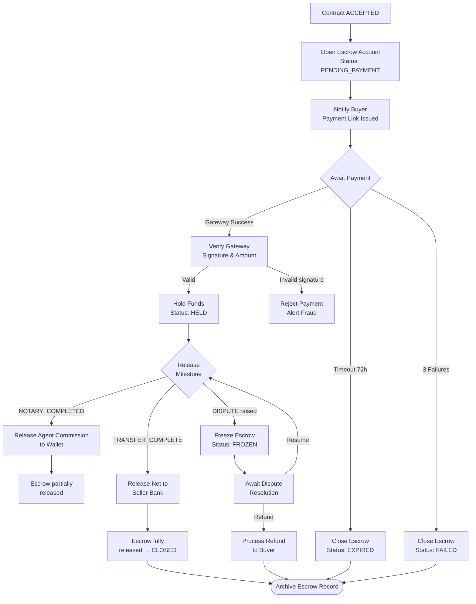
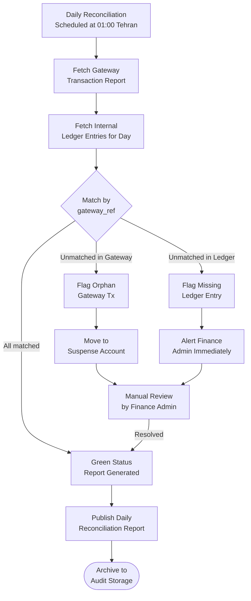
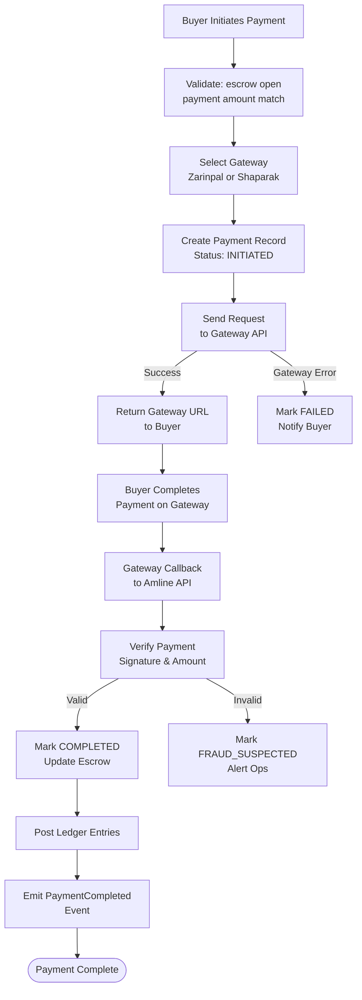
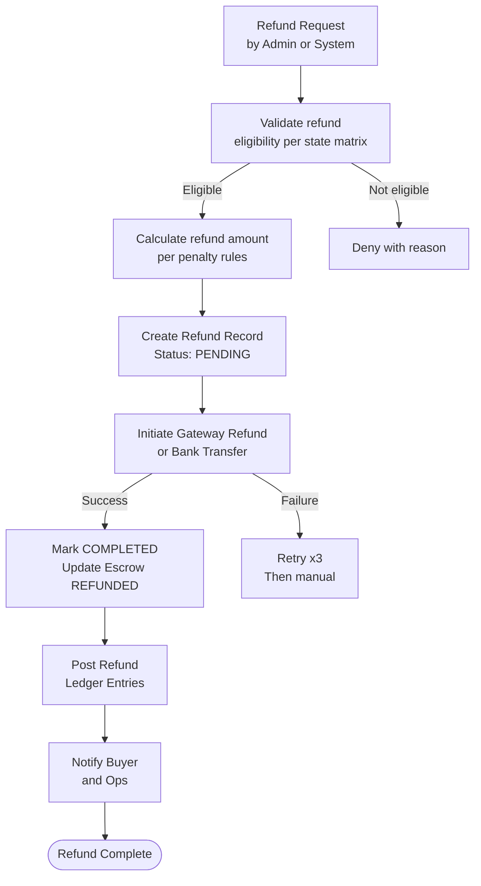
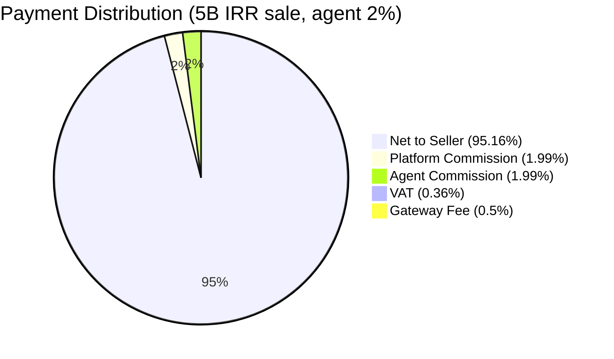

# Payments Domain Specification — Amline v5.0

| Attribute | Value |
|-----------|-------|
| **Version** | v5.0 |
| **Date** | 2026-04-15 |
| **Status** | Active |
| **Domain** | Payment |
| **Service** | `payment-svc` |
| **Owner** | Payment Domain Team |

---

## Table of Contents

1. [Domain Overview](#1-domain-overview)
2. [Payment Ledger Design](#2-payment-ledger-design)
3. [Split Payment Logic](#3-split-payment-logic)
4. [Commission Calculation Rules](#4-commission-calculation-rules)
5. [Refund Policies](#5-refund-policies)
6. [Settlement Schedules](#6-settlement-schedules)
7. [Escrow Management Flow](#7-escrow-management-flow)
8. [Wallet System Design](#8-wallet-system-design)
9. [Payment Gateway Integration](#9-payment-gateway-integration)
10. [Financial Reconciliation](#10-financial-reconciliation)
11. [Tax Compliance (VAT 9%)](#11-tax-compliance)
12. [Payment Flows (Mermaid)](#12-payment-flows)
13. [Database Schema](#13-database-schema)
14. [Cross-References](#14-cross-references)

---

## 1. Domain Overview

The **Payment Domain** is responsible for all financial flows within the Amline platform. It implements a **double-entry accounting ledger** to ensure financial integrity, manages **escrow accounts** for in-progress contracts, processes payments through Iranian payment gateways (Zarinpal, Shaparak), and distributes funds according to the platform's commission structure.

### 1.1 Responsibilities

- Receive and verify payments from buyers through gateway callbacks.
- Manage escrow accounts: open, hold, release, freeze, and close.
- Calculate and distribute platform commissions, agent commissions, and VAT.
- Credit agent wallets and initiate bank transfers to sellers.
- Process refunds according to state-based policies.
- Maintain an immutable double-entry ledger for all transactions.
- Produce VAT-compliant financial records for tax reporting.
- Generate settlement reports and bank reconciliation files.

### 1.2 Key Concepts

| Concept | Description |
|---------|-------------|
| **Escrow Account** | Neutral holding account for buyer funds pending contract completion |
| **Ledger Entry** | One side of a double-entry accounting record (debit or credit) |
| **Wallet** | Internal balance account for agents/consultants |
| **Settlement** | Transfer of funds from platform to seller or agent bank account |
| **Reconciliation** | Daily matching of gateway transactions to internal ledger |

---

## 2. Payment Ledger Design

### 2.1 Double-Entry Accounting

The platform uses **double-entry bookkeeping** where every financial event produces two ledger entries: one debit and one credit, always summing to zero.

**Chart of Accounts:**

| Account Code | Account Name | Type | Description |
|-------------|-------------|------|-------------|
| `1001` | Cash — Zarinpal | Asset | Funds received via Zarinpal gateway |
| `1002` | Cash — Shaparak | Asset | Funds received via Shaparak gateway |
| `1100` | Escrow Payable | Liability | Buyer funds held in escrow |
| `1200` | Agent Wallet | Liability | Commission owed to agents |
| `2001` | Platform Revenue | Revenue | Platform commission earned |
| `2002` | Agent Commission Revenue | Revenue | Agent commission passed through |
| `2003` | VAT Payable | Liability | VAT collected and due to tax authority |
| `3001` | Seller Payable | Liability | Net proceeds due to seller |
| `4001` | Refunds Payable | Liability | Approved refunds awaiting processing |
| `9001` | Suspense | Asset | Temporary unmatched transactions |

### 2.2 Example Ledger Entries for a 5,000,000,000 IRR Sale

```
Event: Buyer Payment Received via Zarinpal (5,000,000,000 IRR)
  DR  Cash—Zarinpal           5,000,000,000
  CR  Escrow Payable          5,000,000,000

Event: Gateway Fee Deducted (0.5% = 25,000,000)
  DR  Escrow Payable             25,000,000
  CR  Gateway Fee Expense        25,000,000

Event: Escrow Release — Commission Split
  DR  Escrow Payable            100,000,000   ← Platform 2%
  CR  Platform Revenue          100,000,000

  DR  Escrow Payable            100,000,000   ← Agent 2%
  CR  Agent Wallet              100,000,000

  DR  Escrow Payable             18,000,000   ← VAT 9% on commissions
  CR  VAT Payable                18,000,000

  DR  Escrow Payable          4,757,000,000   ← Net to seller
  CR  Seller Payable          4,757,000,000

Event: Seller Bank Transfer (T+2)
  DR  Seller Payable          4,757,000,000
  CR  Cash—Shaparak           4,757,000,000
```

---

## 3. Split Payment Logic

### 3.1 Commission Split Formula

```
transaction_amount  = contract.property_price          # e.g., 5,000,000,000 IRR
gateway_fee         = transaction_amount × 0.005       # 0.5% — deducted by gateway
gross_net           = transaction_amount − gateway_fee  # 4,975,000,000 IRR

platform_rate       = 0.020                            # 2% fixed
agent_rate          = consultant.commission_rate        # 0.020 to 0.030 negotiated

platform_commission = gross_net × platform_rate         # 99,500,000 IRR
agent_commission    = gross_net × agent_rate            # 99,500,000–149,250,000 IRR
vat_base            = platform_commission + agent_commission
vat_amount          = vat_base × 0.09                  # 9% VAT on commissions

net_to_seller       = gross_net
                      − platform_commission
                      − agent_commission
                      − vat_amount
```

### 3.2 Example Calculations

| Scenario | Price (IRR) | Platform (2%) | Agent (2%) | VAT (9%) | Net to Seller |
|----------|------------|--------------|-----------|---------|--------------|
| Standard sale | 5,000,000,000 | 99,500,000 | 99,500,000 | 17,910,000 | 4,758,090,000 |
| High-value sale | 20,000,000,000 | 398,000,000 | 398,000,000 | 71,640,000 | 19,132,360,000 |
| Agent 3% rate | 5,000,000,000 | 99,500,000 | 149,250,000 | 22,365,000 | 4,703,885,000 |
| Pre-sale deposit 20% | 1,000,000,000 | 19,900,000 | 19,900,000 | 3,582,000 | 956,618,000 |
| Lease-to-own monthly | 50,000,000 | 995,000 | 1,243,750 | 200,138 | 47,561,112 |

---

## 4. Commission Calculation Rules

### 4.1 Platform Commission

- **Rate**: Fixed 2% of `gross_net` (post-gateway-fee).
- **Calculation basis**: Per contract, at time of escrow release.
- **Minimum**: 1,000,000 IRR regardless of rate.
- **Maximum**: No cap.
- **When calculated**: When `TRANSFER_COMPLETE` event is received.

### 4.2 Agent Commission

- **Rate**: 2.0% – 3.0% of `gross_net`, negotiated per agency contract.
- **Default rate**: 2.0% for unspecified or new agencies.
- **Rate source**: `agency.commission_rate` in Agency domain (fetched at contract creation).
- **Rate lock**: Commission rate is locked at contract ACCEPTED state; later changes do not apply.
- **Split (if sub-agent)**: If a sub-agent referred the lead, 30% of agent commission goes to sub-agent.

### 4.3 VAT Rules

- **Rate**: 9% (مالیات بر ارزش افزوده) — per Iranian VAT law.
- **Applies to**: Platform commission + Agent commission only. Not to property price itself.
- **VAT collector**: Platform collects VAT on behalf of tax authority.
- **Reporting**: Monthly VAT return filed with سازمان امور مالیاتی.
- **Invoice**: VAT invoice (`فاکتور رسمی`) generated for each transaction.

---

## 5. Refund Policies

### 5.1 State-Based Refund Matrix

| Contract State | Trigger | Buyer Refund % | Platform Keeps | Agent Keeps | Notes |
|---------------|---------|---------------|---------------|------------|-------|
| `DEPOSIT_PENDING` → `CANCELLED` (timeout) | Payment timeout | 100% | 0 | 0 | No commission earned yet |
| `DEPOSIT_PENDING` → `CANCELLED` (payment fail) | 3 failed attempts | 100% | 0 | 0 | Gateway charges apply |
| `ACCEPTED` → `CANCELLED` (mutual) | Both parties consent | 100% | 0 | 0 | Admin fee 0.5% may apply |
| `DEPOSIT_PAID` → `CANCELLED` (buyer breach) | Buyer cancels unilaterally | 0–50% | 2% of forfeited | 1% of forfeited | Per penalty clause in terms |
| `DEPOSIT_PAID` → `CANCELLED` (seller breach) | Seller cancels unilaterally | 100% + 2x deposit penalty | 2% of penalty | 1% of penalty | Seller pays penalty to buyer |
| `DISPUTED` → `RESOLVED` → `CANCELLED` | Arbitration ruling | Per ruling | Per ruling | Per ruling | Mediator decides split |
| `NOTARY_SCHEDULED` → `CANCELLED` (no-show buyer) | Buyer no-show | 50% of deposit | 2% | 1% | Per standard penalty clause |
| `NOTARY_SCHEDULED` → `CANCELLED` (no-show seller) | Seller no-show | 100% + 1x deposit | 2% | 1% | Seller liable |
| Any state → `CANCELLED` (fraud confirmed) | Fraud detection | 100% (held pending) | 0 | 0 | Investigation hold applied |

### 5.2 Refund Processing SLA

| Refund Type | Target Processing Time | Method |
|------------|----------------------|--------|
| Full refund (no breach) | T+1 business day | Reverse gateway transaction |
| Partial refund | T+2 business days | Bank transfer |
| Penalty-based refund | T+3 business days | Bank transfer (after legal review) |
| Fraud-related refund | T+5 to T+30 | Held pending investigation |

---

## 6. Settlement Schedules

| Recipient | Amount | Settlement Rule | Method |
|-----------|--------|----------------|--------|
| Seller | Net proceeds | T+2 after `TRANSFER_COMPLETE` | Bank wire to registered account |
| Agent | Commission | T+1 after `NOTARY_COMPLETED` | Wallet credit → bank transfer weekly |
| Platform | Revenue | Real-time ledger credit | Internal accounting |
| Tax Authority (VAT) | VAT amount | Monthly batch (30th of each month) | Bank transfer to tax account |
| Sub-agent (if any) | 30% of agent commission | T+1 after agent settlement | Wallet credit |

### 6.1 Settlement Failure Handling

1. Bank transfer rejected → retry T+1 with same details.
2. After 3 failures → escalate to Finance Admin.
3. Finance Admin verifies bank details with recipient.
4. Manual transfer initiated within 5 business days.
5. All settlement failures logged in audit trail.

---

## 7. Escrow Management Flow



### 7.1 Escrow States

| State | Description |
|-------|-------------|
| `PENDING_PAYMENT` | Escrow opened; awaiting buyer payment |
| `HELD` | Payment received; funds held |
| `PARTIALLY_RELEASED` | Agent commission released; seller funds pending |
| `FROZEN` | Dispute raised; all movements blocked |
| `CLOSED` | All funds disbursed; escrow complete |
| `EXPIRED` | Payment not received in window |
| `FAILED` | Payment failed after max retries |
| `REFUNDED` | Buyer refunded; escrow voided |

---

## 8. Wallet System Design

### 8.1 Wallet Architecture

Each agent/consultant has a **digital wallet** for commission accumulation and withdrawal. The wallet is a ledger-backed virtual account, not a bank account.

### 8.2 Wallet Operations

| Operation | Description | Trigger |
|-----------|-------------|---------|
| `credit(amount)` | Add funds to wallet balance | Agent commission released from escrow |
| `debit(amount)` | Remove funds from wallet | Withdrawal or penalty applied |
| `hold(amount)` | Lock funds (prevent withdrawal) | Dispute involving agent's commission |
| `release_hold(amount)` | Un-lock held funds | Dispute resolved in agent's favor |
| `withdraw(amount, bank_account)` | Initiate bank transfer | Manual request or scheduled weekly payout |

### 8.3 Wallet Constraints

- Minimum withdrawal: 5,000,000 IRR.
- Maximum withdrawal per day: 500,000,000 IRR (anti-fraud limit).
- Bank account must be verified (match national ID) before withdrawal.
- Withdrawals are processed in batch every Sunday and Wednesday.
- Wallet balance is always non-negative (no overdraft).

---

## 9. Payment Gateway Integration

### 9.1 Zarinpal Integration

**Initiate Payment Request:**
```json
{
  "merchant_id": "xxxxxxxx-xxxx-xxxx-xxxx-xxxxxxxxxxxx",
  "amount": 5000000000,
  "description": "Amline Contract CTR-2026-001234 Deposit",
  "callback_url": "https://api.amline.ir/api/v1/payments/gateway/callback/zarinpal",
  "metadata": {
    "payment_id": "pay-uuid",
    "contract_id": "contract-uuid",
    "order_id": "ORD-2026-001234"
  }
}
```

**Zarinpal Success Response:**
```json
{
  "data": {
    "code": 100,
    "message": "Success",
    "authority": "A00000000000000000000000000XXXXXXXX",
    "fee_type": "Merchant",
    "fee": 25000000
  },
  "errors": []
}
```

**Verification Request (on callback):**
```json
{
  "merchant_id": "xxxxxxxx-xxxx-xxxx-xxxx-xxxxxxxxxxxx",
  "amount": 5000000000,
  "authority": "A00000000000000000000000000XXXXXXXX"
}
```

**Verification Response:**
```json
{
  "data": {
    "code": 100,
    "message": "Paid",
    "ref_id": 12345678901234,
    "card_pan": "6274-xxxx-xxxx-1234",
    "card_hash": "sha256-hash",
    "fee_type": "Merchant",
    "fee": 25000000
  },
  "errors": []
}
```

### 9.2 Shaparak (Direct Acquirer) Integration

**Initiate POST to Shaparak PSP:**
```json
{
  "TerminalId": "12345678",
  "MerchantId": "AMLINE_MERCHANT",
  "Amount": 5000000000,
  "LocalDateTime": "20260415T103000",
  "OrderId": "ORD-2026-001234",
  "ReturnUrl": "https://api.amline.ir/api/v1/payments/gateway/callback/shaparak",
  "AdditionalData": "contract_id=contract-uuid"
}
```

**Shaparak Callback Parameters:**
```
ResCode=0
Amount=5000000000
RefNum=REF123456789
SaleOrderId=ORD-2026-001234
TransactionId=TXN987654321
TraceNo=123456
```

### 9.3 Gateway Selection Logic

```python
def select_gateway(amount: int, user_preference: str) -> str:
    # Shaparak for amounts > 100M IRR (corporate payments)
    if amount > 100_000_000 and user_preference != "ZARINPAL":
        return "SHAPARAK"
    # Zarinpal for smaller amounts and default
    return "ZARINPAL"
```

### 9.4 Idempotency

All payment initiations include an `idempotency_key` (= `payment_id`). If the same key is received twice, the second request returns the existing payment without creating a duplicate.

---

## 10. Financial Reconciliation



### 10.1 Reconciliation Report Fields

| Field | Description |
|-------|-------------|
| `report_date` | Date of reconciliation (Jalali + Gregorian) |
| `total_gateway_amount` | Sum of all gateway transactions |
| `total_ledger_amount` | Sum of all ledger entries |
| `matched_count` | Number of matched transaction pairs |
| `unmatched_gateway_count` | Gateway transactions without ledger entry |
| `unmatched_ledger_count` | Ledger entries without gateway transaction |
| `suspense_balance` | Current suspense account balance |
| `status` | GREEN / YELLOW / RED |

---

## 11. Tax Compliance

### 11.1 VAT — مالیات بر ارزش افزوده

- **Current rate**: 9% (as per Iranian VAT Law, effective 2024–2026).
- **Taxable base**: Platform commission + Agent commission (not the property price itself).
- **VAT registration**: Platform is a registered VAT payer (شناسه مالیات بر ارزش افزوده).
- **Invoice**: A formal VAT invoice (`فاکتور رسمی ارزش افزوده`) must be issued for every transaction.
- **Return filing**: Monthly (`اظهارنامه مالیاتی`) submitted by the 15th of the following month.
- **Records retention**: 10 years per Iranian tax law.

### 11.2 VAT Invoice Fields

```
شماره فاکتور: INV-2026-XXXXXX
تاریخ: ۲۶ فروردین ۱۴۰۵
فروشنده: شرکت آملاین (ش.ش: XXXXXXXXX)
شناسه مالیاتی: XXXXXXXXXXXX
خریدار: [نام مشتری]
شرح: کمیسیون معامله ملکی CTR-2026-XXXXXX
مبلغ پایه: X,XXX,XXX,XXX ریال
نرخ مالیات: ۹٪
مبلغ مالیات: XXX,XXX,XXX ریال
جمع کل: X,XXX,XXX,XXX ریال
```

---

## 12. Payment Flows

### 12.1 Payment Initiation Flow



### 12.2 Refund Flow



### 12.3 Commission Split Diagram



---

## 13. Database Schema

### 13.1 Payments Table

```sql
CREATE TABLE payments (
    id                  UUID PRIMARY KEY DEFAULT gen_random_uuid(),
    contract_id         UUID NOT NULL,
    escrow_id           UUID,
    payment_type        VARCHAR(30) NOT NULL CHECK (payment_type IN (
                            'DEPOSIT', 'FULL_PAYMENT', 'MONTHLY_LEASE', 'PENALTY', 'REFUND'
                        )),
    state               VARCHAR(30) NOT NULL DEFAULT 'INITIATED'
                        CHECK (state IN (
                            'INITIATED', 'PENDING_GATEWAY', 'COMPLETED', 'FAILED',
                            'CANCELLED', 'REFUNDED', 'FRAUD_SUSPECTED'
                        )),
    amount              BIGINT NOT NULL CHECK (amount > 0),
    currency            CHAR(3) NOT NULL DEFAULT 'IRR',
    gateway             VARCHAR(20) CHECK (gateway IN ('ZARINPAL', 'SHAPARAK')),
    gateway_ref         VARCHAR(200),
    gateway_fee         BIGINT NOT NULL DEFAULT 0,
    idempotency_key     UUID NOT NULL UNIQUE,
    platform_commission BIGINT,
    agent_commission    BIGINT,
    vat_amount          BIGINT,
    net_to_seller       BIGINT,
    initiated_at        TIMESTAMP WITH TIME ZONE NOT NULL DEFAULT NOW(),
    completed_at        TIMESTAMP WITH TIME ZONE,
    failed_at           TIMESTAMP WITH TIME ZONE,
    failure_code        VARCHAR(50),
    failure_message     TEXT,
    retry_count         SMALLINT NOT NULL DEFAULT 0,
    metadata            JSONB NOT NULL DEFAULT '{}',
    created_at          TIMESTAMP WITH TIME ZONE NOT NULL DEFAULT NOW()
);

CREATE INDEX idx_payments_contract    ON payments(contract_id);
CREATE INDEX idx_payments_state       ON payments(state);
CREATE INDEX idx_payments_gateway_ref ON payments(gateway_ref);
CREATE INDEX idx_payments_created     ON payments(created_at DESC);
```

### 13.2 Ledger Entries Table

```sql
CREATE TABLE ledger_entries (
    id              UUID PRIMARY KEY DEFAULT gen_random_uuid(),
    payment_id      UUID REFERENCES payments(id),
    escrow_id       UUID,
    entry_type      VARCHAR(10) NOT NULL CHECK (entry_type IN ('DEBIT', 'CREDIT')),
    account_code    VARCHAR(10) NOT NULL,
    account_name    VARCHAR(100) NOT NULL,
    amount          BIGINT NOT NULL CHECK (amount > 0),
    currency        CHAR(3) NOT NULL DEFAULT 'IRR',
    description     TEXT NOT NULL,
    correlation_id  UUID NOT NULL,
    posted_at       TIMESTAMP WITH TIME ZONE NOT NULL DEFAULT NOW(),
    period_year     SMALLINT NOT NULL GENERATED ALWAYS AS (EXTRACT(YEAR FROM posted_at)::SMALLINT) STORED,
    period_month    SMALLINT NOT NULL GENERATED ALWAYS AS (EXTRACT(MONTH FROM posted_at)::SMALLINT) STORED
) PARTITION BY RANGE (posted_at);

CREATE TABLE ledger_entries_2026 PARTITION OF ledger_entries
    FOR VALUES FROM ('2026-01-01') TO ('2027-01-01');
CREATE TABLE ledger_entries_2027 PARTITION OF ledger_entries
    FOR VALUES FROM ('2027-01-01') TO ('2028-01-01');

CREATE INDEX idx_ledger_payment    ON ledger_entries(payment_id);
CREATE INDEX idx_ledger_account    ON ledger_entries(account_code);
CREATE INDEX idx_ledger_posted     ON ledger_entries(posted_at DESC);
CREATE INDEX idx_ledger_period     ON ledger_entries(period_year, period_month);
```

### 13.3 Escrow Accounts Table

```sql
CREATE TABLE escrow_accounts (
    id              UUID PRIMARY KEY DEFAULT gen_random_uuid(),
    contract_id     UUID NOT NULL UNIQUE,
    payment_id      UUID REFERENCES payments(id),
    state           VARCHAR(30) NOT NULL DEFAULT 'PENDING_PAYMENT'
                    CHECK (state IN (
                        'PENDING_PAYMENT', 'HELD', 'PARTIALLY_RELEASED',
                        'FROZEN', 'CLOSED', 'EXPIRED', 'FAILED', 'REFUNDED'
                    )),
    held_amount             BIGINT NOT NULL DEFAULT 0,
    released_to_agent       BIGINT NOT NULL DEFAULT 0,
    released_to_seller      BIGINT NOT NULL DEFAULT 0,
    released_to_platform    BIGINT NOT NULL DEFAULT 0,
    refunded_to_buyer       BIGINT NOT NULL DEFAULT 0,
    freeze_reason           TEXT,
    frozen_at               TIMESTAMP WITH TIME ZONE,
    opened_at               TIMESTAMP WITH TIME ZONE NOT NULL DEFAULT NOW(),
    closed_at               TIMESTAMP WITH TIME ZONE,
    metadata                JSONB NOT NULL DEFAULT '{}'
);

CREATE INDEX idx_escrow_contract ON escrow_accounts(contract_id);
CREATE INDEX idx_escrow_state    ON escrow_accounts(state);
```

### 13.4 Wallets Table

```sql
CREATE TABLE wallets (
    id              UUID PRIMARY KEY DEFAULT gen_random_uuid(),
    owner_id        UUID NOT NULL UNIQUE,
    owner_type      VARCHAR(20) NOT NULL CHECK (owner_type IN ('CONSULTANT', 'AGENCY')),
    balance         BIGINT NOT NULL DEFAULT 0 CHECK (balance >= 0),
    held_balance    BIGINT NOT NULL DEFAULT 0 CHECK (held_balance >= 0),
    available_balance BIGINT GENERATED ALWAYS AS (balance - held_balance) STORED,
    currency        CHAR(3) NOT NULL DEFAULT 'IRR',
    bank_account_verified BOOLEAN NOT NULL DEFAULT FALSE,
    bank_iban       VARCHAR(30),
    bank_name       VARCHAR(100),
    created_at      TIMESTAMP WITH TIME ZONE NOT NULL DEFAULT NOW(),
    updated_at      TIMESTAMP WITH TIME ZONE NOT NULL DEFAULT NOW(),
    version         INTEGER NOT NULL DEFAULT 1
);

CREATE INDEX idx_wallets_owner ON wallets(owner_id);

CREATE TABLE wallet_transactions (
    id              UUID PRIMARY KEY DEFAULT gen_random_uuid(),
    wallet_id       UUID NOT NULL REFERENCES wallets(id),
    type            VARCHAR(20) NOT NULL CHECK (type IN (
                        'CREDIT', 'DEBIT', 'HOLD', 'RELEASE_HOLD', 'WITHDRAWAL'
                    )),
    amount          BIGINT NOT NULL CHECK (amount > 0),
    balance_before  BIGINT NOT NULL,
    balance_after   BIGINT NOT NULL,
    reference_id    UUID,
    reference_type  VARCHAR(50),
    description     TEXT,
    created_at      TIMESTAMP WITH TIME ZONE NOT NULL DEFAULT NOW()
);

CREATE INDEX idx_wallet_tx_wallet ON wallet_transactions(wallet_id);
CREATE INDEX idx_wallet_tx_created ON wallet_transactions(created_at DESC);
```

---

## 14. Cross-References

| Topic | Reference Document |
|-------|------------------|
| Contract states that trigger payments | [CONTRACTS-SPEC.md](./CONTRACTS-SPEC.md) |
| Full event catalog | [EVENTS-CATALOG.md](./EVENTS-CATALOG.md) |
| System-wide architecture | [ENTERPRISE-MASTER.md](./ENTERPRISE-MASTER.md) |
| Commission split overview | [ENTERPRISE-MASTER.md — Section 7](./ENTERPRISE-MASTER.md#7-payment--commission-flow) |
| Financial scenario table | [ENTERPRISE-MASTER.md — Section 25](./ENTERPRISE-MASTER.md#25-aggregate-financial-flow) |
| Escrow release event | [ENTERPRISE-MASTER.md — Appendix C](./ENTERPRISE-MASTER.md#appendix-c--event-schema-definitions) |
