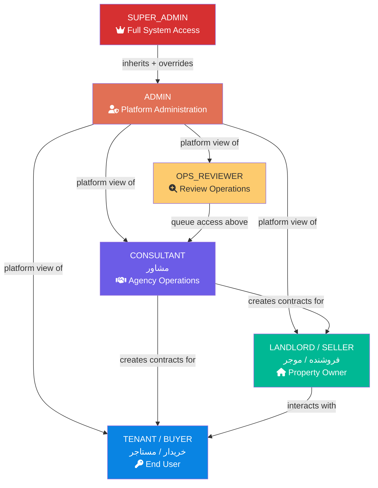
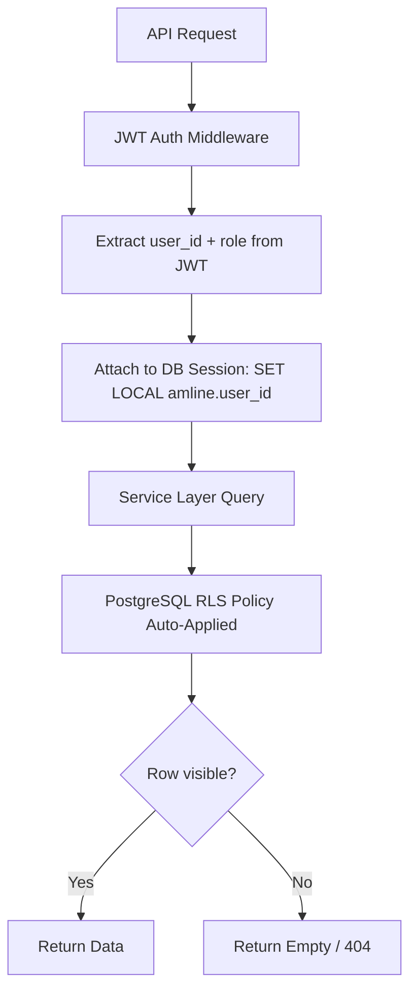
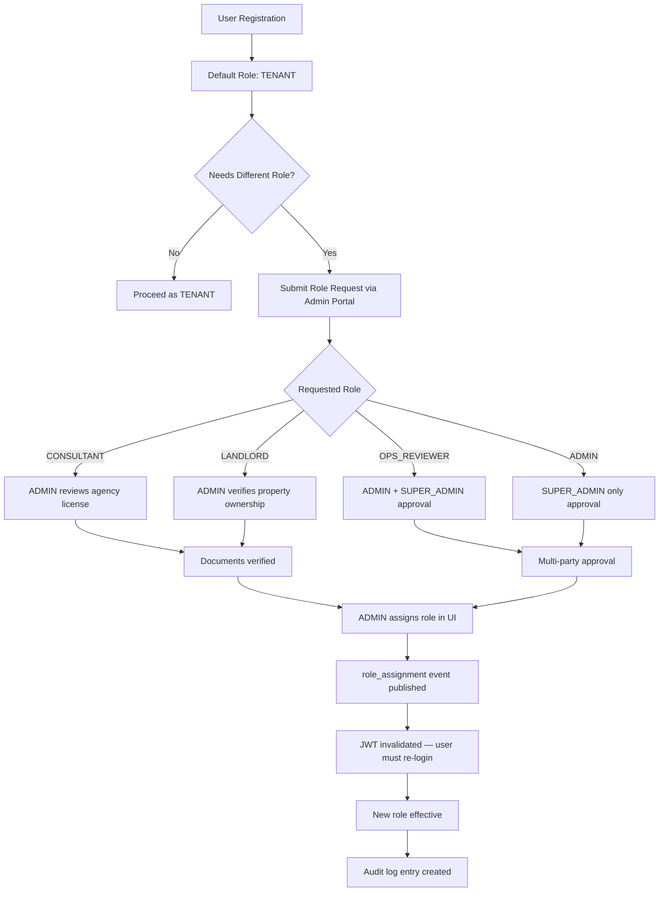

# RBAC Permissions Specification — Amline Enterprise Master v5.0

| Field       | Value                      |
|-------------|----------------------------|
| Version     | v5.0                       |
| Date        | 2026-04-15                 |
| Status      | Active                     |
| Maintainer  | Security & Platform Team   |
| Document ID | AME-RBAC-0007              |

---

## Table of Contents

1. [RBAC Overview and Principles](#1-rbac-overview-and-principles)
2. [Role Hierarchy](#2-role-hierarchy)
3. [Role Definitions](#3-role-definitions)
4. [Permissions Matrix](#4-permissions-matrix)
5. [Row-Level Security (RLS) Rules](#5-row-level-security-rls-rules)
6. [Permission Enforcement Implementation](#6-permission-enforcement-implementation)
7. [PostgreSQL RLS Policy Examples](#7-postgresql-rls-policy-examples)
8. [Role Assignment Workflow](#8-role-assignment-workflow)
9. [Audit Logging for Permission Changes](#9-audit-logging-for-permission-changes)

---

## 1. RBAC Overview and Principles

Amline v5.0 uses **Role-Based Access Control (RBAC)** to enforce authorization across all platform operations. Every API request is validated against the requesting user's assigned role(s) before any business logic executes.

### Core Principles

| Principle                    | Description                                                                          |
|------------------------------|--------------------------------------------------------------------------------------|
| **Least Privilege**          | Each role is granted only the minimum permissions required to perform its function   |
| **Separation of Concerns**   | Roles do not cross domain boundaries (e.g., reviewers cannot manage payments)        |
| **Explicit Deny**            | All permissions are DENY by default; access must be explicitly granted               |
| **Single Role Assignment**   | Each user has exactly one primary role (no role stacking except SUPER_ADMIN override)|
| **Row-Level Isolation**      | Even within a role, users only see data they are entitled to view                    |
| **Audit Everything**         | All role assignments and permission escalations are logged immutably                 |
| **Time-Bounded Elevation**   | Temporary role elevation expires automatically (max 8 hours)                         |

### RBAC vs. ABAC

Amline uses RBAC for coarse-grained access (API endpoints) and ABAC (Attribute-Based) for fine-grained row-level decisions (e.g., "can this user see this specific contract?").

---

## 2. Role Hierarchy



### Role Inheritance Note

Roles do **NOT** inherit permissions in a chain. Each role is an independent permission set defined explicitly. The diagram shows organizational relationships, not permission inheritance.

---

## 3. Role Definitions

### 3.1 SUPER_ADMIN

| Attribute       | Value                              |
|-----------------|------------------------------------|
| **Role Code**   | `SUPER_ADMIN`                      |
| **Persian Name**| مدیر ارشد سیستم                    |
| **Scope**       | Global — all tenants, all data     |
| **Typical User**| CTO, Senior DevOps, Security Lead  |
| **Max Users**   | 3 (hard limit enforced by system)  |

**Capabilities:**
- Full read/write access to all system resources without restriction.
- Can assign or revoke any role including ADMIN.
- Can override any contract state machine transition.
- Access to raw audit logs, security logs, and system configuration.
- Can trigger event replay and DLQ manual processing.
- Can access financial settlement records and escrow balances.
- Can temporarily disable any user account.
- Two-factor authentication is **mandatory** and enforced at login.

**Restrictions:**
- All SUPER_ADMIN actions are logged with before/after state and cannot be hidden.
- Cannot delete audit log entries (immutable ledger).
- Must provide justification for state overrides (captured in audit log).

---

### 3.2 ADMIN

| Attribute       | Value                              |
|-----------------|------------------------------------|
| **Role Code**   | `ADMIN`                            |
| **Persian Name**| مدیر پلتفرم                        |
| **Scope**       | Global — all tenants               |
| **Typical User**| Platform managers, support leads   |

**Capabilities:**
- User management: create, suspend, activate, reset passwords.
- Role assignment for CONSULTANT, LANDLORD, TENANT roles only.
- Generate platform-wide reports (contract volume, payment stats).
- Access support ticket queue.
- View KYC verification status (not raw documents).
- Configure system notification templates.
- Manage marketplace listings.
- Access admin dashboard with platform metrics.

**Restrictions:**
- Cannot access or modify financial settlement amounts.
- Cannot assign SUPER_ADMIN or ADMIN roles (SUPER_ADMIN only).
- Cannot override contract state transitions.
- Cannot view raw payment gateway credentials.

---

### 3.3 OPS_REVIEWER

| Attribute       | Value                                  |
|-----------------|----------------------------------------|
| **Role Code**   | `OPS_REVIEWER`                         |
| **Persian Name**| کارشناس بررسی                          |
| **Scope**       | All contracts in review queue          |
| **Typical User**| Operations staff, compliance officers  |

**Capabilities:**
- View all contracts in PENDING_REVIEW and UNDER_REVIEW states.
- APPROVE, REJECT, or ESCALATE review items.
- View contract documents uploaded by parties.
- View KYC verification status of contract parties.
- Add review notes and checklist completions.
- View property details linked to contracts.
- Escalate to senior reviewer or manager.

**Restrictions:**
- Cannot modify user profile data.
- Cannot initiate, verify, or cancel payments.
- Cannot directly transition contract state (only via review decision).
- Cannot view financial ledger or escrow balances.
- Cannot issue or void tracking codes directly.

---

### 3.4 CONSULTANT / AGENT (مشاور)

| Attribute       | Value                                          |
|-----------------|------------------------------------------------|
| **Role Code**   | `CONSULTANT`                                   |
| **Persian Name**| مشاور / نماینده                               |
| **Scope**       | Own agency, assigned contracts                 |
| **Typical User**| Real estate agents, property consultants       |

**Capabilities:**
- Create contracts on behalf of buyer or seller clients.
- View all contracts they have created or are assigned as agent.
- Submit contracts for review on client's behalf.
- View own commission statements.
- Upload documents for contracts they manage.
- Create support tickets for their contracts.
- View property listings in marketplace.

**Restrictions:**
- Cannot approve or reject contracts (OPS_REVIEWER only).
- Cannot access contracts from other consultants.
- Cannot initiate payments (parties only).
- Cannot modify user profiles of their clients.
- Commission rate capped at 5% (enforced by VR-006).

---

### 3.5 LANDLORD / SELLER (فروشنده / موجر)

| Attribute       | Value                                          |
|-----------------|------------------------------------------------|
| **Role Code**   | `LANDLORD`                                     |
| **Persian Name**| فروشنده / موجر                                |
| **Scope**       | Own contracts and properties                   |
| **Typical User**| Property owners, sellers                       |

**Capabilities:**
- View all contracts where they are the seller/landlord.
- Accept or reject an incoming offer.
- Submit a counter-offer within the allowed window.
- Upload property documents.
- View contract state history for own contracts.
- File a dispute for active contracts.
- Create support tickets.
- View tracking codes for their contracts.

**Restrictions:**
- Cannot initiate payment (buyer/tenant initiates).
- Cannot view contracts where they are not a party.
- Cannot access review queue.
- Cannot see other users' commission information.
- Cannot create contracts (CONSULTANT or TENANT initiates).

---

### 3.6 TENANT / BUYER (خریدار / مستاجر)

| Attribute       | Value                                          |
|-----------------|------------------------------------------------|
| **Role Code**   | `TENANT`                                       |
| **Persian Name**| خریدار / مستاجر                               |
| **Scope**       | Own contracts                                  |
| **Typical User**| Property buyers, renters                       |

**Capabilities:**
- Create new contract requests.
- View all their own contracts.
- Submit contracts for review.
- Accept or reject counter-offers.
- Initiate payments for deposit.
- File disputes for active contracts.
- View tracking codes issued to them.
- Create support tickets.
- Search marketplace listings.

**Restrictions:**
- Cannot see other users' contracts.
- Cannot access review queue.
- Cannot approve or reject contracts as a reviewer.
- Cannot assign tracking codes (system/TrackingService only).
- Cannot view financial ledger entries of other users.

---

## 4. Permissions Matrix

Legend: ✅ Allowed | ❌ Denied | 🔶 Own records only | 🔷 Assigned records only

### 4.1 Contract Domain

| Permission                            | SUPER_ADMIN | ADMIN | OPS_REVIEWER | CONSULTANT  | LANDLORD | TENANT |
|---------------------------------------|:-----------:|:-----:|:------------:|:-----------:|:--------:|:------:|
| contract:create                       | ✅           | ❌     | ❌            | ✅           | ❌        | ✅      |
| contract:read:all                     | ✅           | ✅     | ✅            | ❌           | ❌        | ❌      |
| contract:read:own                     | ✅           | ✅     | ✅            | 🔷           | 🔶        | 🔶      |
| contract:update:draft                 | ✅           | ❌     | ❌            | 🔷           | 🔶        | 🔶      |
| contract:delete                       | ✅           | ❌     | ❌            | ❌           | ❌        | ❌      |
| contract:submit_for_review            | ✅           | ❌     | ❌            | 🔷           | ❌        | 🔶      |
| contract:accept                       | ✅           | ❌     | ❌            | ❌           | 🔶        | 🔶      |
| contract:reject                       | ✅           | ❌     | ❌            | ❌           | 🔶        | 🔶      |
| contract:counter_offer                | ✅           | ❌     | ❌            | 🔷           | 🔶        | 🔶      |
| contract:cancel                       | ✅           | ✅     | ❌            | 🔷           | 🔶        | 🔶      |
| contract:state_override               | ✅           | ❌     | ❌            | ❌           | ❌        | ❌      |
| contract:view_history                 | ✅           | ✅     | ✅            | 🔷           | 🔶        | 🔶      |
| contract:view_documents               | ✅           | ✅     | ✅            | 🔷           | 🔶        | 🔶      |
| contract:upload_documents             | ✅           | ❌     | ❌            | 🔷           | 🔶        | 🔶      |
| contract:dispute                      | ✅           | ❌     | ❌            | ❌           | 🔶        | 🔶      |

### 4.2 Payment Domain

| Permission                            | SUPER_ADMIN | ADMIN | OPS_REVIEWER | CONSULTANT  | LANDLORD | TENANT |
|---------------------------------------|:-----------:|:-----:|:------------:|:-----------:|:--------:|:------:|
| payment:initiate                      | ✅           | ❌     | ❌            | ❌           | ❌        | 🔶      |
| payment:verify                        | ✅           | ❌     | ❌            | ❌           | ❌        | 🔶      |
| payment:read:own                      | ✅           | ✅     | ❌            | ❌           | 🔶        | 🔶      |
| payment:read:all                      | ✅           | ✅     | ❌            | ❌           | ❌        | ❌      |
| payment:refund                        | ✅           | ❌     | ❌            | ❌           | ❌        | 🔶      |
| payment:ledger:read:own               | ✅           | ✅     | ❌            | ❌           | 🔶        | 🔶      |
| payment:ledger:read:all               | ✅           | ✅     | ❌            | ❌           | ❌        | ❌      |
| payment:settlement:read               | ✅           | ❌     | ❌            | ❌           | ❌        | ❌      |
| payment:settlement:execute            | ✅           | ❌     | ❌            | ❌           | ❌        | ❌      |
| payment:summary:own                   | ✅           | ✅     | ❌            | 🔷           | 🔶        | 🔶      |
| escrow:view                           | ✅           | ✅     | ❌            | ❌           | 🔶        | 🔶      |
| escrow:release                        | ✅           | ❌     | ❌            | ❌           | ❌        | ❌      |

### 4.3 Review Domain

| Permission                            | SUPER_ADMIN | ADMIN | OPS_REVIEWER | CONSULTANT  | LANDLORD | TENANT |
|---------------------------------------|:-----------:|:-----:|:------------:|:-----------:|:--------:|:------:|
| review:queue:read                     | ✅           | ✅     | ✅            | ❌           | ❌        | ❌      |
| review:assign                         | ✅           | ✅     | ✅            | ❌           | ❌        | ❌      |
| review:decision:approve               | ✅           | ❌     | ✅            | ❌           | ❌        | ❌      |
| review:decision:reject                | ✅           | ❌     | ✅            | ❌           | ❌        | ❌      |
| review:escalate                       | ✅           | ✅     | ✅            | ❌           | ❌        | ❌      |
| review:read:own                       | ✅           | ✅     | ✅            | 🔷           | 🔶        | 🔶      |
| review:notes:write                    | ✅           | ❌     | ✅            | ❌           | ❌        | ❌      |
| review:sla:override                   | ✅           | ✅     | ❌            | ❌           | ❌        | ❌      |

### 4.4 Tracking Domain

| Permission                            | SUPER_ADMIN | ADMIN | OPS_REVIEWER | CONSULTANT  | LANDLORD | TENANT |
|---------------------------------------|:-----------:|:-----:|:------------:|:-----------:|:--------:|:------:|
| tracking:issue                        | ✅           | ❌     | ❌            | ❌           | ❌        | ❌      |
| tracking:void                         | ✅           | ✅     | ❌            | ❌           | ❌        | ❌      |
| tracking:verify:public                | ✅           | ✅     | ✅            | ✅           | ✅        | ✅      |
| tracking:read:own                     | ✅           | ✅     | ✅            | 🔷           | 🔶        | 🔶      |
| tracking:read:all                     | ✅           | ✅     | ❌            | ❌           | ❌        | ❌      |
| tracking:history                      | ✅           | ✅     | ✅            | 🔷           | 🔶        | 🔶      |

### 4.5 Agency / Commission Domain

| Permission                            | SUPER_ADMIN | ADMIN | OPS_REVIEWER | CONSULTANT  | LANDLORD | TENANT |
|---------------------------------------|:-----------:|:-----:|:------------:|:-----------:|:--------:|:------:|
| agency:commission:read:own            | ✅           | ✅     | ❌            | 🔶           | ❌        | ❌      |
| agency:commission:read:all            | ✅           | ✅     | ❌            | ❌           | ❌        | ❌      |
| agency:commission:configure           | ✅           | ✅     | ❌            | ❌           | ❌        | ❌      |
| agency:consultant:create              | ✅           | ✅     | ❌            | ❌           | ❌        | ❌      |
| agency:consultant:read                | ✅           | ✅     | ❌            | 🔶           | ❌        | ❌      |
| agency:performance:report             | ✅           | ✅     | ❌            | 🔶           | ❌        | ❌      |

### 4.6 Support Domain

| Permission                            | SUPER_ADMIN | ADMIN | OPS_REVIEWER | CONSULTANT  | LANDLORD | TENANT |
|---------------------------------------|:-----------:|:-----:|:------------:|:-----------:|:--------:|:------:|
| support:ticket:create                 | ✅           | ✅     | ✅            | ✅           | ✅        | ✅      |
| support:ticket:read:own               | ✅           | ✅     | ✅            | 🔶           | 🔶        | 🔶      |
| support:ticket:read:all               | ✅           | ✅     | ❌            | ❌           | ❌        | ❌      |
| support:ticket:assign                 | ✅           | ✅     | ❌            | ❌           | ❌        | ❌      |
| support:ticket:resolve                | ✅           | ✅     | ✅            | ❌           | ❌        | ❌      |
| support:ticket:escalate               | ✅           | ✅     | ✅            | ❌           | ❌        | ❌      |
| support:ticket:update                 | ✅           | ✅     | ✅            | 🔶           | 🔶        | 🔶      |

### 4.7 Marketplace Domain

| Permission                            | SUPER_ADMIN | ADMIN | OPS_REVIEWER | CONSULTANT  | LANDLORD | TENANT |
|---------------------------------------|:-----------:|:-----:|:------------:|:-----------:|:--------:|:------:|
| marketplace:listing:create            | ✅           | ✅     | ❌            | ✅           | ✅        | ❌      |
| marketplace:listing:read              | ✅           | ✅     | ✅            | ✅           | ✅        | ✅      |
| marketplace:listing:update:own        | ✅           | ✅     | ❌            | 🔶           | 🔶        | ❌      |
| marketplace:listing:delete            | ✅           | ✅     | ❌            | 🔶           | 🔶        | ❌      |
| marketplace:listing:feature           | ✅           | ✅     | ❌            | ❌           | ❌        | ❌      |
| marketplace:search                    | ✅           | ✅     | ✅            | ✅           | ✅        | ✅      |

### 4.8 User & Admin Domain

| Permission                            | SUPER_ADMIN | ADMIN | OPS_REVIEWER | CONSULTANT  | LANDLORD | TENANT |
|---------------------------------------|:-----------:|:-----:|:------------:|:-----------:|:--------:|:------:|
| user:profile:read:own                 | ✅           | ✅     | ✅            | ✅           | ✅        | ✅      |
| user:profile:update:own               | ✅           | ✅     | ✅            | ✅           | ✅        | ✅      |
| user:profile:read:any                 | ✅           | ✅     | ✅            | ❌           | ❌        | ❌      |
| user:profile:update:any               | ✅           | ✅     | ❌            | ❌           | ❌        | ❌      |
| user:suspend                          | ✅           | ✅     | ❌            | ❌           | ❌        | ❌      |
| user:activate                         | ✅           | ✅     | ❌            | ❌           | ❌        | ❌      |
| user:kyc:view                         | ✅           | ✅     | ✅            | ❌           | ❌        | ❌      |
| user:kyc:approve                      | ✅           | ❌     | ❌            | ❌           | ❌        | ❌      |
| role:assign:consultant                | ✅           | ✅     | ❌            | ❌           | ❌        | ❌      |
| role:assign:admin                     | ✅           | ❌     | ❌            | ❌           | ❌        | ❌      |
| role:assign:super_admin               | ✅           | ❌     | ❌            | ❌           | ❌        | ❌      |
| admin:dashboard:view                  | ✅           | ✅     | ❌            | ❌           | ❌        | ❌      |
| admin:reports:generate                | ✅           | ✅     | ❌            | ❌           | ❌        | ❌      |
| audit:log:read                        | ✅           | ✅     | ❌            | ❌           | ❌        | ❌      |
| system:config:read                    | ✅           | ✅     | ❌            | ❌           | ❌        | ❌      |
| system:config:write                   | ✅           | ❌     | ❌            | ❌           | ❌        | ❌      |

---

## 5. Row-Level Security (RLS) Rules

### 5.1 RLS Policy Definitions

| Rule ID | Entity      | Role           | Access Condition                                          |
|---------|-------------|----------------|-----------------------------------------------------------|
| RLS-001 | contracts   | TENANT         | `buyer_id = current_user_id OR seller_id = current_user_id` |
| RLS-002 | contracts   | LANDLORD       | `seller_id = current_user_id OR buyer_id = current_user_id` |
| RLS-003 | contracts   | CONSULTANT     | `agent_id = current_user_id`                             |
| RLS-004 | contracts   | OPS_REVIEWER   | `state IN ('PENDING_REVIEW','UNDER_REVIEW')` OR `reviewer_id = current_user_id` |
| RLS-005 | contracts   | ADMIN          | All rows (no restriction)                                |
| RLS-006 | contracts   | SUPER_ADMIN    | All rows (no restriction)                                |
| RLS-007 | payments    | TENANT         | `payer_id = current_user_id`                             |
| RLS-008 | payments    | LANDLORD       | Contract where `seller_id = current_user_id`             |
| RLS-009 | payments    | OPS_REVIEWER   | No access (denied at permission level)                   |
| RLS-010 | review_items| OPS_REVIEWER   | All review items OR `assigned_reviewer_id = current_user_id` |
| RLS-011 | review_items| CONSULTANT     | Contracts where `agent_id = current_user_id`             |
| RLS-012 | tracking    | TENANT/LANDLORD| `issued_to = current_user_id` OR contract party          |
| RLS-013 | support_tickets | All       | `created_by = current_user_id` (non-admin)               |

### 5.2 RLS Enforcement Architecture



---

## 6. Permission Enforcement Implementation

### 6.1 JWT Claims Structure

```json
{
  "sub": "USR-10001",
  "role": "TENANT",
  "email": "user@example.com",
  "phone": "+989123456789",
  "kyc_level": "FULL",
  "iat": 1713175200,
  "exp": 1713178800,
  "jti": "550e8400-e29b-41d4-a716-446655440000",
  "iss": "https://auth.amline.ir",
  "aud": "https://api.amline.ir"
}
```

### 6.2 Middleware Implementation

```python
from functools import wraps
from flask import request, g, abort
import jwt

ROLE_PERMISSIONS = {
    "SUPER_ADMIN": {"*"},  # wildcard
    "ADMIN": {
        "contract:read:all", "user:profile:update:any",
        "admin:dashboard:view", "admin:reports:generate",
        # ... full set
    },
    "OPS_REVIEWER": {
        "review:queue:read", "review:decision:approve",
        "review:decision:reject", "review:escalate",
        # ... full set
    },
    "CONSULTANT": {
        "contract:create", "contract:read:own",
        "contract:submit_for_review", "marketplace:listing:create",
        # ... full set
    },
    "LANDLORD": {
        "contract:read:own", "contract:accept", "contract:reject",
        "contract:counter_offer", "contract:dispute",
        # ... full set
    },
    "TENANT": {
        "contract:create", "contract:read:own", "contract:submit_for_review",
        "payment:initiate", "payment:verify", "contract:dispute",
        # ... full set
    },
}

def require_permission(permission: str):
    def decorator(f):
        @wraps(f)
        def wrapper(*args, **kwargs):
            user_role = g.current_user["role"]
            role_perms = ROLE_PERMISSIONS.get(user_role, set())
            if "*" not in role_perms and permission not in role_perms:
                abort(403, description=f"Permission denied: {permission}")
            return f(*args, **kwargs)
        return wrapper
    return decorator

def jwt_required(f):
    @wraps(f)
    def wrapper(*args, **kwargs):
        token = request.headers.get("Authorization", "").replace("Bearer ", "")
        try:
            payload = jwt.decode(token, settings.JWT_PUBLIC_KEY, algorithms=["RS256"])
            g.current_user = payload
        except jwt.ExpiredSignatureError:
            abort(401, description="Token expired")
        except jwt.InvalidTokenError:
            abort(401, description="Invalid token")
        return f(*args, **kwargs)
    return wrapper

# Usage
@app.route("/contracts", methods=["POST"])
@jwt_required
@require_permission("contract:create")
def create_contract():
    ...
```

---

## 7. PostgreSQL RLS Policy Examples

```sql
-- Enable RLS on contracts table
ALTER TABLE contracts ENABLE ROW LEVEL SECURITY;
ALTER TABLE contracts FORCE ROW LEVEL SECURITY;

-- Create role-specific policies
CREATE POLICY tenant_own_contracts ON contracts
    FOR ALL
    TO amline_app_role
    USING (
        current_setting('amline.user_role') = 'TENANT'
        AND (buyer_id = current_setting('amline.user_id')
             OR seller_id = current_setting('amline.user_id'))
    );

CREATE POLICY landlord_own_contracts ON contracts
    FOR ALL
    TO amline_app_role
    USING (
        current_setting('amline.user_role') = 'LANDLORD'
        AND (seller_id = current_setting('amline.user_id')
             OR buyer_id = current_setting('amline.user_id'))
    );

CREATE POLICY consultant_assigned_contracts ON contracts
    FOR ALL
    TO amline_app_role
    USING (
        current_setting('amline.user_role') = 'CONSULTANT'
        AND agent_id = current_setting('amline.user_id')
    );

CREATE POLICY ops_reviewer_queue_contracts ON contracts
    FOR SELECT
    TO amline_app_role
    USING (
        current_setting('amline.user_role') = 'OPS_REVIEWER'
        AND state IN ('PENDING_REVIEW', 'UNDER_REVIEW', 'APPROVED', 'REJECTED')
    );

CREATE POLICY admin_all_contracts ON contracts
    FOR ALL
    TO amline_app_role
    USING (
        current_setting('amline.user_role') IN ('ADMIN', 'SUPER_ADMIN')
    );

-- Payments RLS
ALTER TABLE payments ENABLE ROW LEVEL SECURITY;

CREATE POLICY user_own_payments ON payments
    FOR SELECT
    TO amline_app_role
    USING (
        current_setting('amline.user_role') IN ('TENANT', 'LANDLORD')
        AND payer_id = current_setting('amline.user_id')
    );

CREATE POLICY admin_all_payments ON payments
    FOR ALL
    TO amline_app_role
    USING (
        current_setting('amline.user_role') IN ('ADMIN', 'SUPER_ADMIN')
    );

-- Session variable setter (called at start of every DB session/transaction)
-- Application code must call this before any query:
CREATE OR REPLACE FUNCTION set_amline_session(user_id TEXT, user_role TEXT)
RETURNS VOID AS $$
BEGIN
    PERFORM set_config('amline.user_id', user_id, true);
    PERFORM set_config('amline.user_role', user_role, true);
END;
$$ LANGUAGE plpgsql SECURITY DEFINER;
```

---

## 8. Role Assignment Workflow



### Role Assignment API

```http
POST /admin/users/{user_id}/role
Authorization: Bearer <admin_token>

{
  "role": "CONSULTANT",
  "reason": "Verified agency license #12345",
  "effective_from": "2026-04-15T00:00:00Z",
  "effective_until": null,
  "approved_by": "USR-ADMIN-001"
}
```

### Role Revocation

```http
DELETE /admin/users/{user_id}/role
Authorization: Bearer <admin_or_super_admin_token>

{
  "reason": "Agency license expired",
  "revoked_by": "USR-ADMIN-001",
  "revert_to_role": "TENANT"
}
```

---

## 9. Audit Logging for Permission Changes

### Audit Log Schema

```sql
CREATE TABLE permission_audit_log (
    id              BIGSERIAL       PRIMARY KEY,
    event_type      VARCHAR(50)     NOT NULL,
    -- event_type: ROLE_ASSIGNED, ROLE_REVOKED, PERMISSION_OVERRIDE,
    --             ROLE_ELEVATION_GRANTED, ROLE_ELEVATION_EXPIRED
    target_user_id  VARCHAR(50)     NOT NULL,
    actor_user_id   VARCHAR(50)     NOT NULL,
    old_role        VARCHAR(30),
    new_role        VARCHAR(30),
    reason          TEXT            NOT NULL,
    metadata        JSONB           NOT NULL DEFAULT '{}',
    ip_address      INET,
    user_agent      TEXT,
    created_at      TIMESTAMPTZ     NOT NULL DEFAULT NOW()
);

CREATE INDEX idx_perm_audit_target ON permission_audit_log (target_user_id, created_at DESC);
CREATE INDEX idx_perm_audit_actor  ON permission_audit_log (actor_user_id, created_at DESC);
CREATE INDEX idx_perm_audit_type   ON permission_audit_log (event_type, created_at DESC);

-- Immutability: no updates or deletes allowed
CREATE RULE no_update_permission_audit AS ON UPDATE TO permission_audit_log DO INSTEAD NOTHING;
CREATE RULE no_delete_permission_audit AS ON DELETE TO permission_audit_log DO INSTEAD NOTHING;
```

### Audit Log Entry Example

```json
{
  "id": 10001,
  "event_type": "ROLE_ASSIGNED",
  "target_user_id": "USR-50010",
  "actor_user_id": "USR-ADMIN-001",
  "old_role": "TENANT",
  "new_role": "CONSULTANT",
  "reason": "Verified agency license #12345 issued by Real Estate Organization",
  "metadata": {
    "license_number": "RE-ORG-12345",
    "license_verified_at": "2026-04-15T09:00:00Z",
    "approval_ticket": "TKT-2026-00299"
  },
  "ip_address": "185.123.45.67",
  "user_agent": "Mozilla/5.0 ...",
  "created_at": "2026-04-15T10:00:00Z"
}
```

---

*Document maintained by Security & Platform Team. For changes, open a PR against `docs/v5/RBAC-PERMISSIONS.md`.*
