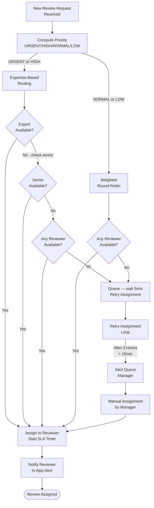
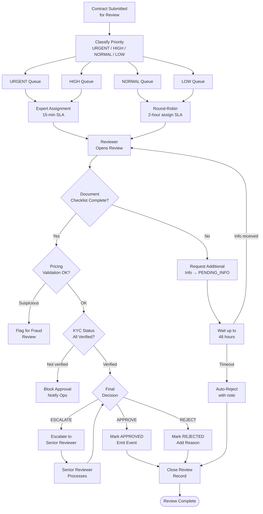
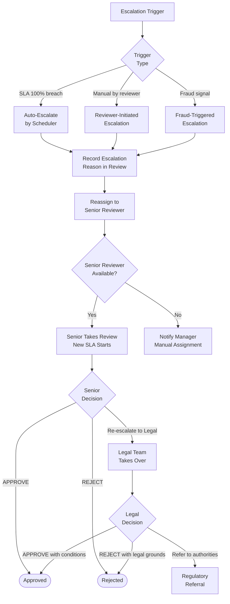

# Review Operations Specification — Amline v5.0

| Attribute | Value |
|-----------|-------|
| **Version** | v5.0 |
| **Date** | 2026-04-15 |
| **Status** | Active |
| **Domain** | Review Operations |
| **Service** | `review-svc` |
| **Owner** | Review-Ops Team |

---

## Table of Contents

1. [Domain Overview](#1-domain-overview)
2. [Review Queue Management](#2-review-queue-management)
3. [Assignment Algorithm](#3-assignment-algorithm)
4. [Escalation Rules](#4-escalation-rules)
5. [SLA Definitions](#5-sla-definitions)
6. [Review States](#6-review-states)
7. [Review State Transitions](#7-review-state-transitions)
8. [Ops Team Workflows](#8-ops-team-workflows)
9. [Quality Control Metrics](#9-quality-control-metrics)
10. [Reviewer Performance Tracking](#10-reviewer-performance-tracking)
11. [Review Flows (Mermaid)](#11-review-flows)
12. [Review Action Types](#12-review-action-types)
13. [Database Schema](#13-database-schema)
14. [Cross-References](#14-cross-references)

---

## 1. Domain Overview

The **Review Operations Domain** provides the human-in-the-loop review layer for all contracts submitted on the Amline platform. No contract can advance from `PENDING_REVIEW` to `APPROVED` (or `REJECTED`) without a human reviewer making an explicit decision.

### 1.1 Why Human Review?

Real estate contracts in Iran carry legal and financial liability. Automated validation cannot detect all edge cases such as:
- Document forgery or manipulation.
- Undisclosed encumbrances on the property (بدهی ملکی).
- Suspicious pricing anomalies (potential money laundering).
- Incomplete or contradictory terms.
- KYC identity mismatch.

The review layer acts as a **compliance gate**, ensuring every contract meets regulatory and platform standards before parties commit funds.

### 1.2 Responsibilities

- Receive review requests from Contract domain.
- Classify and assign to the correct reviewer queue by priority.
- Monitor SLA timers and trigger escalations proactively.
- Record detailed review decisions with reasons and evidence.
- Track reviewer performance and SLA compliance.
- Produce quality audit reports for compliance.

---

## 2. Review Queue Management

### 2.1 Priority Queue Structure

| Priority | Code | Trigger Criteria | Target Assignment SLA | Target Completion SLA |
|----------|------|-----------------|----------------------|-----------------------|
| Urgent | `URGENT` | Contract value > 10B IRR OR fraud flag OR legal hold | 15 minutes | 1 hour |
| High | `HIGH` | Contract value 1B–10B IRR OR re-submission after rejection | 30 minutes | 4 hours |
| Normal | `NORMAL` | Standard contract submission | 2 hours | 24 hours |
| Low | `LOW` | DRAFT auto-saved but not urgently needed | 4 hours | 72 hours |

### 2.2 Priority Computation Algorithm

```python
def compute_review_priority(contract: Contract) -> Priority:
    # Fraud or legal flag overrides all
    if contract.has_fraud_flag or contract.has_legal_hold:
        return Priority.URGENT

    # Very high value → URGENT
    if contract.property_price >= 10_000_000_000:  # 10B IRR
        return Priority.URGENT

    # High value → HIGH
    if contract.property_price >= 1_000_000_000:   # 1B IRR
        return Priority.HIGH

    # Re-submission after rejection → HIGH
    if contract.previous_rejection_count > 0:
        return Priority.HIGH

    # Counter-offer round 3 → HIGH
    if contract.counter_offer_round >= 3:
        return Priority.HIGH

    # Standard submission
    return Priority.NORMAL
```

### 2.3 Queue Depth Monitoring

- Maximum URGENT queue depth: 5 unassigned items before manager alert.
- Maximum HIGH queue depth: 20 unassigned items before supervisor alert.
- Maximum NORMAL queue depth: 100 unassigned items before capacity warning.
- Queue metrics published to Prometheus every 30 seconds.

---

## 3. Assignment Algorithm

### 3.1 Round-Robin Assignment

For NORMAL and LOW priority queues, assignment uses **weighted round-robin** across all available reviewers with matching expertise:

```python
def assign_round_robin(queue: ReviewQueue, reviewers: list[Reviewer]) -> Reviewer:
    available = [r for r in reviewers if r.is_available and r.has_capacity()]
    if not available:
        return None  # Will retry after 5-minute delay
    # Weighted by current workload (lighter workload = higher selection weight)
    weights = [1.0 / max(r.active_review_count, 1) for r in available]
    return random.choices(available, weights=weights, k=1)[0]
```

### 3.2 Expertise-Based Routing

For URGENT and HIGH priority queues, assignment considers **reviewer expertise**:

```python
def assign_expertise_based(contract: Contract, reviewers: list[Reviewer]) -> Reviewer:
    # Match by contract type specialization
    type_experts = [
        r for r in reviewers
        if contract.type in r.specializations and r.is_available
    ]
    if type_experts:
        # Among experts, prefer reviewer with fewest active reviews
        return min(type_experts, key=lambda r: r.active_review_count)

    # Fallback to any available senior reviewer
    senior = [r for r in reviewers if r.level >= ReviewerLevel.SENIOR and r.is_available]
    if senior:
        return min(senior, key=lambda r: r.active_review_count)

    # Last resort: any available reviewer
    available = [r for r in reviewers if r.is_available]
    return min(available, key=lambda r: r.active_review_count, default=None)
```

### 3.3 Assignment Flow



---

## 4. Escalation Rules

### 4.1 SLA Breach Escalation Ladder

| Threshold | Action | Notification Target |
|-----------|--------|-------------------|
| SLA 0% elapsed | Review assigned | Reviewer (in-app) |
| SLA 25% elapsed | Yellow reminder | Reviewer (in-app) |
| SLA 50% elapsed | Orange warning | Reviewer (in-app + email) |
| SLA 75% elapsed | Red alert | Reviewer + Supervisor (in-app + email) |
| SLA 100% breached | Auto-escalate + KPI hit | Reviewer + Supervisor + Manager (all channels) |
| SLA 125% | Second escalation | Manager + Ops Director |
| SLA 150% | Critical alert | Manager + Ops Director + PagerDuty webhook |

### 4.2 Escalation Conditions

A review is escalated from `IN_REVIEW` or `UNDER_REVIEW` to `ESCALATED` when:

1. **SLA breach at 100%** — Automatic system escalation.
2. **Reviewer manually escalates** — Complex legal issues, suspected fraud, or jurisdictional questions.
3. **Reviewer requests specialist** — Property type outside reviewer expertise.
4. **Dispute escalation** — A dispute linked to this contract requires senior review.
5. **Compliance flag** — AML (anti-money laundering) signal detected.

### 4.3 De-escalation

An `ESCALATED` review returns to normal flow when:
- Senior reviewer completes review and issues decision.
- Additional information requested is provided within 48 hours.
- Legal hold is lifted by authorized admin.

---

## 5. SLA Definitions

| Priority | Assignment SLA | Completion SLA | Warning Threshold | Auto-Escalate |
|----------|---------------|---------------|------------------|--------------|
| `URGENT` | 15 minutes | 1 hour (60 min) | 30 min | 60 min |
| `HIGH` | 30 minutes | 4 hours (240 min) | 120 min | 240 min |
| `NORMAL` | 2 hours (120 min) | 24 hours (1440 min) | 720 min | 1440 min |
| `LOW` | 4 hours (240 min) | 72 hours (4320 min) | 2160 min | 4320 min |

### 5.1 SLA Pause Conditions

SLA timer is **paused** (not counted toward SLA) when:
- Review is in `PENDING_INFO` state (waiting for submitter to provide additional information).
- Business hours: SLA only counts during working hours (08:00–20:00 Tehran time, Saturday–Thursday).
- Legal hold: Admin has placed a legal hold on the contract.

### 5.2 SLA Measurement

```
sla_elapsed_minutes = (NOW() - review.assigned_at).total_minutes()
                      - sum(pause_periods)
sla_percentage      = sla_elapsed_minutes / review.sla_minutes × 100
```

---

## 6. Review States

| State | Code | Description |
|-------|------|-------------|
| Queued | `QUEUED` | Review created; awaiting reviewer assignment |
| Assigned | `ASSIGNED` | Reviewer assigned; not yet opened |
| In Review | `IN_REVIEW` | Reviewer has opened and is actively reviewing |
| Pending Info | `PENDING_INFO` | Reviewer requested additional info; SLA paused |
| Approved | `APPROVED` | Review passed; contract can proceed |
| Rejected | `REJECTED` | Review failed; contract returned with notes |
| Escalated | `ESCALATED` | Escalated to senior reviewer or legal |
| Closed | `CLOSED` | Terminal state; review complete and archived |

---

## 7. Review State Transitions

| # | From State | To State | Trigger | Actor | Conditions | Side Effects |
|---|-----------|---------|---------|-------|-----------|-------------|
| 1 | `QUEUED` | `ASSIGNED` | `assign_reviewer()` | Review-SVC (auto) | Available reviewer found | Start SLA timer; notify reviewer |
| 2 | `ASSIGNED` | `IN_REVIEW` | `open_review()` | Reviewer | Reviewer clicks "Start Review" | Record review opened timestamp |
| 3 | `IN_REVIEW` | `APPROVED` | `approve()` | Reviewer | Decision notes provided | Emit ReviewApproved; notify contract-svc |
| 4 | `IN_REVIEW` | `REJECTED` | `reject()` | Reviewer | Rejection reason (min 50 chars) provided | Emit ReviewRejected; notify submitter |
| 5 | `IN_REVIEW` | `PENDING_INFO` | `request_info()` | Reviewer | Info request details provided | Pause SLA timer; notify submitter |
| 6 | `IN_REVIEW` | `ESCALATED` | `escalate()` | Reviewer | Escalation reason provided | Assign senior reviewer; alert manager |
| 7 | `IN_REVIEW` | `ASSIGNED` | `reassign()` | Reviewer / Admin | Reassignment reason provided | Return to assignment with different reviewer |
| 8 | `PENDING_INFO` | `IN_REVIEW` | `info_submitted()` | Submitter / System | Info submitted within 48h | Resume SLA timer |
| 9 | `PENDING_INFO` | `REJECTED` | Scheduler | System | 48h info window expired | Auto-reject; emit ReviewRejected |
| 10 | `ESCALATED` | `APPROVED` | `approve()` | Senior Reviewer | — | Emit ReviewApproved |
| 11 | `ESCALATED` | `REJECTED` | `reject()` | Senior Reviewer | — | Emit ReviewRejected |
| 12 | `ESCALATED` | `ESCALATED` | `re_escalate()` | Senior Reviewer | Requires Director approval | Notify Ops Director |
| 13 | `APPROVED` | `CLOSED` | System (auto) | System | Contract leaves UNDER_REVIEW | Archive review record |
| 14 | `REJECTED` | `CLOSED` | System (auto) | System | Contract returns to DRAFT | Archive review record |
| 15 | `ESCALATED` | `CLOSED` | System (auto) | System | Decision made | Archive review record |

---

## 8. Ops Team Workflows

### 8.1 Daily Review Cycle

```
08:00 — Shift Start
  - Review overnight queue accumulation
  - Check SLA breach alerts from previous shift
  - Assign any unassigned URGENT/HIGH items manually if needed

08:30–12:00 — Morning Review Block
  - Process URGENT and HIGH priority reviews
  - Respond to PENDING_INFO items where info was submitted overnight

12:00–13:00 — Lunch Break (SLA paused for LOW priority only)

13:00–17:00 — Afternoon Review Block
  - Process NORMAL priority reviews
  - Conduct quality spot-checks on approved reviews from morning

17:00–19:00 — End of Day
  - Complete all URGENT reviews before shift end
  - Hand off HIGH priority to evening shift reviewer
  - Submit daily throughput report

19:00–20:00 — Evening Shift (on-call)
  - Monitor URGENT queue only
  - Escalate any new URGENT items immediately
```

### 8.2 Shift Handoff Protocol

When handing off between shifts, the outgoing reviewer must:
1. Complete or explicitly pause all IN_REVIEW items.
2. Document status notes for each paused review in the handoff log.
3. Confirm receipt with incoming reviewer (acknowledgment required in system).
4. Flag any items approaching SLA breach to the supervisor.

### 8.3 Quality Audit Process

Every week, the QA Lead:
1. Randomly samples 5% of approved reviews.
2. Checks document verification completeness.
3. Verifies pricing validation was performed.
4. Confirms all required fields were checked.
5. Scores each review 1–5 on the quality rubric.
6. Reviews below 3/5 trigger reviewer coaching session.

---

## 9. Quality Control Metrics

### 9.1 Review Quality KPIs

| KPI | Formula | Target | Measurement |
|-----|---------|--------|------------|
| **Accuracy Rate** | Correct decisions / Total decisions | > 98% | Weekly audit sample |
| **Throughput** | Reviews completed / Available hours | > 8 per reviewer per day | Daily |
| **SLA Compliance** | Reviews within SLA / Total reviews | > 95% | Daily |
| **First-Pass Approval Rate** | Approved on first review / Submitted | > 75% | Weekly |
| **Re-review Rate** | Contracts re-submitted after rejection / Total | < 20% | Weekly |
| **Escalation Rate** | Escalated / Total reviews | < 5% | Daily |
| **PENDING_INFO Rate** | Info requested / Total reviews | < 15% | Daily |
| **Avg Review Duration** | Mean time IN_REVIEW state | URGENT < 45min; NORMAL < 3h | Daily |

### 9.2 Platform-Level Review Health

| Metric | Alert Threshold |
|--------|----------------|
| Queue depth > 50 (NORMAL) | Yellow alert |
| Queue depth > 200 (NORMAL) | Red alert — hire capacity |
| SLA compliance < 90% | Manager escalation |
| SLA compliance < 80% | Director escalation |
| Reviewer accuracy < 95% | Coaching required |
| Reviewer accuracy < 90% | Performance review |

---

## 10. Reviewer Performance Tracking

### 10.1 Reviewer Scorecard

Each reviewer has a weekly scorecard:

| Dimension | Weight | Measurement |
|-----------|--------|------------|
| SLA Compliance | 30% | % reviews completed within SLA |
| Quality Score | 30% | Avg quality audit score (1–5 scale) |
| Throughput | 20% | Reviews per hour vs. target |
| Accuracy | 20% | % decisions confirmed correct on audit |
| **Total Score** | 100% | Weighted average |

### 10.2 Performance Tiers

| Score Range | Tier | Consequence |
|-------------|------|-------------|
| 90–100% | Excellent | Eligible for Senior promotion / bonus |
| 75–89% | Good | Meets expectations |
| 60–74% | Acceptable | Performance improvement plan recommended |
| Below 60% | Below Standard | Mandatory coaching + reassignment |

### 10.3 Reviewer Attributes

```python
class Reviewer:
    id: UUID
    user_id: UUID
    level: ReviewerLevel          # JUNIOR, STANDARD, SENIOR, LEAD
    specializations: list[str]    # e.g., ["PRESALE", "SALE", "HIGH_VALUE"]
    is_available: bool
    shift: str                    # MORNING, AFTERNOON, EVENING
    active_review_count: int
    max_concurrent_reviews: int   # 3 for JUNIOR, 5 for STANDARD, 8 for SENIOR
    weekly_score: float
    total_completed: int
    sla_compliance_rate: float
    quality_score: float
```

---

## 11. Review Flows

### 11.1 Full Review Queue Flow



### 11.2 Escalation Flow



---

## 12. Review Action Types

| Action | Code | Who Can Perform | Required Fields | Side Effects |
|--------|------|----------------|----------------|-------------|
| Approve | `APPROVE` | Reviewer, Senior Reviewer | `notes` (optional), `decision_summary` | Emit `ReviewApproved`; contract → APPROVED |
| Reject | `REJECT` | Reviewer, Senior Reviewer | `rejection_reason` (min 50 chars), `rejection_codes[]` | Emit `ReviewRejected`; contract → REJECTED |
| Request Info | `REQUEST_INFO` | Reviewer | `info_request_details`, `deadline` | Pause SLA; notify submitter |
| Escalate | `ESCALATE` | Reviewer | `escalation_reason`, `escalation_type` | Reassign to senior; alert manager |
| Reassign | `REASSIGN` | Admin, Manager | `target_reviewer_id`, `reassign_reason` | Reassign without state change; SLA continues |
| Add Comment | `COMMENT` | Reviewer, Admin | `comment_text` | Recorded in review timeline; no state change |
| Approve Override | `ADMIN_OVERRIDE_APPROVE` | Super Admin | `override_reason` (audit required) | Emit `ReviewApproved` with override flag |
| Reject Override | `ADMIN_OVERRIDE_REJECT` | Super Admin | `override_reason` (audit required) | Emit `ReviewRejected` with override flag |

### 12.1 Rejection Codes

| Code | Description |
|------|-------------|
| `REJ_001` | Insufficient or unreadable documents |
| `REJ_002` | KYC verification incomplete |
| `REJ_003` | Property details mismatch |
| `REJ_004` | Price anomaly — suspicious valuation |
| `REJ_005` | Missing required party information |
| `REJ_006` | Contract terms legally invalid |
| `REJ_007` | Duplicate contract detected |
| `REJ_008` | Suspected document forgery |
| `REJ_009` | AML / fraud signal |
| `REJ_010` | Other — see notes |

---

## 13. Database Schema

### 13.1 Reviews Table

```sql
CREATE TABLE reviews (
    id                  UUID PRIMARY KEY DEFAULT gen_random_uuid(),
    contract_id         UUID NOT NULL,
    state               VARCHAR(30) NOT NULL DEFAULT 'QUEUED'
                        CHECK (state IN (
                            'QUEUED', 'ASSIGNED', 'IN_REVIEW', 'PENDING_INFO',
                            'APPROVED', 'REJECTED', 'ESCALATED', 'CLOSED'
                        )),
    priority            VARCHAR(10) NOT NULL
                        CHECK (priority IN ('URGENT', 'HIGH', 'NORMAL', 'LOW')),
    assigned_reviewer_id UUID,
    assigned_at         TIMESTAMP WITH TIME ZONE,
    opened_at           TIMESTAMP WITH TIME ZONE,
    completed_at        TIMESTAMP WITH TIME ZONE,
    decision            VARCHAR(20) CHECK (decision IN ('APPROVED', 'REJECTED', 'ESCALATED')),
    decision_summary    TEXT,
    rejection_reason    TEXT,
    rejection_codes     VARCHAR(10)[],
    sla_minutes         INTEGER NOT NULL,
    sla_deadline        TIMESTAMP WITH TIME ZONE,
    sla_paused_at       TIMESTAMP WITH TIME ZONE,
    sla_paused_minutes  INTEGER NOT NULL DEFAULT 0,
    sla_breached        BOOLEAN NOT NULL DEFAULT FALSE,
    escalation_count    SMALLINT NOT NULL DEFAULT 0,
    submission_count    SMALLINT NOT NULL DEFAULT 1,
    is_override         BOOLEAN NOT NULL DEFAULT FALSE,
    override_actor_id   UUID,
    metadata            JSONB NOT NULL DEFAULT '{}',
    created_at          TIMESTAMP WITH TIME ZONE NOT NULL DEFAULT NOW(),
    updated_at          TIMESTAMP WITH TIME ZONE NOT NULL DEFAULT NOW()
);

CREATE INDEX idx_reviews_contract  ON reviews(contract_id);
CREATE INDEX idx_reviews_state     ON reviews(state);
CREATE INDEX idx_reviews_priority  ON reviews(priority);
CREATE INDEX idx_reviews_reviewer  ON reviews(assigned_reviewer_id);
CREATE INDEX idx_reviews_deadline  ON reviews(sla_deadline) WHERE state NOT IN ('CLOSED', 'APPROVED', 'REJECTED');
CREATE INDEX idx_reviews_created   ON reviews(created_at DESC);
```

### 13.2 Review Queues Table

```sql
CREATE TABLE review_queues (
    id              UUID PRIMARY KEY DEFAULT gen_random_uuid(),
    name            VARCHAR(50) NOT NULL UNIQUE,
    priority        VARCHAR(10) NOT NULL CHECK (priority IN ('URGENT', 'HIGH', 'NORMAL', 'LOW')),
    max_depth       INTEGER NOT NULL DEFAULT 500,
    current_depth   INTEGER NOT NULL DEFAULT 0,
    alert_threshold INTEGER NOT NULL,
    is_active       BOOLEAN NOT NULL DEFAULT TRUE,
    metadata        JSONB NOT NULL DEFAULT '{}',
    created_at      TIMESTAMP WITH TIME ZONE NOT NULL DEFAULT NOW()
);

INSERT INTO review_queues (name, priority, max_depth, alert_threshold) VALUES
    ('urgent-queue',  'URGENT', 50,   5),
    ('high-queue',    'HIGH',   200,  20),
    ('normal-queue',  'NORMAL', 1000, 100),
    ('low-queue',     'LOW',    2000, 500);
```

### 13.3 Reviewer Assignments Table

```sql
CREATE TABLE reviewer_assignments (
    id              UUID PRIMARY KEY DEFAULT gen_random_uuid(),
    reviewer_id     UUID NOT NULL,
    review_id       UUID NOT NULL REFERENCES reviews(id),
    assigned_at     TIMESTAMP WITH TIME ZONE NOT NULL DEFAULT NOW(),
    completed_at    TIMESTAMP WITH TIME ZONE,
    assignment_type VARCHAR(20) NOT NULL CHECK (assignment_type IN (
                        'AUTO_ROUND_ROBIN', 'AUTO_EXPERTISE', 'MANUAL_ADMIN', 'ESCALATION'
                    )),
    is_current      BOOLEAN NOT NULL DEFAULT TRUE,
    replaced_by     UUID REFERENCES reviewer_assignments(id),
    notes           TEXT
);

CREATE INDEX idx_assignments_reviewer ON reviewer_assignments(reviewer_id, is_current);
CREATE INDEX idx_assignments_review   ON reviewer_assignments(review_id);
```

### 13.4 Review Actions Table

```sql
CREATE TABLE review_actions (
    id              UUID PRIMARY KEY DEFAULT gen_random_uuid(),
    review_id       UUID NOT NULL REFERENCES reviews(id),
    action_type     VARCHAR(30) NOT NULL CHECK (action_type IN (
                        'APPROVE', 'REJECT', 'REQUEST_INFO', 'ESCALATE',
                        'REASSIGN', 'COMMENT', 'ADMIN_OVERRIDE_APPROVE', 'ADMIN_OVERRIDE_REJECT'
                    )),
    actor_id        UUID NOT NULL,
    actor_role      VARCHAR(50) NOT NULL,
    actor_ip        INET,
    payload         JSONB NOT NULL DEFAULT '{}',
    notes           TEXT,
    occurred_at     TIMESTAMP WITH TIME ZONE NOT NULL DEFAULT NOW()
);

CREATE INDEX idx_review_actions_review ON review_actions(review_id);
CREATE INDEX idx_review_actions_actor  ON review_actions(actor_id);
CREATE INDEX idx_review_actions_type   ON review_actions(action_type);
CREATE INDEX idx_review_actions_time   ON review_actions(occurred_at DESC);
```

---

## 14. Cross-References

| Topic | Reference Document |
|-------|------------------|
| Contract state machine | [CONTRACTS-SPEC.md](./CONTRACTS-SPEC.md) |
| Contract submission triggers | [CONTRACTS-SPEC.md — Section 4](./CONTRACTS-SPEC.md#4-state-transition-table) |
| Full event catalog | [EVENTS-CATALOG.md](./EVENTS-CATALOG.md) |
| Review-related events | [ENTERPRISE-MASTER.md — Section 14](./ENTERPRISE-MASTER.md#14-event-driven-architecture) |
| System SLA overview | [ENTERPRISE-MASTER.md — Appendix H](./ENTERPRISE-MASTER.md#appendix-h--sla-definitions) |
| Reviewer permissions | [ENTERPRISE-MASTER.md — Appendix D](./ENTERPRISE-MASTER.md#appendix-d--role-permission-matrix) |
| Review API endpoints | [ENTERPRISE-MASTER.md — Appendix E](./ENTERPRISE-MASTER.md#appendix-e--api-endpoint-catalog) |
