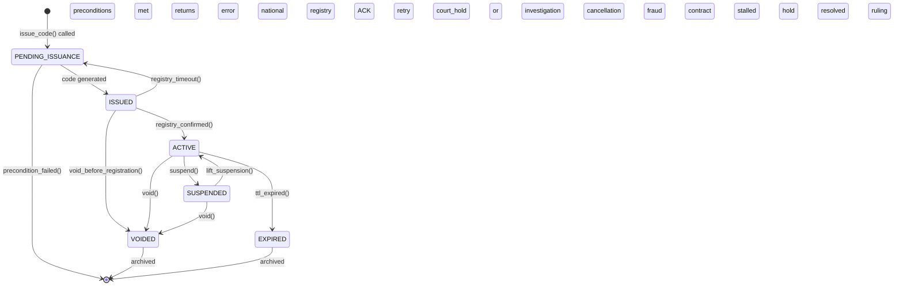
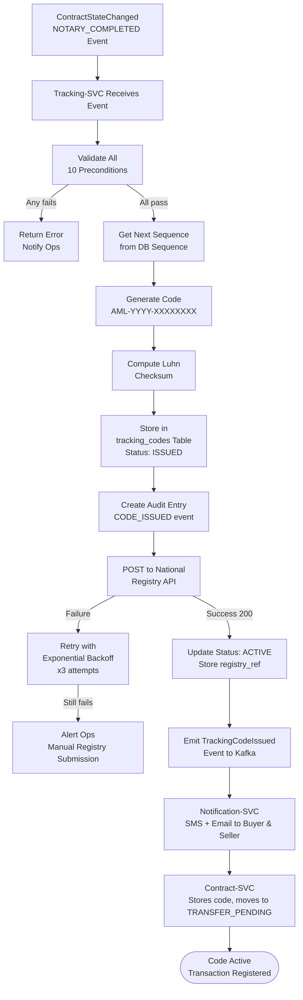
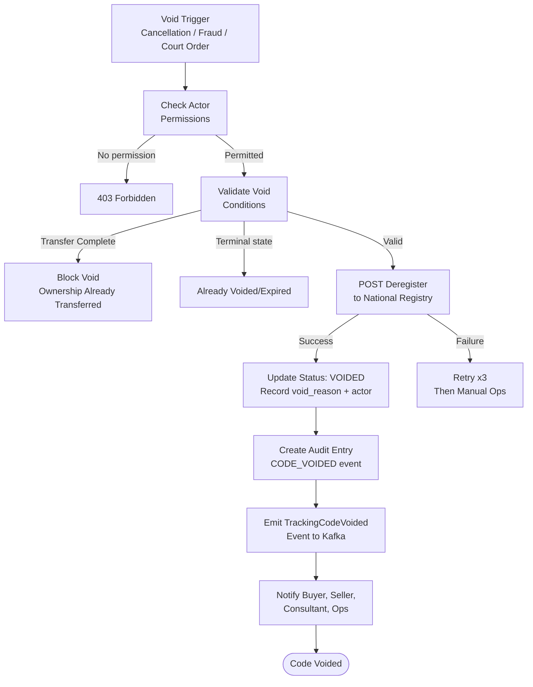
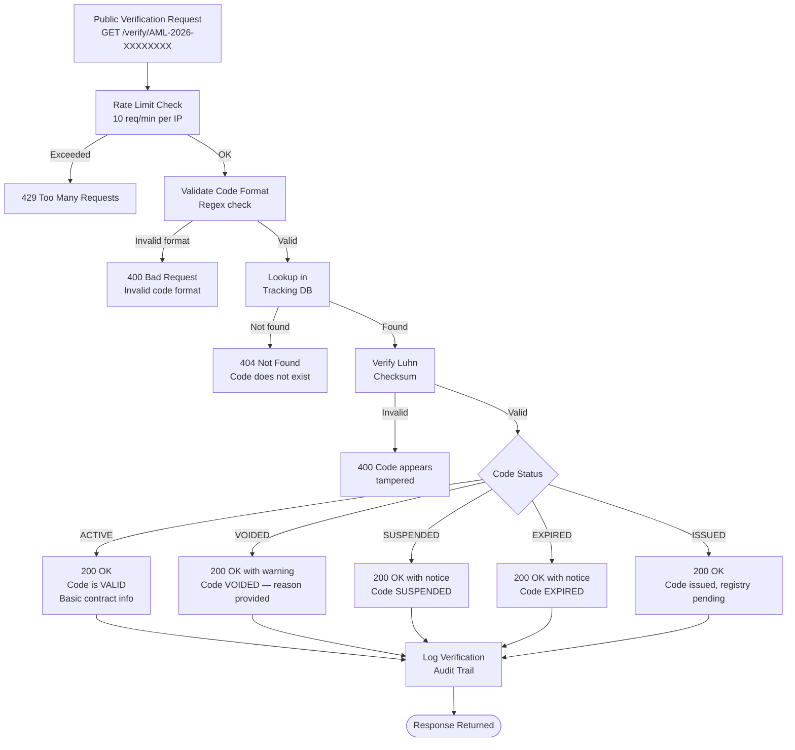

# Tracking Domain Specification — Amline v5.0

| Attribute | Value |
|-----------|-------|
| **Version** | v5.0 |
| **Date** | 2026-04-15 |
| **Status** | Active |
| **Domain** | Tracking |
| **Service** | `tracking-svc` |
| **Owner** | Tracking Domain Team |

---

## Table of Contents

1. [Domain Overview](#1-domain-overview)
2. [Tracking Code Generation Algorithm](#2-tracking-code-generation-algorithm)
3. [Preconditions for Code Issuance](#3-preconditions-for-code-issuance)
4. [Voiding Rules and Conditions](#4-voiding-rules-and-conditions)
5. [Code Format Specification](#5-code-format-specification)
6. [Tracking Code Lifecycle](#6-tracking-code-lifecycle)
7. [Integration with Contract States](#7-integration-with-contract-states)
8. [Audit Trail Requirements](#8-audit-trail-requirements)
9. [Tracking Code Flows (Mermaid)](#9-tracking-code-flows)
10. [Code Verification API](#10-code-verification-api)
11. [Database Schema](#11-database-schema)
12. [Cross-References](#12-cross-references)

---

## 1. Domain Overview

The **Tracking Domain** is responsible for issuing, managing, and revoking the official **کد رهگیری** (tracking code) that Iranian law mandates for all real estate transactions. This code serves as proof that the transaction has been registered with the national property registry (سامانه ثبت معاملات ملکی کشور).

### 1.1 Legal Context

Per the **قانون الزام ثبت معاملات ملکی** (Law on Mandatory Registration of Real Estate Transactions), every real estate transaction in Iran must:
1. Be registered in the national property transaction system.
2. Receive an official tracking code (کد رهگیری).
3. Have both parties' national IDs (کد ملی) verified and on file.
4. Be conducted through a licensed real estate agency.

Failure to obtain a tracking code renders the transaction legally unenforceable and exposes both parties to penalties.

### 1.2 Responsibilities

- Validate all preconditions before issuing a tracking code.
- Generate a unique, verifiable tracking code in the required format.
- Register the code with the national property registry API.
- Manage the code lifecycle: PENDING_ISSUANCE → ISSUED → ACTIVE → SUSPENDED → VOIDED / EXPIRED.
- Void codes when contracts are cancelled, disputed, or fraud is detected.
- Provide a public verification endpoint for third-party code validation.
- Maintain an immutable audit trail for every issuance and voiding event.

---

## 2. Tracking Code Generation Algorithm

### 2.1 Algorithm Overview

```python
import hashlib
import string
from datetime import datetime

TEHRAN_TZ = "Asia/Tehran"

def generate_tracking_code(contract_id: str, sequence_number: int) -> str:
    # Step 1: Format year (Gregorian — registry uses Gregorian)
    year = datetime.now().year  # e.g., 2026

    # Step 2: Pad sequence to 8 digits
    seq_padded = str(sequence_number).zfill(8)  # e.g., "00001234"

    # Step 3: Compute Luhn checksum digit
    raw_code = f"AML{year}{seq_padded}"
    checksum = _compute_luhn(raw_code)

    # Step 4: Assemble final code
    # Format: AML-YYYY-XXXXXXXX (without checksum in display format)
    display_code = f"AML-{year}-{seq_padded}"

    # Store internal code with checksum for verification
    internal_code = f"AML{year}{seq_padded}{checksum}"
    return display_code, internal_code

def _compute_luhn(partial_code: str) -> str:
    # Luhn algorithm over the numeric portion of the code
    digits = [int(c) for c in partial_code if c.isdigit()]
    total = 0
    for i, digit in enumerate(reversed(digits)):
        if i % 2 == 1:
            digit *= 2
            if digit > 9:
                digit -= 9
        total += digit
    check_digit = (10 - (total % 10)) % 10
    return str(check_digit)

def verify_tracking_code(display_code: str) -> bool:
    # Parse display code: AML-YYYY-XXXXXXXX
    parts = display_code.split("-")
    if len(parts) != 3 or parts[0] != "AML":
        return False
    year, seq = parts[1], parts[2]
    if not year.isdigit() or not seq.isdigit() or len(seq) != 8:
        return False
    raw = f"AML{year}{seq}"
    expected_checksum = _compute_luhn(raw)
    # Fetch stored internal code from DB and compare checksum
    stored = tracking_repo.get_by_display_code(display_code)
    if not stored:
        return False
    return stored.internal_code.endswith(expected_checksum)
```

### 2.2 Sequence Number Management

- Sequence numbers are **global** (not per-year) and monotonically increasing.
- Stored in a dedicated PostgreSQL sequence: `tracking_code_sequence`.
- The sequence is pre-allocated in batches of 1,000 for performance.
- Maximum sequence value: 99,999,999 (8 digits).
- When max is reached: year changes naturally, sequence resets automatically.

### 2.3 Code Uniqueness Guarantee

- `(year, sequence_number)` pair is guaranteed unique by database unique constraint.
- In the unlikely event of a collision (sequence wraparound), the system raises an alert and halts until manually resolved.

---

## 3. Preconditions for Code Issuance

All of the following conditions **must** be simultaneously satisfied before a tracking code is issued:

| # | Precondition | Check Method | Error if Fails |
|---|-------------|-------------|---------------|
| 1 | Contract state is `NOTARY_COMPLETED` | Contract domain sync call | `TRACKING_ERR_001` |
| 2 | All parties KYC-verified | Auth domain sync call | `TRACKING_ERR_002` |
| 3 | Deposit fully paid and confirmed in escrow | Payment domain sync call | `TRACKING_ERR_003` |
| 4 | Review has been approved (not just auto-approved) | Review domain sync call | `TRACKING_ERR_004` |
| 5 | Notary appointment confirmed with reference | Contract domain metadata | `TRACKING_ERR_005` |
| 6 | No active dispute on this contract | Contract domain sync call | `TRACKING_ERR_006` |
| 7 | No existing ACTIVE tracking code for this contract | Tracking DB check | `TRACKING_ERR_007` |
| 8 | Both parties national IDs on file and verified | Party data check | `TRACKING_ERR_008` |
| 9 | Property ID is unique in registry (no duplicate registration) | Registry API call | `TRACKING_ERR_009` |
| 10 | Issuing user has `ISSUE_TRACKING_CODE` permission | RBAC check | `TRACKING_ERR_010` |

### 3.1 Precondition Validation Flow

```python
async def validate_issuance_preconditions(contract_id: UUID, actor: Actor) -> None:
    contract = await contract_client.get_contract(contract_id)

    # Check 1: Contract state
    if contract.state != "NOTARY_COMPLETED":
        raise TrackingError("TRACKING_ERR_001",
            f"Contract must be NOTARY_COMPLETED, got {contract.state}")

    # Check 2: KYC
    for party in contract.parties:
        if not party.kyc_verified:
            raise TrackingError("TRACKING_ERR_002",
                f"Party {party.user_id} KYC not verified")

    # Check 3: Escrow / deposit paid
    escrow = await payment_client.get_escrow(contract_id)
    if escrow.state not in ("HELD", "PARTIALLY_RELEASED"):
        raise TrackingError("TRACKING_ERR_003",
            f"Escrow not in HELD state, got {escrow.state}")

    # Check 4: Review approved
    review = await review_client.get_latest_review(contract_id)
    if not review or review.decision != "APPROVED":
        raise TrackingError("TRACKING_ERR_004", "Contract has no APPROVED review")

    # Check 5: Notary reference
    if not contract.metadata.get("appointment_ref"):
        raise TrackingError("TRACKING_ERR_005", "Notary appointment reference missing")

    # Check 6: No active dispute
    if contract.state == "DISPUTED":
        raise TrackingError("TRACKING_ERR_006", "Cannot issue code during active dispute")

    # Check 7: No existing active code
    existing = await tracking_repo.get_active_code(contract_id)
    if existing:
        raise TrackingError("TRACKING_ERR_007",
            f"Active tracking code already exists: {existing.code}")

    # Check 8: National IDs on file
    for party in contract.parties:
        if not party.national_id:
            raise TrackingError("TRACKING_ERR_008",
                f"National ID missing for party {party.user_id}")

    # Check 9: Registry uniqueness
    registry_check = await registry_client.check_property(contract.property_id)
    if registry_check.has_active_registration:
        raise TrackingError("TRACKING_ERR_009",
            "Property already has active registry registration")

    # Check 10: Actor permission
    if not actor.has_permission("ISSUE_TRACKING_CODE"):
        raise TrackingError("TRACKING_ERR_010", "Actor lacks ISSUE_TRACKING_CODE permission")
```

---

## 4. Voiding Rules and Conditions

### 4.1 When a Tracking Code Must Be Voided

A tracking code is **voided** (deregistered from the national registry) when:

| Trigger | Condition | Initiated By |
|---------|-----------|-------------|
| Contract cancelled (mutual) | Both parties cancel after code issued | System (on ContractCancelled event) |
| Contract cancelled (breach) | One party breach | System (on ContractCancelled event) |
| Fraud detected | Confirmed fraud signal on contract or parties | Ops Admin |
| Arbitration ruling = cancel | Arbitration body rules cancellation | Legal Team / Admin |
| Registry rejection | National registry rejects the registration | Registry API callback |
| Court order | Official court order mandates void | Legal Team with court document |
| Data error | Incorrect data submitted to registry | Ops Admin (within 24h of issuance only) |

### 4.2 Voiding Restrictions

- A tracking code **cannot** be voided if `TRANSFER_COMPLETE` has been recorded (ownership already transferred).
- Voiding requires `VOID_TRACKING_CODE` permission (Admin or Legal Team only).
- All voiding requests must include a `void_reason` (minimum 50 characters).
- Voiding is **irreversible**. A new code must be issued if the transaction resumes.
- If the code has been shared with the national registry, deregistration must be confirmed before status changes to VOIDED.

### 4.3 Voiding Process

```python
async def void_tracking_code(code: str, reason: str, actor: Actor) -> TrackingCode:
    # Validate permissions
    if not actor.has_permission("VOID_TRACKING_CODE"):
        raise PermissionDeniedError(actor, "VOID_TRACKING_CODE")

    # Validate reason
    if len(reason.strip()) < 50:
        raise ValidationError("Void reason must be at least 50 characters")

    tracking_code = await tracking_repo.get_by_code(code)
    if not tracking_code:
        raise TrackingCodeNotFoundError(code)

    # Check not already voided
    if tracking_code.state in ("VOIDED", "EXPIRED"):
        raise TrackingError("TRACKING_ERR_011",
            f"Code already in terminal state: {tracking_code.state}")

    # Check transfer not complete
    contract = await contract_client.get_contract(tracking_code.contract_id)
    if contract.state == "TRANSFER_COMPLETE":
        raise TrackingError("TRACKING_ERR_012",
            "Cannot void code after ownership transfer is complete")

    # Deregister from national registry
    if tracking_code.registry_ref:
        deregister_result = await registry_client.deregister(tracking_code.registry_ref, reason)
        if not deregister_result.success:
            raise TrackingError("TRACKING_ERR_013",
                f"Registry deregistration failed: {deregister_result.error}")

    # Update local state
    tracking_code = await tracking_repo.void(tracking_code.id, reason, actor.user_id)

    # Emit event and create audit entry
    await event_bus.publish("TrackingCodeVoided", {
        "code":        code,
        "contract_id": str(tracking_code.contract_id),
        "reason":      reason,
        "voided_by":   str(actor.user_id),
        "voided_at":   datetime.utcnow().isoformat(),
    })
    return tracking_code
```

---

## 5. Code Format Specification

### 5.1 Display Format

```
AML-YYYY-XXXXXXXX

Where:
  AML      = Platform prefix (fixed, 3 chars)
  -        = Separator (display only)
  YYYY     = 4-digit Gregorian year of issuance
  -        = Separator (display only)
  XXXXXXXX = 8-digit zero-padded sequence number

Examples:
  AML-2026-00001234
  AML-2026-00099999
  AML-2027-00000001
```

### 5.2 Internal Format (for verification)

```
AMLYYYYXXXXXXXXc

Where:
  AML      = Prefix
  YYYY     = Year (4 digits)
  XXXXXXXX = Sequence (8 digits)
  c        = Luhn checksum digit (1 digit)

Total length: 16 characters (no separators)

Example internal code: AML202600001234 7
```

### 5.3 Format Validation Regex

```python
import re

DISPLAY_CODE_PATTERN = re.compile(r'^AML-\d{4}-\d{8}$')
INTERNAL_CODE_PATTERN = re.compile(r'^AML\d{4}\d{8}\d{1}$')

def is_valid_display_code(code: str) -> bool:
    return bool(DISPLAY_CODE_PATTERN.match(code))

def is_valid_internal_code(code: str) -> bool:
    return bool(INTERNAL_CODE_PATTERN.match(code))
```

### 5.4 Code Components Summary

| Component | Value | Length | Example |
|-----------|-------|--------|---------|
| Prefix | `AML` (fixed) | 3 chars | `AML` |
| Year separator | `-` (display only) | 1 char | `-` |
| Year | Current Gregorian year | 4 digits | `2026` |
| Sequence separator | `-` (display only) | 1 char | `-` |
| Sequence number | Global monotonic counter | 8 digits | `00001234` |
| Checksum | Luhn digit (internal) | 1 digit | `7` |
| **Total display** | | **17 chars** | `AML-2026-00001234` |
| **Total internal** | | **16 chars** | `AML2026000012347` |

---

## 6. Tracking Code Lifecycle

### 6.1 States

| State | Code | Description | Terminal? |
|-------|------|-------------|-----------|
| Pending Issuance | `PENDING_ISSUANCE` | Issuance requested; preconditions being checked | No |
| Issued | `ISSUED` | Code generated and stored locally | No |
| Active | `ACTIVE` | Registered with national registry; legally valid | No |
| Suspended | `SUSPENDED` | Temporarily suspended (e.g., court hold) | No |
| Voided | `VOIDED` | Permanently cancelled; deregistered from registry | Yes |
| Expired | `EXPIRED` | Code expired due to contract inactivity (rare) | Yes |

### 6.2 Lifecycle State Diagram



---

## 7. Integration with Contract States

### 7.1 Contract State → Tracking Code Action Mapping

| Contract State | Tracking Code Action | Tracking Code State | Notes |
|---------------|---------------------|-------------------|-------|
| NOTARY_COMPLETED | Issue code | PENDING_ISSUANCE → ISSUED → ACTIVE | Happy path trigger |
| TRANSFER_PENDING | No action (code already ACTIVE) | ACTIVE | Transfer in progress |
| TRANSFER_COMPLETE | No action (code remains ACTIVE) | ACTIVE | Code is permanent proof |
| CANCELLED (after NOTARY_COMPLETED) | Void code | VOIDED | Must deregister from registry |
| DISPUTED (after code issued) | Suspend code | SUSPENDED | Await resolution |
| RESOLVED → CANCELLED | Void code | VOIDED | Per arbitration ruling |
| RESOLVED → resume | Lift suspension | ACTIVE | Contract resumes |
| EXPIRED (after code issued) | Void code | VOIDED | Contract expired, code invalid |
| ARCHIVED | No action | Code remains in terminal state | Archived alongside contract |

### 7.2 State Integration Flow (Contract ↔ Tracking)

```
Contract: NOTARY_COMPLETED
    ↓
Tracking: receives ContractStateChanged event
    ↓
Tracking: validate all preconditions
    ↓
Tracking: generate code AML-YYYY-XXXXXXXX
    ↓
Tracking: POST to national registry API
    ↓
Tracking: status = ACTIVE, emit TrackingCodeIssued
    ↓
Contract: receives TrackingCodeIssued, stores code, moves to TRANSFER_PENDING
```

---

## 8. Audit Trail Requirements

### 8.1 What Must Be Logged

Every issuance and voiding event must produce an immutable audit record containing:

| Field | Description | Example |
|-------|-------------|---------|
| `event_id` | UUID of audit event | `uuid-v4` |
| `event_type` | `CODE_ISSUED` or `CODE_VOIDED` | `CODE_ISSUED` |
| `code` | The tracking code | `AML-2026-00001234` |
| `contract_id` | Associated contract UUID | `uuid` |
| `actor_id` | UUID of user who performed the action | `uuid` |
| `actor_role` | Role of the actor | `OPS_ADMIN` |
| `actor_ip` | IP address of the actor | `192.168.1.1` |
| `reason` | Mandatory reason for voiding | `n/a` for issuance |
| `registry_ref` | National registry reference number | `REG-IR-20260420-789` |
| `registry_response` | Full response from registry API | JSON |
| `occurred_at` | ISO-8601 timestamp | `2026-04-20T09:00:00Z` |
| `correlation_id` | Trace correlation ID | `uuid` |

### 8.2 Audit Immutability

- Audit records are stored in an **append-only** table with `NO UPDATE, NO DELETE` permissions enforced at the database role level.
- Audit records are **replicated in real-time** to an off-site audit storage bucket (MinIO cold tier).
- Audit records are **retained for 10 years** (longer than standard 7-year commercial requirement, to cover long property ownership disputes).
- Audit table is **partitioned by month** for query performance.

### 8.3 Audit Report Generation

Monthly audit reports are generated automatically:
- Total codes issued in period.
- Total codes voided in period.
- Voiding breakdown by reason.
- Registry sync success/failure rate.
- All issuances with KYC-unverified parties (should be zero — flags if any).

---

## 9. Tracking Code Flows

### 9.1 Code Generation Flow



### 9.2 Voiding Flow



### 9.3 Verification Flow



---

## 10. Code Verification API

### 10.1 Public Verification Endpoint

This endpoint is **publicly accessible** (no authentication required) for third-party verification.

```
GET /api/v1/tracking/verify/{code}

Rate limit: 10 requests per minute per IP
Cache: 60 seconds (codes change state rarely)
```

**Success Response (ACTIVE code):**
```json
{
  "code": "AML-2026-00001234",
  "status": "ACTIVE",
  "valid": true,
  "issued_at": "2026-04-20T09:00:00Z",
  "contract_type": "SALE",
  "property_region": "Tehran — District 2",
  "registry_ref": "REG-IR-20260420-789",
  "message": "این کد رهگیری معتبر است و در سامانه ثبت معاملات ملکی ثبت شده است."
}
```

**Success Response (VOIDED code):**
```json
{
  "code": "AML-2026-00001234",
  "status": "VOIDED",
  "valid": false,
  "voided_at": "2026-05-10T14:30:00Z",
  "void_reason_public": "قرارداد مرتبط لغو گردیده است.",
  "message": "این کد رهگیری باطل شده است."
}
```

**Not Found Response:**
```json
{
  "code": "AML-2026-00099999",
  "status": "NOT_FOUND",
  "valid": false,
  "message": "کد رهگیری در سیستم یافت نشد."
}
```

### 10.2 Authenticated Verification (Full Details)

For authenticated Ops users — returns full contract metadata:

```
GET /api/v1/tracking/{code}
Authorization: Bearer <token>
```

**Full Response:**
```json
{
  "id": "uuid",
  "code": "AML-2026-00001234",
  "contract_id": "contract-uuid",
  "state": "ACTIVE",
  "registry_ref": "REG-IR-20260420-789",
  "issued_by": "ops-user-uuid",
  "issued_at": "2026-04-20T09:00:00Z",
  "voided_at": null,
  "void_reason": null,
  "contract": {
    "contract_number": "CTR-2026-001234",
    "type": "SALE",
    "property_id": "property-uuid",
    "buyer_name": "علی محمدی",
    "seller_name": "مریم احمدی",
    "property_price": 5000000000,
    "notary_office_id": "NOT-TEH-042",
    "notary_date": "2026-04-20"
  },
  "events": [
    {
      "event_type": "CODE_ISSUED",
      "occurred_at": "2026-04-20T09:00:00Z",
      "actor_role": "OPS_ADMIN"
    }
  ]
}
```

---

## 11. Database Schema

### 11.1 Tracking Codes Table

```sql
CREATE TABLE tracking_codes (
    id                  UUID PRIMARY KEY DEFAULT gen_random_uuid(),
    code                VARCHAR(20) NOT NULL UNIQUE,  -- AML-YYYY-XXXXXXXX
    internal_code       VARCHAR(20) NOT NULL UNIQUE,  -- AMLYYYYXXXXXXXXc
    contract_id         UUID NOT NULL UNIQUE,          -- One code per contract
    state               VARCHAR(30) NOT NULL DEFAULT 'PENDING_ISSUANCE'
                        CHECK (state IN (
                            'PENDING_ISSUANCE', 'ISSUED', 'ACTIVE',
                            'SUSPENDED', 'VOIDED', 'EXPIRED'
                        )),
    sequence_number     BIGINT NOT NULL,
    year_issued         SMALLINT NOT NULL,
    issued_by           UUID NOT NULL,
    issued_at           TIMESTAMP WITH TIME ZONE NOT NULL DEFAULT NOW(),
    registry_ref        VARCHAR(100),
    registry_confirmed_at TIMESTAMP WITH TIME ZONE,
    registry_raw_response JSONB,
    suspended_at        TIMESTAMP WITH TIME ZONE,
    suspension_reason   TEXT,
    voided_at           TIMESTAMP WITH TIME ZONE,
    voided_by           UUID,
    void_reason         TEXT,
    expired_at          TIMESTAMP WITH TIME ZONE,
    metadata            JSONB NOT NULL DEFAULT '{}',
    created_at          TIMESTAMP WITH TIME ZONE NOT NULL DEFAULT NOW(),
    updated_at          TIMESTAMP WITH TIME ZONE NOT NULL DEFAULT NOW()
);

-- Global sequence for code generation
CREATE SEQUENCE tracking_code_sequence START 1 INCREMENT 1 MAXVALUE 99999999;

CREATE INDEX idx_tracking_codes_contract ON tracking_codes(contract_id);
CREATE INDEX idx_tracking_codes_state    ON tracking_codes(state);
CREATE INDEX idx_tracking_codes_year     ON tracking_codes(year_issued);
CREATE INDEX idx_tracking_codes_issued   ON tracking_codes(issued_at DESC);

-- Partial index for active codes lookup
CREATE INDEX idx_tracking_codes_active
    ON tracking_codes(contract_id)
    WHERE state = 'ACTIVE';
```

### 11.2 Tracking Code Events Table (Audit Trail)

```sql
CREATE TABLE tracking_code_events (
    id              UUID PRIMARY KEY DEFAULT gen_random_uuid(),
    tracking_code_id UUID NOT NULL REFERENCES tracking_codes(id),
    code            VARCHAR(20) NOT NULL,  -- Denormalized for fast audit query
    event_type      VARCHAR(50) NOT NULL CHECK (event_type IN (
                        'CODE_ISSUED', 'CODE_REGISTRY_CONFIRMED',
                        'CODE_SUSPENDED', 'CODE_SUSPENSION_LIFTED',
                        'CODE_VOIDED', 'CODE_EXPIRED',
                        'CODE_VERIFIED', 'CODE_REGISTRY_FAILED',
                        'CODE_MANUAL_REGISTRY_SUBMITTED'
                    )),
    actor_id        UUID,
    actor_role      VARCHAR(50),
    actor_ip        INET,
    reason          TEXT,
    registry_ref    VARCHAR(100),
    registry_response JSONB,
    correlation_id  UUID,
    occurred_at     TIMESTAMP WITH TIME ZONE NOT NULL DEFAULT NOW()
) PARTITION BY RANGE (occurred_at);

CREATE TABLE tracking_code_events_2026 PARTITION OF tracking_code_events
    FOR VALUES FROM ('2026-01-01') TO ('2027-01-01');
CREATE TABLE tracking_code_events_2027 PARTITION OF tracking_code_events
    FOR VALUES FROM ('2027-01-01') TO ('2028-01-01');

-- Immutability enforcement via role permissions
-- REVOKE UPDATE, DELETE ON tracking_code_events FROM app_role;
-- Only INSERT is allowed from application role.

CREATE INDEX idx_tc_events_code     ON tracking_code_events(code);
CREATE INDEX idx_tc_events_tracking ON tracking_code_events(tracking_code_id);
CREATE INDEX idx_tc_events_type     ON tracking_code_events(event_type);
CREATE INDEX idx_tc_events_occurred ON tracking_code_events(occurred_at DESC);
```

### 11.3 Registry Sync Log

```sql
CREATE TABLE registry_sync_log (
    id              UUID PRIMARY KEY DEFAULT gen_random_uuid(),
    tracking_code_id UUID NOT NULL REFERENCES tracking_codes(id),
    code            VARCHAR(20) NOT NULL,
    operation       VARCHAR(20) NOT NULL CHECK (operation IN ('REGISTER', 'DEREGISTER')),
    attempt_number  SMALLINT NOT NULL DEFAULT 1,
    request_payload JSONB,
    response_status INTEGER,
    response_body   JSONB,
    success         BOOLEAN NOT NULL,
    error_message   TEXT,
    attempted_at    TIMESTAMP WITH TIME ZONE NOT NULL DEFAULT NOW(),
    duration_ms     INTEGER
);

CREATE INDEX idx_registry_sync_code ON registry_sync_log(tracking_code_id);
CREATE INDEX idx_registry_sync_time ON registry_sync_log(attempted_at DESC);
```

---

## 12. Cross-References

| Topic | Reference Document |
|-------|------------------|
| Contract states that trigger code issuance | [CONTRACTS-SPEC.md — Section 4](./CONTRACTS-SPEC.md#4-state-transition-table) |
| Notary scheduling (precondition) | [CONTRACTS-SPEC.md — Section 12](./CONTRACTS-SPEC.md#12-service-layer-api) |
| Payment / escrow (precondition) | [PAYMENTS-SPEC.md — Section 7](./PAYMENTS-SPEC.md#7-escrow-management-flow) |
| Review approval (precondition) | [REVIEW-OPS-SPEC.md — Section 6](./REVIEW-OPS-SPEC.md#6-review-states) |
| TrackingCodeIssued event schema | [ENTERPRISE-MASTER.md — Appendix C](./ENTERPRISE-MASTER.md#appendix-c--event-schema-definitions) |
| System architecture | [ENTERPRISE-MASTER.md — Section 2](./ENTERPRISE-MASTER.md#2-system-architecture-overview) |
| Tracking API endpoints | [ENTERPRISE-MASTER.md — Appendix E](./ENTERPRISE-MASTER.md#appendix-e--api-endpoint-catalog) |
| Tracking error codes | [ENTERPRISE-MASTER.md — Appendix F](./ENTERPRISE-MASTER.md#appendix-f--error-code-reference) |
