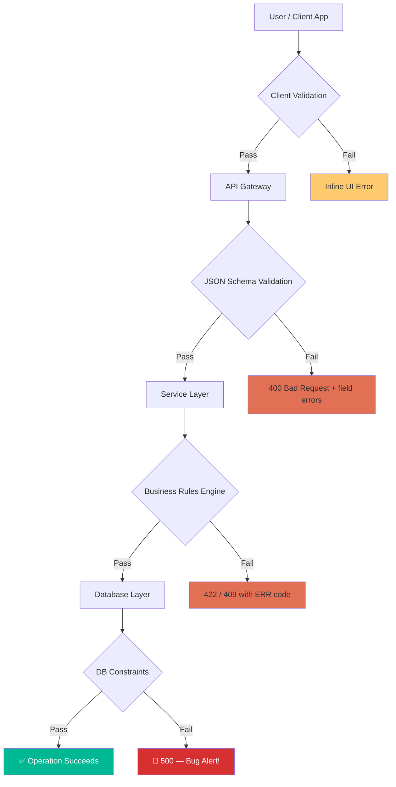
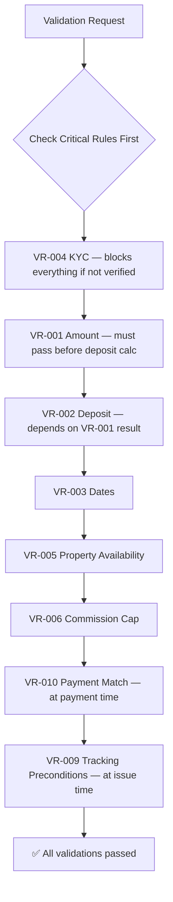

# Validation Rules Matrix — Amline Enterprise Master v5.0

| Field       | Value                      |
|-------------|----------------------------|
| Version     | v5.0                       |
| Date        | 2026-04-15                 |
| Status      | Active                     |
| Maintainer  | Backend Platform Team      |
| Document ID | AME-VR-0010                |

---

## Table of Contents

1. [Validation Philosophy](#1-validation-philosophy)
2. [Validation Layers Diagram](#2-validation-layers-diagram)
3. [Summary Matrix](#3-summary-matrix)
4. [Detailed Rule Definitions](#4-detailed-rule-definitions)
   - [VR-001: Contract Amount Limits](#vr-001-contract-amount-limits)
   - [VR-002: Deposit Percentage](#vr-002-deposit-percentage)
   - [VR-003: Contract Dates](#vr-003-contract-dates)
   - [VR-004: KYC Required](#vr-004-kyc-required)
   - [VR-005: No Active Contracts on Property](#vr-005-no-active-contracts-on-property)
   - [VR-006: Agent Commission Cap](#vr-006-agent-commission-cap)
   - [VR-007: Counter-offer Window](#vr-007-counter-offer-window)
   - [VR-008: Dispute Filing Window](#vr-008-dispute-filing-window)
   - [VR-009: Tracking Code Preconditions](#vr-009-tracking-code-preconditions)
   - [VR-010: Payment Amount Match](#vr-010-payment-amount-match)
   - [VR-011: Cancellation Fee](#vr-011-cancellation-fee)
   - [VR-012: Review SLA](#vr-012-review-sla)
5. [Rule Conflict Resolution](#5-rule-conflict-resolution)
6. [Rule Override Process](#6-rule-override-process)
7. [Testing the Validation Rules](#7-testing-the-validation-rules)

---

## 1. Validation Philosophy

Amline v5.0 applies **defense in depth** for all validation: the same rules are enforced at multiple layers, with each layer providing a different type of guarantee.

### Validation Layers

| Layer              | Technology              | Validates                          | Fails As        |
|--------------------|-------------------------|------------------------------------|-----------------|
| **Client-side**    | React form validation   | Format, required fields, UI bounds | Inline error    |
| **API Gateway**    | JSON Schema + OpenAPI   | Structure, types, enum values      | 400 Bad Request |
| **Service Layer**  | Python business rules   | Business logic, cross-field rules  | 422 / 409       |
| **Database**       | PostgreSQL constraints  | Data integrity, referential safety | 500 (must not reach client) |

### Why Multi-Layer?

- Client validation is **UX**, not security — it can be bypassed.
- API validation catches **malformed requests** before hitting business logic.
- Service validation enforces **domain rules** that require state from the database.
- Database constraints are the **last line of defense** — they must never be violated in normal operation; if they trigger, it indicates a service-layer bug.

---

## 2. Validation Layers Diagram



---

## 3. Summary Matrix

| Rule ID | Rule Name                       | Persian Name                       | Layer               | Severity | Error Code |
|---------|---------------------------------|------------------------------------|---------------------|----------|------------|
| VR-001  | Contract Amount Limits          | محدودیت مبلغ قرارداد              | API + Service + DB  | CRITICAL | ERR_002    |
| VR-002  | Deposit Percentage              | درصد سپرده                         | API + Service + DB  | HIGH     | ERR_002    |
| VR-003  | Contract Dates                  | تاریخ‌های قرارداد                  | API + Service       | HIGH     | ERR_001    |
| VR-004  | KYC Required                    | احراز هویت الزامی                  | Service             | CRITICAL | ERR_008    |
| VR-005  | No Active Contracts on Property | عدم تداخل قرارداد ملک              | Service + DB        | HIGH     | ERR_014    |
| VR-006  | Agent Commission Cap            | سقف کمیسیون مشاور                  | API + Service + DB  | HIGH     | ERR_019    |
| VR-007  | Counter-offer Window            | پنجره زمانی پیشنهاد متقابل         | Service             | MEDIUM   | ERR_015    |
| VR-008  | Dispute Filing Window           | پنجره زمانی ثبت اعتراض             | Service             | MEDIUM   | ERR_016    |
| VR-009  | Tracking Code Preconditions     | پیش‌شرط‌های کد رهگیری              | Service             | CRITICAL | ERR_007    |
| VR-010  | Payment Amount Match            | تطابق مبلغ پرداخت                  | API + Service       | CRITICAL | ERR_002    |
| VR-011  | Cancellation Fee                | هزینه انصراف                       | Service             | HIGH     | ERR_001    |
| VR-012  | Review SLA                      | SLA بررسی                          | Service (Scheduler) | MEDIUM   | ERR_006    |

### Applies To Matrix

| Rule ID | ContractCreate | ContractUpdate | ContractSubmit | ContractAccept | PaymentInitiate | TrackingIssue | DisputeFile |
|---------|:--------------:|:--------------:|:--------------:|:--------------:|:---------------:|:-------------:|:-----------:|
| VR-001  | ✅              | ✅              | ❌              | ❌              | ✅               | ❌             | ❌           |
| VR-002  | ✅              | ✅              | ❌              | ❌              | ✅               | ❌             | ❌           |
| VR-003  | ✅              | ✅              | ✅              | ❌              | ❌               | ❌             | ❌           |
| VR-004  | ❌              | ❌              | ✅              | ✅              | ✅               | ✅             | ❌           |
| VR-005  | ✅              | ✅              | ❌              | ❌              | ❌               | ❌             | ❌           |
| VR-006  | ✅              | ✅              | ❌              | ❌              | ❌               | ❌             | ❌           |
| VR-007  | ❌              | ❌              | ❌              | ❌              | ❌               | ❌             | ❌           |
| VR-008  | ❌              | ❌              | ❌              | ❌              | ❌               | ❌             | ✅           |
| VR-009  | ❌              | ❌              | ❌              | ❌              | ❌               | ✅             | ❌           |
| VR-010  | ❌              | ❌              | ❌              | ❌              | ✅               | ❌             | ❌           |
| VR-011  | ❌              | ❌              | ❌              | ❌              | ❌               | ❌             | ❌           |
| VR-012  | ❌              | ❌              | ❌              | ❌              | ❌               | ❌             | ❌           |

---

## 4. Detailed Rule Definitions

---

### VR-001: Contract Amount Limits

| Attribute        | Value                                                          |
|------------------|----------------------------------------------------------------|
| **Rule ID**      | VR-001                                                         |
| **Persian Name** | محدودیت مبلغ قرارداد                                           |
| **Rule**         | `amount > 0 AND amount <= 100_000_000_000`                     |
| **Currency**     | IRR only                                                       |
| **Layers**       | API (JSON Schema), Service (Python), Database (CHECK constraint)|
| **Error Code**   | ERR_002                                                        |
| **Severity**     | CRITICAL                                                       |
| **Applies To**   | ContractCreate, ContractUpdate, PaymentInitiate                |

**Business Justification:**

Prevents fraudulent contracts with inflated values that could be used for money laundering or bypass platform fee caps. The 100 Billion IRR ceiling (≈ 2.5M USD at 2026 rates) covers the largest legitimate real estate transactions in Iran. Values above this threshold require off-platform banking approval not supported in v5.0.

**Rule Logic:**

```python
from decimal import Decimal

MAX_CONTRACT_AMOUNT = Decimal("100_000_000_000")  # 100 Billion IRR
MIN_CONTRACT_AMOUNT = Decimal("1")

def validate_vr001(amount: Decimal, currency: str) -> None:
    if currency != "IRR":
        raise ValidationError("ERR_002", "Only IRR currency is supported in v5.0")
    if amount <= 0:
        raise ValidationError("ERR_002", "Contract amount must be greater than zero",
                              details={"submitted_amount": str(amount)})
    if amount > MAX_CONTRACT_AMOUNT:
        raise ValidationError("ERR_002", "Contract amount exceeds maximum allowed",
                              details={
                                  "submitted_amount": str(amount),
                                  "max_allowed": str(MAX_CONTRACT_AMOUNT)
                              })
```

**Database Constraint:**

```sql
ALTER TABLE contracts
ADD CONSTRAINT chk_amount_range
CHECK (amount > 0 AND amount <= 100000000000);
```

**API JSON Schema:**

```json
"amount": {
  "type": "integer",
  "minimum": 1,
  "maximum": 100000000000,
  "description": "Contract amount in IRR"
}
```

---

### VR-002: Deposit Percentage

| Attribute        | Value                                                          |
|------------------|----------------------------------------------------------------|
| **Rule ID**      | VR-002                                                         |
| **Persian Name** | درصد سپرده                                                    |
| **Rule**         | `10.0 <= deposit_pct <= 30.0` percent of `amount`             |
| **Layers**       | API (JSON Schema), Service (Python), Database (CHECK constraint)|
| **Error Code**   | ERR_002                                                        |
| **Severity**     | HIGH                                                           |
| **Applies To**   | ContractCreate, ContractUpdate                                 |

**Business Justification:**

The deposit (earnest money / ودیعه) must be between 10% and 30% to be legally meaningful in Iranian real estate law. Below 10% is insufficient to bind parties; above 30% places excessive burden on buyers and is non-standard.

**Rule Logic:**

```python
def validate_vr002(amount: Decimal, deposit_pct: float) -> Decimal:
    MIN_PCT = 10.0
    MAX_PCT = 30.0

    if not (MIN_PCT <= deposit_pct <= MAX_PCT):
        raise ValidationError("ERR_002",
            f"Deposit percentage must be between {MIN_PCT}% and {MAX_PCT}%",
            details={
                "submitted_percentage": deposit_pct,
                "min_allowed": MIN_PCT,
                "max_allowed": MAX_PCT
            })

    deposit_amount = amount * Decimal(deposit_pct) / Decimal(100)
    return deposit_amount.quantize(Decimal("1"))
```

**Database Constraint:**

```sql
ALTER TABLE contracts
ADD CONSTRAINT chk_deposit_percentage
CHECK (deposit_percentage >= 10.0 AND deposit_percentage <= 30.0);

ALTER TABLE contracts
ADD CONSTRAINT chk_deposit_amount_consistency
CHECK (ABS(deposit_amount - (amount * deposit_percentage / 100.0)) <= 1000);
```

---

### VR-003: Contract Dates

| Attribute        | Value                                                          |
|------------------|----------------------------------------------------------------|
| **Rule ID**      | VR-003                                                         |
| **Persian Name** | تاریخ‌های قرارداد                                              |
| **Rule**         | See sub-rules below                                            |
| **Layers**       | API (JSON Schema format), Service (Python)                     |
| **Error Code**   | ERR_001 (invalid transition), ERR_002 (validation)            |
| **Severity**     | HIGH                                                           |
| **Applies To**   | ContractCreate, ContractUpdate, ContractSubmit                 |

**Sub-rules:**

| Sub-rule | Rule                                                  |
|----------|-------------------------------------------------------|
| VR-003a  | `start_date >= TODAY + 1 day`                         |
| VR-003b  | `end_date > start_date`                               |
| VR-003c  | `end_date - start_date <= 5 years` for LEASE type    |
| VR-003d  | `end_date - start_date <= 2 years` for PRE_SALE type |
| VR-003e  | No date modifications after PENDING_REVIEW state      |

**Rule Logic:**

```python
from datetime import date, timedelta

MAX_LEASE_DURATION_DAYS = 365 * 5   # 5 years
MAX_PRE_SALE_DURATION_DAYS = 365 * 2  # 2 years

def validate_vr003(
    contract_type: str,
    start_date: date,
    end_date: date,
    today: date = None
) -> None:
    today = today or date.today()
    tomorrow = today + timedelta(days=1)

    if start_date < tomorrow:
        raise ValidationError("ERR_002",
            "start_date must be at least tomorrow",
            details={"start_date": str(start_date), "minimum": str(tomorrow)})

    if end_date <= start_date:
        raise ValidationError("ERR_002",
            "end_date must be after start_date")

    duration_days = (end_date - start_date).days

    if contract_type == "LEASE" and duration_days > MAX_LEASE_DURATION_DAYS:
        raise ValidationError("ERR_002",
            "Lease contracts cannot exceed 5 years",
            details={"duration_days": duration_days, "max_days": MAX_LEASE_DURATION_DAYS})

    if contract_type == "PRE_SALE" and duration_days > MAX_PRE_SALE_DURATION_DAYS:
        raise ValidationError("ERR_002",
            "Pre-sale contracts cannot exceed 2 years",
            details={"duration_days": duration_days, "max_days": MAX_PRE_SALE_DURATION_DAYS})
```

---

### VR-004: KYC Required

| Attribute        | Value                                                         |
|------------------|---------------------------------------------------------------|
| **Rule ID**      | VR-004                                                        |
| **Persian Name** | احراز هویت الزامی                                             |
| **Rule**         | KYC level must meet minimum for each operation                |
| **Layers**       | Service (Python) — queries KYCService                         |
| **Error Code**   | ERR_008                                                       |
| **Severity**     | CRITICAL                                                      |
| **Applies To**   | ContractSubmit, ContractAccept, PaymentInitiate, TrackingIssue|

**KYC Level Requirements:**

| Operation              | Buyer KYC Required | Seller KYC Required |
|------------------------|--------------------|---------------------|
| Contract in DRAFT      | NONE               | NONE                |
| ContractSubmit         | BASIC              | NONE                |
| ContractAccept         | FULL               | FULL                |
| PaymentInitiate        | BASIC              | NONE                |
| TrackingIssue          | FULL               | FULL                |

**KYC Grace Period:**

- BASIC KYC: Valid for DRAFT and PENDING_REVIEW operations. Expires after 2 years.
- FULL KYC: Required for ACCEPTED and beyond. Expires after 2 years from verification.

**Rule Logic:**

```python
from enum import IntEnum

class KYCLevel(IntEnum):
    NONE = 0
    BASIC = 1
    FULL = 2

KYC_REQUIREMENTS = {
    "contract:submit_for_review": {"buyer": KYCLevel.BASIC, "seller": KYCLevel.NONE},
    "contract:accept": {"buyer": KYCLevel.FULL, "seller": KYCLevel.FULL},
    "payment:initiate": {"buyer": KYCLevel.BASIC, "seller": KYCLevel.NONE},
    "tracking:issue": {"buyer": KYCLevel.FULL, "seller": KYCLevel.FULL},
}

def validate_vr004(operation: str, buyer_kyc: KYCLevel, seller_kyc: KYCLevel) -> None:
    requirements = KYC_REQUIREMENTS.get(operation, {})
    buyer_required = requirements.get("buyer", KYCLevel.NONE)
    seller_required = requirements.get("seller", KYCLevel.NONE)

    if buyer_kyc < buyer_required:
        raise ValidationError("ERR_008", "Buyer KYC verification required",
            details={
                "party": "buyer",
                "current_level": buyer_kyc.name,
                "required_level": KYCLevel(buyer_required).name,
            })

    if seller_kyc < seller_required:
        raise ValidationError("ERR_008", "Seller KYC verification required",
            details={
                "party": "seller",
                "current_level": seller_kyc.name,
                "required_level": KYCLevel(seller_required).name,
            })
```

---

### VR-005: No Active Contracts on Property

| Attribute        | Value                                                            |
|------------------|------------------------------------------------------------------|
| **Rule ID**      | VR-005                                                           |
| **Persian Name** | عدم تداخل قرارداد ملک                                            |
| **Rule**         | No two active contracts for same `property_id` with overlapping dates |
| **Layers**       | Service (Python + DB query), Database (advisory lock)            |
| **Error Code**   | ERR_014                                                          |
| **Severity**     | HIGH                                                             |
| **Applies To**   | ContractCreate, ContractUpdate                                   |

**Active States for Overlap Check:**

States considered "active" for conflict detection:
`PENDING_REVIEW`, `UNDER_REVIEW`, `APPROVED`, `DEPOSIT_PENDING`, `DEPOSIT_PAID`, `ACCEPTED`, `TRACKING_ISSUED`, `ACTIVE`, `DISPUTED`

**Rule Logic:**

```python
def validate_vr005(db, property_id: str, start_date, end_date, exclude_contract_id=None):
    ACTIVE_STATES = [
        'PENDING_REVIEW', 'UNDER_REVIEW', 'APPROVED', 'DEPOSIT_PENDING',
        'DEPOSIT_PAID', 'ACCEPTED', 'TRACKING_ISSUED', 'ACTIVE', 'DISPUTED'
    ]
    conflicts = db.query_overlap(
        property_id=property_id,
        start_date=start_date,
        end_date=end_date,
        active_states=ACTIVE_STATES,
        exclude_id=exclude_contract_id
    )
    if conflicts:
        conflict = conflicts[0]
        raise ValidationError("ERR_014",
            "Property already under active contract with overlapping dates",
            details={
                "property_id": property_id,
                "conflicting_contract_id": conflict["contract_id"],
                "conflicting_period": {
                    "from": str(conflict["start_date"]),
                    "to": str(conflict["end_date"])
                }
            })
```

**Database Query (optimized with partial index):**

```sql
CREATE INDEX idx_contracts_property_dates_active
ON contracts (property_id, start_date, end_date)
WHERE state IN ('PENDING_REVIEW','UNDER_REVIEW','APPROVED','DEPOSIT_PENDING',
                'DEPOSIT_PAID','ACCEPTED','TRACKING_ISSUED','ACTIVE','DISPUTED');

-- Overlap check query
SELECT contract_id, start_date, end_date, state
FROM contracts
WHERE property_id = $1
  AND state = ANY($2)
  AND contract_id != $3
  AND start_date <= $5
  AND end_date   >= $4;
```

---

### VR-006: Agent Commission Cap

| Attribute        | Value                                                          |
|------------------|----------------------------------------------------------------|
| **Rule ID**      | VR-006                                                         |
| **Persian Name** | سقف کمیسیون مشاور                                             |
| **Rule**         | `commission_rate <= 5%`; if dual agents: each `<= 2.5%`       |
| **Layers**       | API (JSON Schema), Service (Python), Database (CHECK)          |
| **Error Code**   | ERR_019                                                        |
| **Severity**     | HIGH                                                           |
| **Applies To**   | ContractCreate, ContractUpdate                                 |

**Business Justification:**

Regulatory compliance with Iranian Real Estate Organization circular RE-ORG-CIRCULAR-2025-7 which caps agent commissions at 5% total of contract value.

**Rule Logic:**

```python
MAX_SINGLE_AGENT_RATE = Decimal("0.05")   # 5%
MAX_DUAL_AGENT_RATE   = Decimal("0.025")  # 2.5% each

def validate_vr006(buyer_rate: Decimal, seller_rate: Decimal, is_dual: bool) -> None:
    if is_dual:
        for label, rate in [("buyer", buyer_rate), ("seller", seller_rate)]:
            if rate > MAX_DUAL_AGENT_RATE:
                raise ValidationError("ERR_019",
                    f"{label.capitalize()} agent commission exceeds 2.5% cap",
                    details={"submitted_rate": float(rate),
                             "max_allowed": float(MAX_DUAL_AGENT_RATE)})
    else:
        total = buyer_rate + seller_rate
        if total > MAX_SINGLE_AGENT_RATE:
            raise ValidationError("ERR_019",
                "Total commission exceeds 5% regulatory cap",
                details={"total_rate": float(total),
                         "max_allowed": float(MAX_SINGLE_AGENT_RATE),
                         "regulation": "RE-ORG-CIRCULAR-2025-7"})
```

**Database Constraint:**

```sql
ALTER TABLE contracts
ADD CONSTRAINT chk_commission_rate
CHECK (
    (buyer_agent_commission_rate + seller_agent_commission_rate) <= 0.05
    AND buyer_agent_commission_rate  >= 0
    AND seller_agent_commission_rate >= 0
);
```

---

### VR-007: Counter-offer Window

| Attribute        | Value                                                         |
|------------------|---------------------------------------------------------------|
| **Rule ID**      | VR-007                                                        |
| **Persian Name** | پنجره زمانی پیشنهاد متقابل                                    |
| **Rule**         | Counter-offer must be submitted within 48 hours of offer      |
| **Layers**       | Service (Python) — time check; Scheduler (auto-expire)        |
| **Error Code**   | ERR_015                                                       |
| **Severity**     | MEDIUM                                                        |
| **Applies To**   | ContractCounterOffer                                          |

**Business Justification:**

Prevents offers from hanging indefinitely, keeping the property market fluid. After 48 hours without a counter-offer or acceptance, the offer auto-expires and both parties are notified.

**Rule Logic:**

```python
from datetime import datetime, timezone, timedelta

COUNTER_OFFER_WINDOW_HOURS = 48

def validate_vr007(offer_created_at: datetime, now: datetime = None) -> None:
    now = now or datetime.now(timezone.utc)
    window_expires_at = offer_created_at + timedelta(hours=COUNTER_OFFER_WINDOW_HOURS)

    if now > window_expires_at:
        raise ValidationError("ERR_015",
            "Counter-offer window has expired",
            details={
                "offer_created_at": offer_created_at.isoformat(),
                "window_hours": COUNTER_OFFER_WINDOW_HOURS,
                "window_expired_at": window_expires_at.isoformat(),
                "current_time": now.isoformat()
            })
```

**Scheduler Auto-expiry (runs every 15 minutes):**

```sql
UPDATE contracts
SET state = 'EXPIRED',
    updated_at = NOW(),
    expiry_reason = 'COUNTER_OFFER_WINDOW_EXCEEDED'
WHERE state = 'APPROVED'
  AND offer_sent_at < NOW() - INTERVAL '48 hours'
  AND NOT EXISTS (
      SELECT 1 FROM contract_counter_offers
      WHERE contract_id = contracts.contract_id
        AND created_at >= contracts.offer_sent_at
  );
```

---

### VR-008: Dispute Filing Window

| Attribute        | Value                                                         |
|------------------|---------------------------------------------------------------|
| **Rule ID**      | VR-008                                                        |
| **Persian Name** | پنجره زمانی ثبت اعتراض                                        |
| **Rule**         | Dispute must be filed within 7 calendar days of incident_date |
| **Layers**       | Service (Python)                                              |
| **Error Code**   | ERR_016                                                       |
| **Severity**     | MEDIUM                                                        |
| **Applies To**   | ContractDispute                                               |

**Business Justification:**

Ensures disputes are filed while evidence is fresh and memories are reliable. Mirrors standard Iranian commercial dispute statutes for real estate.

**Rule Logic:**

```python
DISPUTE_WINDOW_DAYS = 7

def validate_vr008(incident_date, today=None):
    from datetime import date, timedelta
    today = today or date.today()
    deadline = incident_date + timedelta(days=DISPUTE_WINDOW_DAYS)

    if today > deadline:
        raise ValidationError("ERR_016",
            "Dispute filing window has expired",
            details={
                "incident_date": str(incident_date),
                "deadline": str(deadline),
                "today": str(today),
                "days_overdue": (today - deadline).days
            })

    if incident_date > today:
        raise ValidationError("ERR_002", "incident_date cannot be in the future")
```

---

### VR-009: Tracking Code Preconditions

| Attribute        | Value                                                              |
|------------------|--------------------------------------------------------------------|
| **Rule ID**      | VR-009                                                             |
| **Persian Name** | پیش‌شرط‌های کد رهگیری                                               |
| **Rule**         | All 4 conditions must pass simultaneously                          |
| **Layers**       | Service (Python) — multi-check                                     |
| **Error Code**   | ERR_007                                                            |
| **Severity**     | CRITICAL                                                           |
| **Applies To**   | TrackingIssue                                                      |

**Required Conditions:**

| Condition | Check                                     |
|-----------|-------------------------------------------|
| C1        | Contract state = `ACCEPTED`               |
| C2        | Deposit payment status = `COMPLETED`      |
| C3        | Review decision = `APPROVED`              |
| C4        | Both buyer AND seller KYC level = `FULL`  |

**Rule Logic:**

```python
def validate_vr009(contract, payment, review, buyer_kyc, seller_kyc):
    conditions = {
        "contract_accepted": contract["state"] == "ACCEPTED",
        "deposit_paid":       payment["status"] == "COMPLETED",
        "review_approved":    review["decision"] == "APPROVED",
        "buyer_kyc_full":     buyer_kyc >= KYCLevel.FULL,
        "seller_kyc_full":    seller_kyc >= KYCLevel.FULL,
    }
    failed = [k for k, v in conditions.items() if not v]
    if failed:
        raise ValidationError("ERR_007",
            "Escrow release conditions not met",
            details={
                "contract_id": contract["contract_id"],
                "conditions": conditions,
                "failed_conditions": failed
            })
```

---

### VR-010: Payment Amount Match

| Attribute        | Value                                                         |
|------------------|---------------------------------------------------------------|
| **Rule ID**      | VR-010                                                        |
| **Persian Name** | تطابق مبلغ پرداخت                                             |
| **Rule**         | `payment.amount == contract.deposit_amount` (exact match)    |
| **Layers**       | API (amount field validation), Service (cross-check with DB)  |
| **Error Code**   | ERR_002                                                       |
| **Severity**     | CRITICAL                                                      |
| **Applies To**   | PaymentInitiate, PaymentVerify                                |

**Business Justification:**

Partial payments create complex escrow accounting scenarios not supported in v5.0. Exact match simplifies reconciliation and prevents manipulation.

**Rule Logic:**

```python
def validate_vr010(payment_amount: Decimal, deposit_amount: Decimal, currency: str) -> None:
    if currency != "IRR":
        raise ValidationError("ERR_002", "Only IRR payments are supported")
    if payment_amount != deposit_amount:
        raise ValidationError("ERR_002",
            "Payment amount must exactly equal contract deposit amount",
            details={
                "submitted_amount": str(payment_amount),
                "required_amount": str(deposit_amount),
                "discrepancy": str(payment_amount - deposit_amount),
                "partial_payments_allowed": False
            })
```

---

### VR-011: Cancellation Fee

| Attribute        | Value                                                         |
|------------------|---------------------------------------------------------------|
| **Rule ID**      | VR-011                                                        |
| **Persian Name** | هزینه انصراف                                                  |
| **Rule**         | See fee schedule below                                        |
| **Layers**       | Service (Python) — applied during cancellation processing     |
| **Error Code**   | ERR_001 (if cancellation not allowed in current state)       |
| **Severity**     | HIGH                                                          |
| **Applies To**   | ContractCancel                                                |

**Cancellation Fee Schedule:**

| When Cancelled          | Fee                                                |
|-------------------------|----------------------------------------------------|
| Before DEPOSIT_PAID     | No fee. Full deposit refunded (if any held).       |
| After DEPOSIT_PAID      | 1% of contract amount, deducted from deposit.      |
| After ACCEPTED / ACTIVE | 2% of contract amount (negotiated settlement).     |

**Business Justification:**

Protects sellers who have taken the property off-market. The 1% cancellation fee compensates for lost opportunity cost.

**Rule Logic:**

```python
def calculate_cancellation_fee(state: str, amount: Decimal, deposit: Decimal) -> dict:
    NO_FEE_STATES = ['DRAFT','PENDING_REVIEW','UNDER_REVIEW','APPROVED',
                     'DEPOSIT_PENDING','REJECTED']
    if state in NO_FEE_STATES:
        return {"cancellation_fee": Decimal("0"), "refund_amount": Decimal("0"),
                "policy": "NO_FEE_PRE_DEPOSIT"}
    elif state == "DEPOSIT_PAID":
        fee = (amount * Decimal("0.01")).quantize(Decimal("1"))
        return {"cancellation_fee": fee,
                "refund_amount": max(deposit - fee, Decimal("0")),
                "policy": "ONE_PERCENT_OF_CONTRACT_AMOUNT"}
    else:  # ACCEPTED, TRACKING_ISSUED, ACTIVE
        fee = (amount * Decimal("0.02")).quantize(Decimal("1"))
        return {"cancellation_fee": fee,
                "refund_amount": max(deposit - fee, Decimal("0")),
                "policy": "TWO_PERCENT_NEGOTIATED",
                "requires_both_party_agreement": True}
```

---

### VR-012: Review SLA

| Attribute        | Value                                                         |
|------------------|---------------------------------------------------------------|
| **Rule ID**      | VR-012                                                        |
| **Persian Name** | SLA بررسی                                                    |
| **Rule**         | Review must be completed within 24h of assignment             |
| **Layers**       | Service Scheduler (Python cron job, runs every 5 minutes)     |
| **Error Code**   | ERR_006 (queue full as result of SLA breach cascade)         |
| **Severity**     | MEDIUM                                                        |
| **Applies To**   | ReviewAssigned → ReviewCompleted                              |

**SLA Timeline:**

| Time After Assignment | Action                                          |
|-----------------------|-------------------------------------------------|
| 0h                    | Review item assigned; SLA clock starts          |
| 20h                   | WARNING: Notification sent to reviewer          |
| 24h                   | AUTO-ESCALATE: Assigned to senior reviewer      |
| 36h                   | ALERT: Ops manager notified                     |
| 48h                   | AUTO-ESCALATE: Assigned to OPS manager          |
| 72h                   | P1 INCIDENT: CEO alert; regulatory risk flagged |

**Rule Logic (Scheduler):**

```python
from datetime import datetime, timezone, timedelta

SLA_THRESHOLDS = {
    "warning": 20,
    "senior_escalation": 24,
    "manager_alert": 36,
    "manager_escalation": 48,
    "p1_incident": 72,
}

def check_review_slas(db, notification_svc, escalation_svc):
    now = datetime.now(timezone.utc)
    open_reviews = db.get_open_reviews()

    for review in open_reviews:
        hours = (now - review["assigned_at"]).total_seconds() / 3600

        if hours >= SLA_THRESHOLDS["p1_incident"]:
            escalation_svc.create_p1_incident(review["review_id"])
        elif hours >= SLA_THRESHOLDS["manager_escalation"]:
            escalation_svc.escalate_to_manager(review["review_id"])
        elif hours >= SLA_THRESHOLDS["manager_alert"]:
            notification_svc.alert_ops_manager(review["review_id"])
        elif hours >= SLA_THRESHOLDS["senior_escalation"]:
            escalation_svc.escalate_to_senior(review["review_id"])
        elif hours >= SLA_THRESHOLDS["warning"]:
            notification_svc.warn_reviewer(review["review_id"])
```

**SLA Status SQL Query:**

```sql
SELECT
    review_id,
    contract_id,
    assigned_at,
    ROUND(EXTRACT(EPOCH FROM (NOW() - assigned_at)) / 3600, 1) AS hours_elapsed,
    CASE
        WHEN EXTRACT(EPOCH FROM (NOW() - assigned_at)) / 3600 >= 72 THEN 'P1_BREACH'
        WHEN EXTRACT(EPOCH FROM (NOW() - assigned_at)) / 3600 >= 48 THEN 'MANAGER_ESCALATED'
        WHEN EXTRACT(EPOCH FROM (NOW() - assigned_at)) / 3600 >= 24 THEN 'SENIOR_ESCALATED'
        WHEN EXTRACT(EPOCH FROM (NOW() - assigned_at)) / 3600 >= 20 THEN 'WARNING'
        ELSE 'ON_TRACK'
    END AS sla_status
FROM review_items
WHERE state = 'IN_PROGRESS'
ORDER BY assigned_at ASC;
```

---

## 5. Rule Conflict Resolution

When two validation rules appear to conflict, the following priority order applies:



### Known Conflict Scenarios

| Scenario                                    | Resolution                                        |
|---------------------------------------------|---------------------------------------------------|
| VR-003 date valid but VR-005 property busy  | VR-005 takes precedence; suggest different dates  |
| VR-007 window passed but VR-003 dates valid | VR-007 takes precedence; offer already expired    |
| VR-011 fee vs VR-004 KYC at cancellation   | VR-004 checked first; cancellation blocked without KYC |

---

## 6. Rule Override Process

**Only SUPER_ADMIN** can override a validation rule. Overrides require:

1. **Written justification** (captured in audit log).
2. **Dual approval**: SUPER_ADMIN + one additional ADMIN signature.
3. **Time-limited**: Override expires after 24 hours by default.
4. **Immutable audit entry**: The override is logged with before/after state.

### Override API

```http
POST /admin/contracts/{id}/validation-override
Authorization: Bearer <super_admin_token>

{
  "rule_id": "VR-005",
  "justification": "Court order allows overlap for PROP-40004, ref: COURT-2026-1234",
  "override_expires_at": "2026-04-16T10:00:00Z",
  "second_approver_id": "USR-ADMIN-002",
  "legal_reference": "COURT-ORDER-2026-1234"
}
```

### Override Audit Log Entry

```json
{
  "event_type": "VALIDATION_OVERRIDE",
  "rule_id": "VR-005",
  "contract_id": "CTR-2026-00099",
  "overriding_user": "USR-SUPER-001",
  "second_approver": "USR-ADMIN-002",
  "justification": "Court order allows overlapping contract...",
  "legal_reference": "COURT-ORDER-2026-1234",
  "override_valid_until": "2026-04-16T10:00:00Z",
  "created_at": "2026-04-15T10:00:00Z"
}
```

---

## 7. Testing the Validation Rules

### VR-001 Test Cases

| Test ID       | Input Amount    | Expected Result  | Error Code |
|---------------|-----------------|------------------|------------|
| VR001-TC-001  | 5,000,000,000   | ✅ Pass           | —          |
| VR001-TC-002  | 0               | ❌ Fail           | ERR_002    |
| VR001-TC-003  | -1              | ❌ Fail           | ERR_002    |
| VR001-TC-004  | 100,000,000,000 | ✅ Pass (boundary)| —          |
| VR001-TC-005  | 100,000,000,001 | ❌ Fail           | ERR_002    |

```python
import pytest
from decimal import Decimal

def test_vr001_valid_amount():
    validate_vr001(Decimal("5000000000"), "IRR")  # Should not raise

def test_vr001_zero_amount():
    with pytest.raises(ValidationError) as exc:
        validate_vr001(Decimal("0"), "IRR")
    assert exc.value.code == "ERR_002"

def test_vr001_exceeds_maximum():
    with pytest.raises(ValidationError) as exc:
        validate_vr001(Decimal("100000000001"), "IRR")
    assert exc.value.code == "ERR_002"

def test_vr001_boundary_maximum():
    validate_vr001(Decimal("100000000000"), "IRR")  # Exactly at limit

def test_vr001_wrong_currency():
    with pytest.raises(ValidationError) as exc:
        validate_vr001(Decimal("5000000000"), "USD")
    assert exc.value.code == "ERR_002"
```

### VR-003 Test Cases

```python
from datetime import date

def test_vr003_valid_lease():
    validate_vr003("LEASE", date(2026,5,1), date(2027,5,1), today=date(2026,4,15))

def test_vr003_start_date_today():
    with pytest.raises(ValidationError):
        validate_vr003("LEASE", date(2026,4,15), date(2027,4,15), today=date(2026,4,15))

def test_vr003_lease_exceeds_5_years():
    with pytest.raises(ValidationError) as exc:
        validate_vr003("LEASE", date(2026,5,1), date(2032,5,2), today=date(2026,4,15))
    assert exc.value.code == "ERR_002"

def test_vr003_pre_sale_within_2_years():
    validate_vr003("PRE_SALE", date(2026,5,1), date(2028,4,30), today=date(2026,4,15))

def test_vr003_pre_sale_exceeds_2_years():
    with pytest.raises(ValidationError):
        validate_vr003("PRE_SALE", date(2026,5,1), date(2028,5,2), today=date(2026,4,15))
```

### VR-007 Test Cases

```python
from datetime import datetime, timezone

def test_vr007_within_window():
    offer_time = datetime(2026,4,14,10,0,0, tzinfo=timezone.utc)
    now        = datetime(2026,4,15,10,0,0, tzinfo=timezone.utc)  # 24h later — still valid
    validate_vr007(offer_time, now)

def test_vr007_window_expired():
    offer_time = datetime(2026,4,13,10,0,0, tzinfo=timezone.utc)
    now        = datetime(2026,4,15,10,0,1, tzinfo=timezone.utc)  # 48h + 1s
    with pytest.raises(ValidationError) as exc:
        validate_vr007(offer_time, now)
    assert exc.value.code == "ERR_015"

def test_vr007_exactly_at_boundary():
    offer_time = datetime(2026,4,13,10,0,0, tzinfo=timezone.utc)
    now        = datetime(2026,4,15,10,0,0, tzinfo=timezone.utc)  # exactly 48h — passes
    validate_vr007(offer_time, now)
```

### VR-009 Test Cases

```python
def test_vr009_all_conditions_met():
    validate_vr009(
        contract={"contract_id": "CTR-001", "state": "ACCEPTED"},
        payment={"status": "COMPLETED"},
        review={"decision": "APPROVED"},
        buyer_kyc=KYCLevel.FULL,
        seller_kyc=KYCLevel.FULL
    )

def test_vr009_deposit_not_paid():
    with pytest.raises(ValidationError) as exc:
        validate_vr009(
            contract={"contract_id": "CTR-001", "state": "ACCEPTED"},
            payment={"status": "PENDING"},
            review={"decision": "APPROVED"},
            buyer_kyc=KYCLevel.FULL,
            seller_kyc=KYCLevel.FULL
        )
    assert exc.value.code == "ERR_007"
    assert "deposit_paid" in exc.value.details["failed_conditions"]

def test_vr009_seller_kyc_only_basic():
    with pytest.raises(ValidationError) as exc:
        validate_vr009(
            contract={"contract_id": "CTR-001", "state": "ACCEPTED"},
            payment={"status": "COMPLETED"},
            review={"decision": "APPROVED"},
            buyer_kyc=KYCLevel.FULL,
            seller_kyc=KYCLevel.BASIC
        )
    assert "seller_kyc_full" in exc.value.details["failed_conditions"]
```

### VR-012 Test Cases

```python
from datetime import datetime, timezone, timedelta

def test_vr012_on_track():
    assigned = datetime.now(timezone.utc) - timedelta(hours=5)
    status = get_sla_status(assigned)
    assert status == "ON_TRACK"

def test_vr012_warning_triggered():
    assigned = datetime.now(timezone.utc) - timedelta(hours=21)
    status = get_sla_status(assigned)
    assert status == "WARNING"

def test_vr012_p1_breach():
    assigned = datetime.now(timezone.utc) - timedelta(hours=73)
    status = get_sla_status(assigned)
    assert status == "P1_BREACH"
```

---

*Document maintained by Backend Platform Team. For changes, open a PR against `docs/v5/VALIDATION-RULES.md`.*
